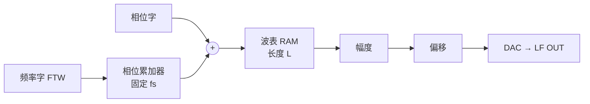
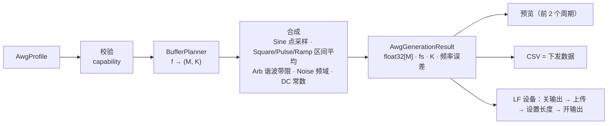
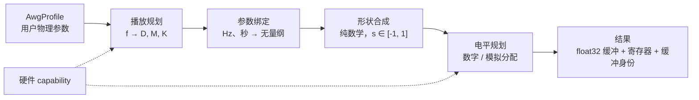

## 一、从手册推断的优利德 LF 基波模型

证据（手册 PDF 页码）：p.9 “直接数字合成技术”、p.18–19 默认值与操作、p.46 各载波频率范围、p.133–134 出厂默认、p.141–142 参数树。

| 基波 | USG 参数（除公共项） | 公共项 |
| --- | --- | --- |
| Sine | — | 负载、频率、幅度(Vpp)、直流偏移(V)、相位(°)、噪声叠加 |
| Square | 占空比 | 同上 |
| Ramp/三角波 | 对称度 | 同上 |
| Pulse | 占空比、上升沿、下降沿（默认 20 ns） | 同上 |
| Arb | 任意波文件(.bsv，一个周期) | 同上（含频率、相位） |
| Noise | 噪声幅度、直流偏移、噪声带宽 | 无频率/相位 |
| DC | 直流偏移 | 无 |

推断算法：DDS 相位累加器（fs 固定，频率分辨率 1 mHz），Sine/Ramp/Arb 按相位查表，Square/Pulse 按“相位 < 占空比”阈值判决，Pulse 边沿是叠加在阈值判决上的线性过渡段；Noise 为高斯噪声源 + 可调带宽数字低通。频率上限按波形分层：Sine 50 MHz、Square/Pulse/Arb 15 MHz、Triangle 3 MHz。默认 500 kHz / 2 Vpp / 0 V / 0° / 50% / 50% / 20 ns。

## “LF DAC 是否固定 fs”指什么

指 LF 输出通路的 DAC 转换时钟是不是一个**不随波形频率改变的常数**（例如始终 250 MSa/s），还是可以**跟随用户设定而调节**。它决定了软件用哪种方式“调频率”：

| 模型 | DAC 时钟 | 频率怎么变 | 软件要交付什么 | 每周期点数 |
| --- | --- | --- | --- | --- |
| A. 硬件 DDS | 固定 | 相位累加器步长（FTW）：$f = \dfrac{\mathrm{FTW}}{2^N} f_s$ | 参数 + 一张单周期波表（Sine 可由硬件自带） | 非整数、随 f 变化，用户不感知 |
| B. 固定 fs 缓冲回放 | 固定 | 软件在 fs 下算好整段缓冲，硬件循环播放 | 长度 M 的样本缓冲，需含整数个周期 | 非整数，缓冲需满足 $M\cdot f/f_s = K$ |
| C. 可变 fs 缓冲回放 | 可调 | 缓冲固定 N 点，$f = f_s/N$，改 fs 即改频率 | N 点缓冲 + fs 值 | 整数、恒定 |

当前代码 `sampleRate = frequency × pointCount` 就是模型 C 的假设：它要求硬件能以 1.024 Sa/s 到几百 MSa/s 之间任意一个 fs 打点。

## 手册给出的间接证据

USG 更像模型 A：
- p.9 明确“直接数字合成技术（DDS）”；
- 频率下限 1 mHz、上限按波形分层（50 M / 15 M / 3 M），这是 DDS 相位累加器分辨率 + 各波形谐波带宽限制的典型表现；
- p.46 “任意波作为调制波时自动抽点到 4 kpts”，说明硬件用固定长度波表，而不是任意长度缓冲。

## 是否只有高端台表才能任意 fs

不是。三个层面区分开：

1. **真正可调的 DAC 物理时钟**（PLL/小数分频直接改采样时钟）：多见于高端 AWG（Keysight M8190、Tek AWG 系列），确实是高端特征。
2. **“虚拟”可变采样率**：DAC 时钟仍固定，前面加数字插值/重采样或样点重复，让用户看到 1 µSa/s–几十 MSa/s 的“采样率”参数。SIGLENT SDG1000X Plus（60 MHz 入门机）的 TrueArb、Keysight 33500 的 Trueform 都属于这一类，所以入门台表也能提供“任意 fs”界面。代价是你调研文档里已记录的那条：TrueArb 只对 AM/DSB-AM 有效，FM/PM/ASK/FSK/PSK 仍走 DDS Arb。
3. **RF 基带 ARB**：本项目 HTRA 回放本来就是按文件采样率回放，也属于“可变 fs”路径，但那是 RF 域，和 LF DAC 无关。

所以问题不在“高端不高端”，而在于**我们的 LF 硬件选了哪个模型**。低端函数发生器、RF 源内置 LF（USG、DSG、SSG）基本都是模型 A；模型 C 只在硬件明确提供可调时钟或重采样器时才成立。

## 对我们的实际影响

需要向硬件/FPGA 侧确认三件事，答案直接决定生成器改法：

1. LF DAC 时钟源：固定晶振还是可编程 PLL？固定值是多少？
2. 软件接口：下发**参数 + 波表**（模型 A，软件只负责生成归一化单周期表和噪声表），还是下发**整段样本缓冲**（模型 B/C）？
3. 若是缓冲：深度上限、是否要求整周期对齐、硬件有无插值。

- 若为 A：现有 `AwgWaveformGenerator` 大部分逻辑退化为“波表生成器”，频率/幅度/偏移/相位不进样本，直接作为寄存器参数下发；这与 USG 最一致。
- 若为 B：生成器按固定 fs 做 DDS 式整缓冲计算，`pointCount` 变派生量，需处理整周期约束和 `actualFrequencyHz` 偏差。
- 若为 C：现有模型可保留，但仍应按波形类型加频率上限，并处理低频时 fs 过低导致的边沿/带宽问题（例如 1 mHz × 1024 点 = 1 Sa/s，Square 边沿会有 1 s 的量化抖动）。

在得到确认前，建议先改动与采样模型无关的部分（Pulse 边沿、Ramp 0/100%、Noise 频域生成、Arb 周期形状表语义），采样模型这一项留到硬件契约明确后再动。

## 模型 A 的硬件契约

使用模型 A契约，意味着硬件侧由 FPGA 负责逐点输出，软件不再生成播放样本：



软件只下发两类数据：
- **寄存器参数**：频率、相位、幅度、偏移、输出开关。改这些参数不重新生成数据。
- **波表**：一个周期的归一化形状，长度 L 由硬件固定。只有形状改变时才重新下发。

按这个契约对照当前代码，需要做以下修改。

## 一、生成器的输出类型要拆开

现在 `AwgWaveformGenerator::generate()` 只返回一种结果 `AwgRealWaveform{samples, sampleRateHz}`，也就是可以直接播放的样本。模型 A 下要拆成三种互不混用的输出：

| 输出 | 内容 | 用途 |
| --- | --- | --- |
| `AwgWaveTable` | L 点、按相位索引、归一化到 ±1，不含频率/幅度/偏移/相位 | 下发给波表 RAM |
| `AwgLfRegisters` | 量化后的 FTW、相位字、幅度码、偏移码，以及实际频率 `FTW·fs/2^N` | 下发给寄存器 |
| 仿真输出（可选） | 用上面两者模拟 DAC 在固定 fs 下的输出 | 只用于预览和 CSV |


## 二、逐波形核对：哪些由硬件原生产生，哪些需要波表

这一项必须由硬件侧逐项确认，因为答案决定软件的工作量。

| 波形 | 可能的硬件实现 | 软件需要做的事 |
| --- | --- | --- |
| Sine | 硬件 ROM 或 CORDIC | 只写寄存器，不需要波表 |
| Square | 比较器（占空比寄存器）或波表 | 若用波表：边沿会量化到 1/fs，出现 ±1/fs 抖动；占空比分辨率受 `f/fs` 限制 |
| Ramp | 波表（只依赖对称度） | 对称度改变时重建波表；改频率不需要重建 |
| Pulse | 专用边沿发生器，或波表 | 见下方“关键耦合” |
| Arb | 波表 | 文件重采样为 L 点 |
| Noise | 不走 DDS | 见第四节 |
| DC | 只用偏移寄存器 | 不需要波表，也不需要点数 |

## 三、Arbitrary：重采样规则改变
模型 A 下改为重采样到 L 点：
- 文件点数 > L 时，线性插值等于直接抽点，会产生混叠。可以选择先低通再抽取，也可以对齐 USG 的“自动抽点”行为（手册 p.46 提到调制波抽点到 4 kpts）。无论选哪种，都要写明规则。
- 文件点数 < L 时，插值方式（线性或零阶保持）会影响波表的高频成分，也需要写明。
- 波表需要量化成硬件格式（位宽、有符号/偏移码）。量化规则应放在生成器中定义，不能留给设备层。

**不受影响的部分**：`generateArbitrary` 的入口校验、导入后的 ±1 形状语义，都可以保留。

## 四、Noise：这是模型 A 的例外

Noise 不是周期波形，不能进入 DDS 波表。如果把噪声放进 L 点波表，再以频率 f 播放，得到的是一个以 1/f 为周期、频谱随 f 缩放的周期信号，而不是噪声。硬件只有两种可能：

| 硬件实现 | 软件改动 |
| --- | --- |
| 硬件噪声源（LFSR/高斯 + 可配置滤波器） | 均值、σ、带宽写寄存器。`bandLimitedGaussian` 降级为 Host 预览算法；预览与实机滚降一致性只能以硬件滤波器响应为准 |
| 噪声 RAM 以固定 fs 回放（对 Noise 而言是模型 B） | 保留现有频域算法，但 `sampleRateHz` 改为硬件固定 fs，不再允许用户编辑（`awgpanel.cpp:191-197`）；`pointCount` 改为硬件噪声 RAM 长度。2 的幂约束和 `K ≥ 4` 仍然成立，但由硬件长度决定 |

两种方式都要确认：σ 和均值是直接写进数据，还是通过幅度/偏移寄存器实现。如果走寄存器，CF=5 规则就要改为约束幅度寄存器的取值范围。

**对后续 NoiseSum 的影响**：同样的原因，噪声叠加不能在软件中把噪声加进周期波表，必须依靠硬件的噪声通路和加法器。

## 五、需要向硬件/FPGA 确认的清单

1. fs、相位累加器位数、相位字位数
2. 波表长度 L、位宽/编码，是否支持无毛刺切换
3. Sine、Square、Pulse、Noise 各自是否由硬件原生产生；Pulse 是否有边沿时间寄存器
4. 幅度/偏移的实现方式（数字乘法、模拟衰减、偏移 DAC）、Vmax 与负载的关系
5. Noise 的实现方式（硬件噪声源还是 RAM 回放），以及滤波器响应
6. 各波形的频率上限

## 模型 B 的硬件契约

模型 B 下，DAC 以**固定 fs** 逐点读取一段长度为 M 的样本缓冲，并循环播放。软件负责算好每一个输出样本，频率、幅度、偏移、相位全部体现在样本里，硬件只负责播放。

要让循环首尾无缝衔接，缓冲中必须恰好装下整数个周期：

$$
M\cdot\frac{f}{f_s}=K\;(K\in\mathbb{Z}^+),\qquad f_{\text{actual}}=\frac{K\,f_s}{M}
$$

与模型 A 相比：
- **优点**：当前代码的数据形态 `AwgRealWaveform{samples, sampleRateHz}` 可以基本保留，CSV 就是实际下发的数据，改动面最小。
- **代价**：任何参数变化都要重新生成并重新上传整段缓冲；频率有下限；抗混叠必须由软件处理。

## 一、频率 → (M, K) 的求解（核心） M样本长度，K周期

现在的 `sampleRate = f × pointCount` 要改为：fs 由硬件给定，由程序求 (M, K)。

**约束条件**：
- $M_{\min} \le M \le M_{\max}$
- M 是硬件长度粒度 g 的整数倍（常见为 16、32、64）
- $K/M$ 尽量逼近 $f/f_s$

**算法**：对 $f/(f_s\cdot g)$ 做连分数展开，在分母 $\le M_{\max}/g$ 的范围内取最佳有理逼近。这是有理逼近的标准做法，复杂度只有 O(log)。

**选取策略**（这是产品决策，需要定下来）：取第一个满足相对误差 ≤ 容差的 M。M 越小，上传越快；如果在 $M_{\max}$ 内达不到容差，就取 $M_{\max}$ 内的最优解，并**显示实际频率和误差**，不能静默替换成近似频率。

**示例**（假设 fs = 250 MSa/s，$M_{\max}$ = 16 Mi）：

| 设定频率 | 结果 |
| --- | --- |
| 1 kHz | M = 250000，K = 1，频率精确 |
| 1.234567 MHz | 精确解需要 M = 2.5×10⁸，超出上限；取最佳逼近，相对误差约 1e-12 量级 |
| 50 MHz Sine（粒度 32） | M = 160，K = 32 |
| **1 mHz** | 需要 2.5×10¹¹ 点，**无法实现**；最低频率 = $f_s/M_{\max}$ ≈ 14.9 Hz |

**最后一行是模型 B 的根本限制。** 要达到 USG 的 1 mHz 下限，硬件必须提供以下能力之一：
- 整数分频 $f_s/D$：软件选出能装下的最小 D，本质上变成“离散 fs 的 B/C 混合模型”；
- 序列器 / 段重复：同一段样本重复播放 R 次。

如果两者都没有，capability 中的频率下限必须改为 $f_s/M_{\max}$，而不是现在的 1 mHz。

## 二、样本合成：相位计算与抗混叠

### 2.1 相位计算改用整数运算

循环里的 `x = index / N` 改为：

$$
\text{phase}[n]=\frac{(K\cdot n)\bmod M}{M}+\varphi
$$

`K·n` 用 64 位整数计算，然后取模。M 在千万量级时，这样做能保证每个周期严格对齐，不会累积浮点漂移。

### 2.2 抗混叠：模型 B 必须新增的工作

现在的代码（模型 C）每周期点数是整数，混叠分量恰好落在谐波上，所以看起来很干净。在模型 B 中，每个周期的采样相位都不同，直接按理想波形采样会产生两个问题：
1. 边沿有 ±1/fs 的抖动；
2. 混叠分量落在非谐波位置，形成杂散。

Square、Pulse、Ramp 高频时尤其严重。

**建议方案**：Square、Pulse、Ramp 都是**分段线性**函数，可以对每个样本在 $[n, n+1]/f_s$ 区间上求理想波形的解析积分平均（box-filter，也叫积分差分法）：
- 计算量 O(M)，没有迭代；
- 边沿能落在亚采样位置：边沿样本变成中间值，时间抖动转化为确定性的幅度；
- 能抑制大部分混叠；
- 可以直接改写现有的分段公式，逐段积分即可。

**Sine** 直接计算，不需要处理。

**按波形区分的频率上限**（Triangle 3 M、Square/Pulse/Arb 15 M 等）仍然要加上。它们限制的是谐波混叠的严重程度，与积分平均是互补关系。

**Pulse 边沿下限**：采用积分平均后，rise = 0 在数学上也能成立。但如果硬件或手册规定了最小边沿，capability 中的下限应该用那个值，而不是 0。

## 三、各波形的具体改动

| 波形 | 需要改的内容 |
| --- | --- |
| Sine | 相位改用整数计算；其余不变 |
| Square / Pulse / Ramp | 改为积分平均采样；现有 duty、rise/fall、对称度的约束保留 |
| Arbitrary | 见下方 |
| Noise | 与频率无关：fs 改为硬件固定值，删除采样率编辑器（`awgpanel.cpp:191-197`）。缓冲长度取 ≤ $M_{\max}$ 的 2 的幂，现有频域算法、`K ≥ 4`、CF 规则全部保留。需要注明：噪声每 M/fs 秒重复一次 |
| DC | 按硬件最小长度 $M_{\min}$ 填充常数；如果硬件有偏移寄存器，优先使用寄存器 |

**Arbitrary 的改动**：
- 现在的实现在形状表中按分数位置做线性插值（`awgwaveformgenerator.cpp:143-157`）。在模型 B 中，每个周期的读取位置都不同，线性插值会引入镜像分量。
- 更根本的问题是：形状表中 $h\cdot f \ge f_s/2$ 的谐波会混叠。
- **建议**：先对形状表做 DFT，只保留 $h < f_s/(2f)$ 的谐波，再在 M 点缓冲上合成。形状表不大时 O(L²) 的 DFT 就够用；如果要求 L 为 2 的幂，可以复用 `Utils::ifftInPlace`。
- 由于频率一变本来就要重新生成整段缓冲，带限截止频率随 f 变化不会增加额外成本。

## 四、幅度、偏移、相位：是否写进样本

这一项必须向硬件确认，因为它影响输出质量：

- **写进样本（纯数字缩放）**：小幅度时有效位数会严重下降。例如满量程 2 Vpp、输出 1 mVpp 时，只用到 1/2000 的码值范围，相当于损失约 11 bit。
- **硬件有模拟增益和偏移 DAC（AWG 常见配置）**：推荐只按满量程生成归一化形状，幅度和偏移写寄存器。这样 DAC 分辨率不会损失，而且改幅度、改偏移不需要重新上传缓冲。
- **相位**：对单通道自由循环播放没有可观测意义，只在多通道同步或触发起点时有意义。可以继续写进样本；如果硬件支持起始地址偏移，也可以改用起始地址实现。

## 五、样本格式、生成与上传

- **量化**：`float` → 硬件码值（int16 或 14 bit），包括舍入规则、有符号还是偏移码。这一步在生成器中定义，不留给设备层。
- **生成**：M 最大到 16 Mi，float 格式约 64 MB。需要放在工作线程中执行，可以复用 `Utils` 中 FFT 已有的取消回调模式。
- **上传**：按链路带宽估算上传时间，例如 32 MB 走 USB 2.0 约 1 秒量级。UI 编辑需要防抖，只提交最后一次意图；异步接口要区分“请求已接受”“上传完成”“开始输出”三个阶段。
- **切换行为**：确认硬件是否支持双缓冲（ping-pong 段）无毛刺切换。如果不支持，就要明确定义上传期间的输出行为（静音或保持旧波形），并让用户看到当前状态。

## 六、数据类型、UI 与 CSV

**数据类型**：`AwgRealWaveform` 保留。`AwgGenerationResult` 增加以下字段：
- `cyclesInBuffer`（K）
- `frequencyErrorHz`
- `actualFrequencyHz` 改为 $K f_s/M$

**UI**：
- “Points / Period” 删除，改为只读显示“每周期样本数 M/K”（非整数）；
- “Sample Rate” 改为只读，显示硬件 fs；
- 新增只读项：缓冲长度、实际频率、频率误差；
- 频率输入范围的下限改为 $f_s/M_{\max}$，除非硬件支持分频或序列器。

**预览**：缓冲中可能包含大量周期（K 很大）。建议默认显示前 1～若干个周期；现有的包络保峰预览可以继续用于整段缓冲的概览。

**CSV**：时间轴 n/fs 现在就是真实的物理时间，CSV 可以直接等于下发的缓冲。元数据增加 `cycles_in_buffer`、`frequency_error_hz`，并把 `point_count` 的语义改为缓冲长度 M，同时升级 `format_version`。

## 七、业务层与设备层

与模型 A 相同，需要新增 LF 设备接口：上传缓冲、设置长度、输出开关、状态回读。区别在于参数变更的处理方式要简单得多：

| 变更 | 动作 |
| --- | --- |
| 除幅度/偏移外的任何参数 | 重新生成并上传整段缓冲 |
| 幅度 / 偏移 | 硬件有寄存器时只写寄存器；否则也要重新上传 |

## 八、需要向硬件确认的清单

1. fs；是否支持整数分频，或段重复/序列器
2. $M_{\min}$、$M_{\max}$、长度粒度 g
3. 样本位宽和编码格式
4. 是否有模拟幅度控制和偏移 DAC
5. 是否支持双缓冲无毛刺切换；上传链路带宽
6. 模拟输出带宽和重建滤波器（决定各波形的实际频率上限）

## 结论先行

按“低档 AWG + 模型 B”设计后，以下问题的结论都比较明确，唯一需要尽快拍板的是**频率下限**：

- **频率下限约 119 Hz**：硬件不分频、深度只有 1 Mi 点时，最低能装下一个周期的频率就是 $f_s/M_{\max}$ ≈ 119 Hz。这对 LF 发生器来说偏高。纯软件无法补救，只能由硬件提供整数分频，或者加大深度。
- **幅度和偏移都写进样本**：没有模拟增益和偏移 DAC 时，小幅度输出会损失有效位数。这是低档机的固有代价，接受即可，但文档中要写明。
- **样本以 float32 归一化上传**：软件不做整型量化，DAC 位宽由硬件处理。缓冲大小为 4 B/点，1 Mi 点即 4 MiB。

## 一、低档硬件默认值（占位 capability）

下表是软件在拿到真实硬件答复前使用的默认值，全部集中在 capability 中，替换时不需要改代码。

| 项 | 默认值 | 依据 / 说明 |
| --- | --- | --- |
| DAC 采样率 fs | 125 MSa/s，固定，不分频 | 低档函数/任意波发生器常见量级 |
| DAC 位宽 | 14 bit | 只作说明，软件不使用 |
| 上传格式 | float32 LE，归一化到 [-1, 1] | 按你的要求；越界由软件保证不发生 |
| 缓冲长度 | $M_{\min}$ = 64，$M_{\max}$ = 1 048 576（1 Mi），粒度 g = 16 | 1 Mi × 4 B = 4 MiB，低档板载 DDR 可以容纳；g = 16 对应 64 B 突发传输 |
| 模拟增益 / 偏移 DAC | 无 | 幅度、偏移全部写进样本 |
| 输出使能开关 | 有 | 用于重载期间关断输出，需要硬件确认 |
| 双缓冲 / 无毛刺切换 | 无 | 重载时输出中断 |
| 序列器、触发、Burst、硬件调制 | 无 | — |
| 上传链路 | USB 2.0 HS，有效带宽约 10 MB/s | 4 MiB 约 0.4 s |
| 抗混叠截止频率 $f_c$ | 0.4 fs = 50 MHz | 代表模拟重建滤波器的通带上限 |
| 频率准确度 | 晶振 ±20 ppm | 软件频率容差设为 1e-9 已远小于硬件误差 |

**按波形区分的频率范围**（用 fs 的比例定义，fs 变了自动跟随）：

| 波形 | 下限 | 上限 | 说明 |
| --- | --- | --- | --- |
| Sine | $f_{\min}$ | 25 MHz（0.2 fs） | 每周期 ≥ 5 点 |
| Square / Pulse | $f_{\min}$ | 10 MHz（0.08 fs） | 每周期 ≥ 12.5 点 |
| Ramp | $f_{\min}$ | 2 MHz | 取 Square 的 1/5，与 USG 的比例一致 |
| Arbitrary | $f_{\min}$ | 5 MHz | 在 $f_c$ 以内至少保留 10 次谐波 |
| Noise 带宽 | $4f_s/M$ | 25 MHz | — |
| Pulse 上升/下降沿 | 1/fs = 8 ns | 按周期约束 | 默认 20 ns |

其中频率下限：

$$
f_{\min}=\frac{f_s}{\lfloor M_{\max}/g\rfloor\cdot g}=\frac{125\times10^6}{1048576}\approx119.2\ \text{Hz}
$$

## 二、目标数据流



### 缓冲规划器（新文件 `awgbufferplanner.h/.cpp`）

规划器有明确的数学不变量，而且需要独立测试，所以单独成文件。

```cpp
struct AwgBufferPlan {
    quint64 length = 0;       // M
    quint64 cycles = 0;       // K
    double actualFrequencyHz = 0.0;
    double frequencyErrorHz = 0.0;
};
// 返回 false 表示频率低于 fmin 或高于 fs/2
bool planAwgBuffer(double frequencyHz, const AwgWaveformCapabilities &caps,
                   AwgBufferPlan *plan, QString *error);
```

**算法（全部用精确整数运算）**：
1. 频率量化到 1 µHz，与 UI 的 6 位小数一致：$f_\mu = \text{llround}(f\cdot10^6)$。
2. 目标比值为 $\dfrac{K}{m}=\dfrac{f_\mu\cdot g}{f_s\cdot10^6}$，其中 $M = g\cdot m$。分子不超过 4e14，分母为 1.25e14，都在 `quint64` 范围内。
3. 对这个有理数用欧几里得算法求连分数，依次得到渐近分数 $p_i/q_i$，限制 $q_i \le \lfloor M_{\max}/g \rfloor$。
4. 取第一个满足 $|f_{\text{act}}-f|/f \le 10^{-9}$ 的渐近分数，这样 M 最小、上传最快。如果到上限仍不满足，就在上限处比较最后一个渐近分数和半渐近分数，取误差最小者。
5. 如果 $M < M_{\min}$，把 K 和 M 同乘 $\lceil M_{\min}/M\rceil$。
6. 输出 $f_{\text{act}} = K f_s / M$ 和误差。

**示例**（fs = 125 MSa/s）：

| 设定频率 | M | K | 误差 |
| --- | --- | --- | --- |
| 1 kHz | 125 000 | 1 | 0 |
| 10 MHz Square | 400 | 32 | 0（因 g = 16 对齐） |
| 1.234567 MHz | ≤ 1 Mi 的最佳逼近 | — | 相对误差约 1e-10 |
| 100 Hz | — | — | 返回错误：低于 119.2 Hz |

**成功标准**：
- $K f_s / M$ 与 $f$ 的误差不超过容差，否则如实返回最佳误差；
- M 是 g 的整数倍，且 $M_{\min} \le M \le M_{\max}$；
- 同一输入永远得到同一输出。

### 周期波形合成（`awgwaveformgenerator.cpp`）

**1. 相位用整数计算**

$$
p_n=\operatorname{frac}\!\left(\frac{(K\cdot n)\bmod M}{M}+\frac{\varphi}{360}\right),\qquad \Delta=\frac{K}{M}
$$

`K·n` 在 64 位整数中计算后再取模，缓冲首尾严格对齐，不会累积浮点漂移。

**2. Sine：直接点采样**

$y = \text{offset} + A\sin(2\pi p_n)$。正弦没有谐波，不需要抗混叠；如果做区间平均，反而会引入 sinc 幅度下降（25 MHz 时约 −0.6 dB）。

**3. Square / Pulse / Ramp：解析区间平均**

这三种波形都是分段线性的，所以每个样本可以取理想波形在一个采样间隔上的精确平均：

$$
\bar s(p,\Delta)=\frac{S^*(p+\Delta)-S^*(p)}{\Delta},\qquad S^*(q)=\lfloor q\rfloor\,S(1)+S(\operatorname{frac}q)
$$

其中 $S$ 是单周期原函数，分段为二次函数：

| 波形 | $S(p)$ |
| --- | --- |
| Square（占空比 d） | $p<d:\ p$；$p\ge d:\ 2d-p$；$S(1)=2d-1$ |
| Ramp（对称度 a，0<a<1） | $p<a:\ -p+p^2/a$；$p\ge a:\ (p-a)-(p-a)^2/(1-a)$；$S(1)=0$ |
| Ramp（a = 0 或 1） | 单段锯齿的原函数 |
| Pulse | 低 → 上升沿 → 高 → 下降沿 → 低，共 4 段；沿宽按相位折算为 $r=t_r\cdot f$、$r_f = t_f\cdot f$ |

这样做的效果：
- 边沿能落在亚采样位置，消除 ±1/fs 的时间抖动；
- 非谐波位置的混叠杂散得到一阶抑制；
- 计算量 O(M)，没有迭代；
- 平均值天然落在 [-1, 1] 内，不会越出满量程。

**4. 与 fs 相关的新增约束**
- 占空比：$f/f_s \le d \le 1-f/f_s$，保证高、低电平各至少占一个采样；
- Pulse 沿宽：$\ge 1/f_s$，现有的 `rise + fall ≤ 高/低段时间` 约束保留；
- 频率上限按波形取 capability 中的值。

**成功标准**：
- 缓冲首尾衔接无跳变；
- 10 MHz 方波的 FFT 中，非谐波杂散比直接点采样降低（验收门限建议 ≤ −40 dBc，由测试给出实测值）；
- 数值误差范围内输出不越出 [-1, 1]。

### Arbitrary 谐波带限

**问题**：形状表中频率为 $h\cdot f > f_c$ 的谐波会混叠；在模型 B 下每个周期的读取位置都不同，线性插值还会引入镜像分量。

**唯一一条处理路径**：
1. 对长度为 L 的形状表做 DFT，得到谐波系数 $c_h$。L 不要求是 2 的幂，因此在 `Utils` 中新增 **Bluestein 任意长度 FFT**，内部复用现有的 radix-2 实现，约 40 行，并且是可复用的公共算法。
2. 保留谐波 $h \le H = \min\!\big(\lfloor (L-1)/2 \rfloor,\ \lfloor f_c / f \rfloor\big)$，其余置零。
3. 把保留的谐波放到长度 $T = \text{nextPow2}(\max(L, 16H))$ 的频谱中，用 radix-2 IFFT 得到**过采样的带限单周期表**。
4. 在相位 $p_n$ 处用周期 Catmull-Rom 三次插值读取该表。过采样倍数 ≥ 16 时，插值镜像足够低。
5. 输出 $y = \text{offset} + A\cdot T(p_n)$。

**满量程规则**：带限会产生 Gibbs 过冲，含跳变的形状约过冲 9%，可能超出 ±1。
- 先计算带限表的峰值 P，校验 $|\text{offset}| + A\cdot P \le 1$，不满足就报错；
- 这与 Noise 采用的原则一致：不做静默缩放，也不做限幅（限幅会重新引入谐波）；
- P 只由文件和频率决定，UI 的幅度键盘上限直接取 $(1-|\text{offset}|)/P$。

**成功标准**：
- 缓冲的 FFT 中，超过 $f_c$ 的谐波能量处于数值噪声量级；
- 低频时（$f\cdot L/2 \le f_c$）输出与原形状的误差不超过插值误差。

### Noise 与 DC

**Noise**：
- 保留现有的频域和白噪声两条路径、CF = 5 规则、`K ≥ 4` 约束；
- fs 改为 `caps.dacSampleRateHz`，不再由用户编辑；
- 缓冲长度改为独立字段 `noiseBufferLength`：取 2 的幂，范围 [64, $M_{\max}$]，默认 $M_{\max}$；
- 文档注明：1 Mi 点在 125 MSa/s 下每 8.4 ms 重复一次；带宽分辨率 $df$ = 119 Hz，所以最小带宽约 477 Hz。

**DC**：
- 生成 $M_{\min}$ 点常数；
- 用户可见名称从 `Constant` 改为 `DC`（UI 文案和 CSV 波形名）；
- 枚举整数值保持 4，已有持久化数据不受影响。


## 设计原则：按“会变什么”分三层

高级硬件能力只会改变两件事：**用什么采样网格播放**（分频、序列器），以及**电平由谁实现**（数字还是模拟）。波形数学本身不会变。因此把生成器拆成三层，硬件差异只出现在上下两层：



**核心约束：形状合成层看不到 Hz、秒、fs、增益，只接收无量纲参数。** 所有物理量的换算都在“播放规划”和“参数绑定”中完成。这样：
- 硬件换成分频或序列器，只改播放规划；
- 硬件加上模拟增益或偏移 DAC，只改电平规划；
- 形状合成和它的测试都不用动。

## 一、各层的职责与接口

### 1. 硬件 capability：用数据表示能力

默认值取第一个低端方案的值，高级能力用同一套字段的不同取值来表示，不另设开关：

```cpp
struct AwgPlaybackCapabilities {
    double dacSampleRateHz = 125.0e6;
    QVector<quint32> sampleRateDividers {1};   // {1} = 不分频
    quint64 minLength = 64;
    quint64 maxLength = 1048576;
    quint64 lengthGranularity = 16;
    double analogCutoffHz = 50.0e6;            // 重建滤波器的通带上限
};

struct AwgLevelCapabilities {
    QVector<double> analogGains {1.0};         // {1} = 无模拟增益；步进衰减器即多个取值
    bool offsetDac = false;
};
```

说明：
- 这些字段在默认硬件下也会被读取：规划器遍历只有一个元素的分频列表，电平规划器从只有一个元素的增益列表中选择。所以代码路径只有一条，没有“为将来预留但现在不走”的分支。
- 序列器相关字段（段数上限、重复次数上限）**现在不加**，理由见第四节。

### 2. 播放规划（新文件 `awgplaybackplanner.h/.cpp`）

```cpp
struct AwgPlaybackPlan {
    quint32 divider = 1;               // D
    double effectiveSampleRateHz = 0;  // fs / D
    quint64 length = 0;                // M
    quint64 cycles = 0;                // K
    double actualFrequencyHz = 0;
    double frequencyErrorHz = 0;
};

bool planPeriodic(double frequencyHz, const AwgPlaybackCapabilities &, AwgPlaybackPlan *, QString *);
bool planNoise(quint64 length, double bandwidthHz, bool bandLimited,
               const AwgPlaybackCapabilities &, AwgPlaybackPlan *, QString *);
AwgPlaybackPlan planConstant(const AwgPlaybackCapabilities &);
```

**周期波形的算法**：
1. 按升序遍历分频列表。第一个候选是能装下一个周期的最小 D，即满足 $f_s/(D\cdot M_{\max}) \le f$。
2. 对每个候选 D，用前一版方案中的连分数方法求 (M, K)，频率统一取 µHz 整数进行精确运算。
3. 选择第一个满足频率容差的 D；如果都不满足，取误差最小的一个。
4. **策略是 D 越小越好**。D 越小，有效采样率越高，零阶保持（ZOH）的镜像频率越高、幅度下降越小。

**Noise 的算法**：同样遍历分频列表，取满足以下两个条件的最小 D：
- 带宽内至少有 4 个非 DC 的频点：$\lfloor BW\cdot D\cdot M/f_s\rfloor \ge 4$；
- 带宽不超过有效采样率的限制：$BW \le 0.4\,f_s/D$。

也就是说，**分频能力到来后，窄带噪声自动可用**，Noise 的合成代码不需要改动。

默认硬件只有 D = 1，行为与前一版方案完全一致。

### 3. 参数绑定：把物理量换成无量纲量（在 `awgshapesynthesis` 中）

```cpp
struct AwgShapeSpec {
    AwgWaveformKind kind;
    double phaseTurns;        // 相位 / 360
    double duty, symmetry;
    double riseTurns, fallTurns;   // 边沿时间 × 实际频率
    quint32 harmonicLimit;    // Arb 保留的谐波数 H
    quint64 noiseBins;        // Noise 带宽内的正频点数
    quint32 noiseSeed;
    double noiseCrestFactor;
    bool operator==(const AwgShapeSpec &) const;
};

AwgShapeSpec bindShape(const AwgProfile &, const AwgPlaybackPlan &, const AwgPlaybackCapabilities &);
```

所有与采样率有关的换算都集中在这里，**并且统一使用规划后的有效采样率 fs/D**：
- **Pulse 边沿**：`riseTurns = 上升沿时间 × 实际频率`。
- **Arb 谐波上限**：

$$
H=\left\lfloor\frac{\min\big(f_{c,\text{analog}},\ 0.4\,f_s/D\big)}{f}\right\rfloor
$$

  分频后，DAC 以 fs/D 做零阶保持，而模拟滤波器是按 fs 设计的，镜像不会被滤掉，所以截止频率必须取两者中较小的一个。这条规则现在就写进去；默认 D = 1 时，它退化为 $f_c/f$。
- **Noise 频点数**：由有效采样率计算。

**与规划相关的约束放在绑定之后校验**：占空比满足 $f/f_s' \le d \le 1-f/f_s'$，边沿不小于 $1/f_s'$（$f_s' = f_s/D$）。校验因此分成两步：先按 capability 检查静态范围，再按规划结果检查与采样率相关的约束。

### 4. 形状合成（纯数学，新文件 `awgshapesynthesis.h/.cpp`）

```cpp
struct AwgSynthesisGrid { quint64 length; quint64 cycles; };   // M, K

// 写出第 [first, first + count) 个样本，结果在 [-1, 1] 内
void synthesizeRange(const AwgShapeSpec &, const AwgSynthesisGrid &,
                     const AwgShapeTable *arbTable, quint64 first, quint64 count, float *out);

double shapePeak(const AwgShapeSpec &, const AwgShapeTable *arbTable);   // 峰值 P ≤ 1
```

两个关键设计：

**(a) 所有波形统一输出归一化形状，峰值 ≤ 1，并给出等效幅度：**

| 波形 | 形状 s | 峰值 | 等效幅度 A_eq | 偏移 |
| --- | --- | --- | --- | --- |
| Sine、Square、Pulse、Ramp | 前一版方案的点采样或区间平均 | 1 | A | offset |
| Arb | 带限表 ÷ P | 1 | A·P | offset |
| Noise | clip(x, ±CF) / CF，其中 x 是零均值、单位 σ 的序列 | 1 | CF·σ | mean |
| DC | 0 | 0 | 0 | 直流值 |

这样全部波形共用一条满量程规则：$|\text{offset}| + A_{eq} \le 1$。电平规划器因此完全不需要区分波形。

这里有一个**行为变化**需要你确认：Noise 的限幅位置改为在归一化域中固定在 ±CF·σ，而不是现在“加上均值后在 ±1 处限幅”。理由是：限幅位置如果随电平实现方式变化，同一组参数在不同硬件上就会得到不同的输出内容。

**(b) 按任意样本区间合成，而不是整段缓冲一次生成：**
- 周期波形的相位 $p_n = \big((K n \bmod M)/M + \varphi\big) \bmod 1$ 只依赖 n，本来就可以随机访问；
- Noise 需要整体 IFFT，所以先整体生成，再按区间取数据。

按区间合成**现在就有用处**：可以分块生成、分块上传，也方便 worker 线程分段检查取消。将来序列器需要单独生成边沿段时，直接调用即可。

### 5. 电平规划（放在 `awgplaybackplanner`，与播放规划同属“硬件实现”）

```cpp
struct AwgLevelPlan {
    double digitalScale, digitalOffset;   // 写进样本
    double analogGain, analogOffset;      // 写寄存器
};

bool planLevel(double equivalentAmplitude, double offset,
               const AwgLevelCapabilities &, AwgLevelPlan *, QString *);
```

算法中 $G$ 从 `analogGains` 中选取，列表按升序排列：

| 硬件 | 选择 G | 数字部分 | 模拟部分 |
| --- | --- | --- | --- |
| 默认（G 只有 1，没有偏移 DAC） | G = 1 | scale = A_eq，offset = offset | 无 |
| 有步进衰减，没有偏移 DAC | 最小的满足 $G \ge \lvert\text{offset}\rvert + A_{eq}$ 的 G | scale = A_eq/G，offset = offset/G | gain = G |
| 有步进衰减，有偏移 DAC | 最小的满足 $G \ge A_{eq}$ 的 G | scale = A_eq/G，offset = 0 | gain = G，offset = offset |
| 连续增益，有偏移 DAC | G = A_eq | scale = 1（数字满量程） | gain = A_eq，offset = offset |

选择最小的可用 G，就能让数字部分尽量接近满量程，损失的有效位数最少。以后如果硬件提供的是连续增益而不是步进衰减，只需要在这个函数中增加一个“按范围取值”的分支。

最终样本：$\text{digital}[n] = \text{digitalOffset} + \text{digitalScale}\cdot s[n]$，格式为 float32。

### 6. 结果与“缓冲身份”

```cpp
struct AwgBufferIdentity {             // 相同则无需重新上传
    AwgShapeSpec shape;
    AwgPlaybackPlan playback;
    double digitalScale, digitalOffset;
    QString arbFile;                   // 加上文件内容的哈希
    bool operator==(const AwgBufferIdentity &) const;
};

struct AwgGenerationResult {
    AwgRealWaveform waveform;          // float32 数字缓冲，sampleRateHz = fs/D
    AwgPlaybackPlan playback;
    AwgLevelPlan level;
    AwgBufferIdentity identity;
    QStringList errors;
};
```

业务层只比较 `identity`：
- 身份相同：只写寄存器（增益、偏移、分频）；
- 身份不同：重新上传缓冲。

**不按参数名列清单来判断**哪些改动需要重传。这样：
- 默认硬件上，幅度和偏移都包含在身份中，改了自然会重传；
- 有模拟电平时，幅度和偏移不再进入身份，改了自动变成只写寄存器；
- 这个过程业务层不需要任何修改。

### 7. 预览与 CSV：展示准备交给 DAC 的 float32 数字样本 d[n]

## 二、每种高级能力到来时要改什么

| 能力 | 解决的问题 | 需要改的内容 | 不需要改的内容 |
| --- | --- | --- | --- |
| 整数分频 | 频率下限从 119 Hz 降到 $f_s/(D_{\max} M_{\max})$；窄带噪声 | 更新 `sampleRateDividers` 默认值；如果分频范围很大（如 32 位），规划器改为直接计算 $D_{\min}$，不再遍历列表；补充规划器测试 | 形状合成、电平规划、业务层 |
| 模拟增益 / 偏移 DAC | 小幅度下的有效位损失；改幅度、偏移不用重传 | 更新 `analogGains` 和 `offsetDac`；如果增益是连续的，在 `planLevel` 中加一个分支；设备层写寄存器 | 形状合成、播放规划、业务层的重传判断 |
| 段重复 / 序列器 | 只让 Square、Pulse、DC 在低频可用（压缩平坦段）；将来的 Burst / List | 见下文 | 形状数学公式 |

**序列器的影响最大**，因为它改变的是结果的形态：从“一段循环缓冲”变成“多个段，每段有重复次数”。所以**现在不预先建模**，只保证以下几点：
- 已按区间合成，可以单独生成边沿段；
- 平坦段可以解析判断：对分段线性的波形，当区间 $[p_n, p_n+\Delta]$ 完全落在常数段内时，样本就是常数；
- 规划器的约束“$M \le M_{\max}$”写在一个函数里。

硬件确认有序列器后，需要做的是：
1. 新增 `AwgSegment { samples, repeat }`，结果改为段列表；默认硬件就是只有一段；
2. 规划器的约束改为“实际存储的样本数 ≤ $M_{\max}$，段数 ≤ $S_{\max}$”，对 Square、Pulse、DC 按平坦段估算存储量；
3. 在预览、CSV、设备这三个消费方中展开或下发段列表。逻辑长度可能达到 1e10 点，CSV 需要确定导出策略，例如只导出前 N 个周期或直接导出段列表。

需要注意：**Sine、Ramp、Arb 没有平坦段，序列器不能降低它们的频率下限**，只有分频能做到。所以向硬件方提需求时，分频的优先级高于序列器。

## 三、调整后的实施步骤:

编排完成后，生成器大约只有下面这些代码：

```cpp
AwgGenerationResult AwgWaveformGenerator::generate(const AwgProfile &p, const AwgHardwareCapabilities &caps)
{
    // 1 静态校验 → 2 播放规划 → 3 参数绑定与规划相关校验
    // 4 synthesizeRange → 5 planLevel（满量程规则）→ 6 应用数字电平，生成缓冲身份
}
```
