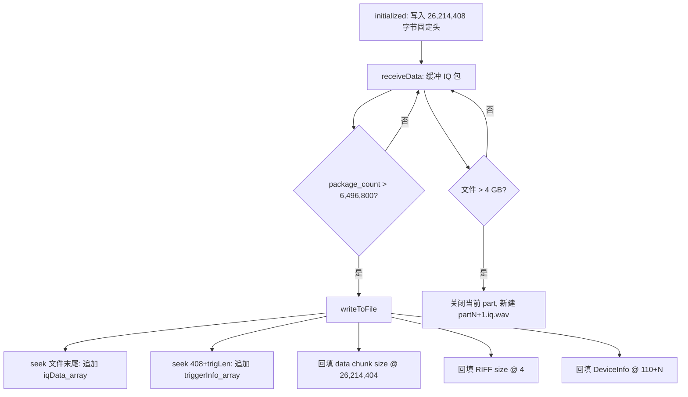

# 06 - IQS `.iq.wav` 文件格式说明

> 适用范围：IQS 模式录制的 IQ 数据文件（扩展名 `*.iq.wav`）

## 1. 格式概述

IQS 录制文件在标准 RIFF/WAVE 容器上扩展了 HAROGIC 私有 chunk，用于同时保存：

- **IQ 采样数据**（`data` chunk，追加写入）
- **每包触发/设备状态元数据**（`trig` chunk 预留区内追加）
- **设备配置与流信息**（`prof` chunk，MsgPack 序列化）
- **设备标识信息**（`prof` chunk 尾部，录制过程中更新）

该格式 **不是** 可直接用普通音频播放器播放的标准 PCM WAV；`fmt` chunk 中的声道/采样率字段主要用于描述 IQ 数据的逻辑结构（I/Q 两路、等效采样率）。

### 1.1 文件命名

| 模式 | 命名模式 | 示例 |
|------|----------|------|
| 普通录制 | `{uidPrefix}_{yyyyMMdd_hhmmss}.part{N}.iq.wav` | `a3f2_20260708_143025.part1.iq.wav` |
| 快速录制 | `{uidPrefix}_{yyyyMMdd_hhmmss}_qk.part{N}.iq.wav` | `a3f2_20260708_143025_qk.part1.iq.wav` |

- `{uidPrefix}`：设备 UID 低 4 位十六进制（无 UID 时省略）
- `{N}`：分片序号，从 1 递增（`fileCount`）
- 一次连续录制可产生多个 `part` 文件；回放时 `AbstractFileReader::fileFilter()` 按 `.part1.`、`.part2.` … 排序拼接

### 1.2 识别特征

回放打开文件时，`IQSFileReader` 在偏移 **46** 处校验魔数与协议版本：

| 偏移 | 长度 | 期望值 | 含义 |
|------|------|--------|------|
| 46 | 1 | `0x8C` | 魔数字节 'H' |
| 47 | 1 | `0x22` | 魔数字节 'D' |
| 48 | 1 | `0x52` | 魔数字节 'R' |
| 49 | 1 | `0x9B` | 魔数字节 'L' |
| 50 | 1 | `0x00` | 协议主版本 |
| 51 | 1 | `0x02` | 协议次版本（**IQS = 0x0002**） |

同时校验文件中记录的 API 版本与当前运行时 API 版本的主/次版本号是否一致。

## 2. 整体布局

```text
┌─────────────────────────────────────────────────────────────────┐
│ RIFF Header (offset 0)                                          │
├─────────────────────────────────────────────────────────────────┤
│ fmt  chunk  (offset 12, 24 bytes total)                         │
├─────────────────────────────────────────────────────────────────┤
│ prof chunk  (offset 36, 364 bytes = 4+4+356)                    │
│   ├─ 固定头：分片号、魔数、API 版本、幅度偏移                      │
│   ├─ MsgPack：IQS_Profile + IQS_StreamInfo                      │
│   └─ DeviceInfo（2B 长度 + 20B 内容，录制过程中回填）             │
├─────────────────────────────────────────────────────────────────┤
│ trig chunk  (offset 400, 25 MiB 预留区)                          │
│   └─ 按包追加 TriggerRecord × N（每包 405 字节）                  │
├─────────────────────────────────────────────────────────────────┤
│ data chunk  (offset 26,214,400)                                 │
│   ├─ chunk header: "data" + size (8 bytes)                      │
│   └─ IQ 原始字节流（按 API 包顺序追加，offset 26,214,408 起）     │
└─────────────────────────────────────────────────────────────────┘
```

### 2.1 关键尺寸常量

| 常量 | 值 | 说明 |
|------|-----|------|
| `trigChunkLength` | `25 × 1024 × 1024` = **26,214,400** | trig 区总占用（含 chunk 头） |
| 固定头部长度 | **400** | RIFF + fmt + prof 合计 |
| 初始文件大小 | **26,214,408** | `400 + trigChunkLength + 8`（含空 data chunk 头） |
| `headerSize`（回放） | **26,214,400** | `25 MiB + 400`，用于计算数据区偏移 |
| 数据区起始偏移 | **26,214,408** | `headerSize + 8`，跳过 data chunk 头 |
| 单文件上限 | **4,021,746,808** | 约 4 GB（代码注释：61500×64968 + 25 MiB + 408） |
| 每包 TriggerRecord | **405** | `IQSFileWriter::pack()` 固定输出 |
| 典型每包 IQ 字节 | **64,968** | Complex16bit、16242 点/包时；实际以 `PacketDataSize` 为准 |

## 3. Chunk 详细说明

### 3.1 RIFF 头（offset 0–11）

| 偏移 | 长度 | 字节序 | 字段 | 说明 |
|------|------|--------|------|------|
| 0 | 4 | — | ChunkID | 固定 `"RIFF"` |
| 4 | 4 | **LE** uint32 | ChunkSize | 文件总大小 − 8；初始写 `36`，录制过程中反复更新 |
| 8 | 4 | — | Format | 固定 `"WAVE"` |

### 3.2 fmt chunk（offset 12–35）

标准 PCM 格式描述，字段在 `IQSFileWriter::initialized()` 中写入：

| 偏移 | 长度 | 字节序 | 字段 | 值 / 来源 |
|------|------|--------|------|-----------|
| 12 | 4 | — | ChunkID | `"fmt "` |
| 16 | 4 | LE uint32 | ChunkSize | `16` |
| 20 | 2 | LE uint16 | AudioFormat | `1`（PCM） |
| 22 | 2 | LE uint16 | NumChannels | `2`（I 路 + Q 路） |
| 24 | 4 | LE uint32 | SampleRate | `streamInfo.IQSampleRate` |
| 28 | 4 | LE uint32 | ByteRate | `SampleRate × 2 × m_dataWidth` |
| 32 | 2 | LE uint16 | BlockAlign | `2 × m_dataWidth` |
| 34 | 2 | LE uint16 | BitsPerSample | `m_dataWidth × 8` |

**`m_dataWidth`（每声道样本字节数）** 由 `DataFormat` 决定：

| DataFormat | m_dataWidth | BitsPerSample |
|------------|-------------|---------------|
| Complex16bit | 2 | 16 |
| Complex32bit | 4 | 32 |
| Complex8bit | 1 | 8 |
| 其他（含 Complexfloat） | 2（默认） | 16 |

### 3.3 prof chunk（offset 36–399）

| 偏移 | 长度 | 字节序 | 字段 | 说明 |
|------|------|--------|------|------|
| 36 | 4 | — | ChunkID | `"prof"` |
| 40 | 4 | LE uint32 | ChunkSize | 固定 `356`（payload 长度，不含 8 字节 chunk 头） |
| 44 | 2 | **BE** uint16 | PartNumber | 当前分片序号（从 1 开始） |
| 46 | 4 | BE | Magic | `8C 22 52 9B`（"HDRLJ" 魔数） |
| 50 | 2 | BE | ProtocolVersion | `0x0002`（IQS 协议） |
| 52 | 4 | BE uint32 | APIVersion | 录制时设备 API 版本 |
| 56 | 10 | — | （未使用） | 初始填充 `'X'`，无业务写入 |
| 66 | 8 | **BE** double | AmpOffset | 幅度补偿偏移（dB 相关，录制时传入） |
| 74 | 34 | — | （未使用） | 初始填充 |
| 108 | 2 | BE uint16 | ProfileStreamInfoLen | 后续 MsgPack  blob 长度 |
| 110 | N | — | ProfileStreamInfo | MsgPack 序列化数据（见 §4） |
| 110+N | 2 | BE uint16 | DeviceInfoLen | 设备信息长度（通常 20） |
| 110+N+2 | M | — | DeviceInfo | 设备信息（见 §5.2）；初始可能为占位，录制 flush 时更新为最后一包内容 |
field[01] = 1000000000      疑似 CenterFreq_Hz，即 1 GHz
field[12] = -10             疑似 RefLevel_dBm
field[28] = 99999962.37     疑似 span/bandwidth 类参数，约 100 MHz
field[32] = 62500000        采样/带宽相关参数，62.5 MHz
field[43] = 25000000
field[44] = 31250000        当前代码用作 IQSampleRate
field[48] = 16240           当前代码用作 PacketSamples
field[49] = 64960           当前代码用作 PacketDataSize
**prof chunk 有效载荷上限**：356 字节。MsgPack 数据与 DeviceInfo 必须落在 prof 声明的 356 字节 payload 内（110 偏移起到 offset 399 止，共 290 字节可用空间减去 DeviceInfo 长度字段）。若 MsgPack 过长，会导致头部写入异常——实际录制配置下长度由 `IQS_ProfileStreamInfo::toByteArray()` 决定。

### 3.4 trig chunk（offset 400 – 26,214,399）

| 偏移 | 长度 | 字节序 | 字段 | 说明 |
|------|------|--------|------|------|
| 400 | 4 | — | ChunkID | `"trig"` |
| 404 | 4 | LE uint32 | ChunkSize | `trigChunkLength − 8` = **26,214,392** |
| 408 | 405 × N | — | TriggerRecord[] | 每 IQ 包对应一条 405 字节记录，顺序追加 |

Trigger 记录在录制过程中写入偏移 `408 + triggerInfo_array_length`（非覆盖整个 25 MiB，而是从头顺序增长）。25 MiB 为上限预留。

#### TriggerRecord 结构（405 字节，大端）

每条记录对应 `IQSFileWriter::pack()` / `IQSFileReader::unpack()` 的编解码，布局如下：

| 记录内偏移 | 长度 | 类型 (BE) | 字段 | 来源 |
|------------|------|-----------|------|------|
| 0 | 2 | uint16 | TriggerInfoLen | 固定 **337** |
| 2 | 8 | uint64 | SysTimerCountOfFirstDataPoint | `IQS_TriggerInfo` |
| 10 | 2 | uint16 | InPacketTriggeredDataSize | `IQS_TriggerInfo` |
| 12 | 2 | uint16 | InPacketTriggerEdges | `IQS_TriggerInfo` |
| 14 | 100 | uint32[25] | StartDataIndexOfTriggerEdges | `IQS_TriggerInfo` |
| 114 | 200 | uint64[25] | SysTimerCountOfEdges | `IQS_TriggerInfo` |
| 314 | 25 | int8[25] | EdgeType | `IQS_TriggerInfo` |
| 339 | 2 | uint16 | DeviceStateLen | 固定 **52** |
| 341 | 2 | int16 | Temperature | `DeviceState` |
| 343 | 2 | uint16 | RFState | `DeviceState` |
| 345 | 2 | uint16 | BBState | `DeviceState` |
| 347 | 8 | double | AbsoluteTimeStamp | `DeviceState` |
| 355 | 4 | float | Latitude | `DeviceState` |
| 359 | 4 | float | Longitude | `DeviceState` |
| 363 | 2 | uint16 | GainPattern | `DeviceState` |
| 365 | 8 | int64 | RFCFreq | `DeviceState` |
| 373 | 4 | uint32 | ConvertPattern | `DeviceState` |
| 377 | 4 | uint32 | NCOFTW | `DeviceState` |
| 381 | 4 | uint32 | SampleRate | `DeviceState` |
| 385 | 2 | uint16 | CPU_BCFlag | `DeviceState` |
| 387 | 2 | uint16 | IFOverflow | `DeviceState` |
| 389 | 2 | uint16 | DecimateFactor | `DeviceState` |
| 391 | 2 | uint16 | OptionState | `DeviceState` |
| 393 | 4 | float | IQS_ScaleToV | `IQStream_TypeDef` |
| 397 | 4 | float | MaxPower_dBm | `IQStream_TypeDef` |
| 401 | 4 | uint32 | MaxIndex | `IQStream_TypeDef` |
| **合计** | **405** | | | |

回放时按包索引 `k` 定位：

```text
trigOffset(k) = 408 + k × 405
```

### 3.5 data chunk（offset ≥ 26,214,400）

| 偏移 | 长度 | 字节序 | 字段 | 说明 |
|------|------|--------|------|------|
| 26,214,400 | 4 | — | ChunkID | `"data"` |
| 26,214,404 | 4 | LE uint32 | ChunkSize | IQ  payload 总字节数；初始为 0，flush 时更新 |
| 26,214,408 | 变长 | — | IQ Payload | 按包顺序追加的原始 `AlternIQStream` 字节 |

#### IQ Payload 内容

每个数据包对应 API `IQS_GetIQStream_PM2` 返回的 `IQStream_TypeDef.AlternIQStream`，长度为 `IQS_StreamInfo.PacketDataSize`（录制时保存于 MsgPack 的 `streamInfo.PacketDataSize`）。

数据排列为 **交替 I/Q 采样**（与 API 内存布局一致）：

- Complex16bit：每个复数样本 4 字节（I int16 + Q int16）
- Complex32bit：每个复数样本 8 字节
- Complex8bit：每个复数样本 2 字节

每包样本数 = `PacketSamples`（MsgPack 中 `streamInfo.PacketSamples`）。

回放定位（第 `k` 包，0-based）：

```text
dataOffset(k) = 26_214_408 + k × PacketDataSize
```

> **注意**：当前 `IQSFileReader` 中 `perPackLen` 硬编码为 **64968**。若录制时 `PacketDataSize` 不同，回放 seek 可能不正确。正常 IQS 录制（Complex16bit、16242 点/包）下为 64968。

## 4. ProfileStreamInfo（MsgPack 载荷）

写入：`IQS_ProfileStreamInfo::toByteArray()`  
读取：`IQSFileReader::profileStreamInfoFromByteArray()`

使用项目内 `MsgPackStream` 按顺序序列化以下字段：

### 4.1 IQS_Profile_TypeDef 字段（按序）

| # | 字段 |
|---|------|
| 1 | CenterFreq_Hz |
| 2 | RefLevel_dBm |
| 3 | DecimateFactor |
| 4 | RxPort |
| 5 | BusTimeout_ms |
| 6 | TriggerSource |
| 7 | TriggerEdge |
| 8 | TriggerMode |
| 9 | TriggerLength (quint64) |
| 10 | TriggerOutMode |
| 11 | TriggerOutPulsePolarity |
| 12 | TriggerLevel_dBm |
| 13 | TriggerLevel_SafeTime |
| 14 | TriggerDelay |
| 15 | PreTriggerTime |
| 16 | TriggerTimerSync |
| 17 | TriggerTimer_Period |
| 18 | EnableReTrigger |
| 19 | ReTrigger_Period |
| 20 | ReTrigger_Count |
| 21 | DataFormat |
| 22 | GainStrategy |
| 23 | Preamplifier |
| 24 | AnalogIFBWGrade |
| 25 | IFGainGrade |
| 26 | EnableDebugMode |
| 27 | ReferenceClockSource |
| 28 | ReferenceClockFrequency |
| 29 | EnableReferenceClockOut |
| 30 | SystemClockSource |
| 31 | ExternalSystemClockFrequency |
| 32 | NativeIQSampleRate_SPS |
| 33 | EnableIFAGC |
| 34 | Atten |
| 35 | DCCancelerMode |
| 36 | QDCMode |
| 37 | QDCIGain |
| 38 | QDCQGain |
| 39 | QDCPhaseComp |
| 40 | DCCIOffset |
| 41 | DCCQOffset |
| 42 | LOOptimization |

### 4.2 IQS_StreamInfo_TypeDef 字段（按序）

| # | 字段 | 类型注意 |
|---|------|----------|
| 1 | Bandwidth | |
| 2 | IQSampleRate | |
| 3 | PacketCount | quint64 |
| 4 | StreamSamples | quint64 |
| 5 | StreamDataSize | quint64 |
| 6 | PacketSamples | |
| 7 | PacketDataSize | **决定每包 IQ 字节长度** |
| 8 | GainParameter | |

回放时 `TriggerMode` 会被强制设为 `Adaptive`，其余 profile 字段按文件还原。

## 5. DeviceInfo

### 5.1 二进制布局（20 字节，大端）

由 `IQSFileWriter::packDeviceInfo()` 生成：

| 偏移 | 长度 | 类型 (BE) | 字段 |
|------|------|-----------|------|
| 0 | 8 | uint64 | DeviceUID |
| 8 | 2 | uint16 | Model |
| 10 | 2 | uint16 | HardwareVersion |
| 12 | 4 | uint32 | MFWVersion |
| 16 | 4 | uint32 | FFWVersion |

### 5.2 写入时机

- 文件头初始写入时，prof 尾部 DeviceInfo 区域可能仍为占位数据
- 每次 `writeToFile()` / 录制结束 flush 时，将 **当前批次最后一包** 的 `DeviceInfo` 写回偏移 `110 + profileStreamInfoArrayLen`

## 6. 录制过程中的文件更新

录制并非一次性顺序写盘，而是 **分区追加 + 头部回填**：



| 更新项 | 文件偏移 | 时机 |
|--------|----------|------|
| IQ 数据 | 文件末尾（≥ 26,214,408） | 每批 flush |
| Trigger 记录 | 408 + 已有 trig 长度 | 每批 flush |
| data chunk size | 26,214,404 | 每批 flush |
| RIFF chunk size | 4 | 每批 flush |
| DeviceInfo | 110 + ProfileStreamInfoLen | 每批 flush |

批量 flush 阈值：`package_count > 6,496,800` 字节（约 100 个 64968 字节的包）；或缓冲待写数据超过约 8 MB（`run()` 中判断）。

## 7. 分片与容量

### 7.1 单文件大小限制

当 `m_file.size() > 4,021,746,808` 或本批写入会导致超限时：

1. flush 当前文件
2. `fileCount++`，创建 `{basename}.part{N+1}.iq.wav`
3. 重新写入完整固定头（prof 中 PartNumber 递增）

### 7.2 数据量估算

有效 IQ 数据量（不含头）近似：

```text
IQ_bytes ≈ PacketCount × PacketDataSize
```

UI 展示的文件大小估算（含 25 MiB trig 头开销）：

```text
file_size ≈ IQ_bytes + ceil(IQ_bytes / 3.74GiB) × 25MiB + 408
```

（见 `IQSIRecorderImpl::calRecordTimeSizeByPoints` 等）

## 8. 回放读取行为摘要

`IQSFileReader` 按以下逻辑解析文件：

1. **校验**：偏移 46 魔数 + 协议 0x0002 + API 版本兼容
2. **读配置**：偏移 44 起读 prof 固定头；偏移 110 起反序列化 MsgPack
3. **读 DeviceInfo**：紧跟 MsgPack 之后
4. **计算包间隔**：读前两包 TriggerRecord 的 `SysTimerCountOfFirstDataPoint` 差值推算回放 pacing
5. **按包读取**：
   - Trigger：`seek(408 + k × 405)`
   - Data：`seek(26_214_408 + k × PacketDataSize)`（reader 中 PacketDataSize 以 64968 常量使用）
6. **多 part 文件**：按 `fileList` 顺序拼接，`totalDataLength = Σ (fileSize − 26_214_400)`

## 9. 与其他 WAV 变体的区别

| 项目 | IQS `.iq.wav` | DET `.det.wav` | 说明 |
|------|---------------|----------------|------|
| 协议版本 (offset 50–51) | `0x0002` | `0x0004` | 不同测量模式 |
| fmt PCM 字段 | 完整写入 | 注释掉/未写 | IQS 写标准 fmt |
| data 内容 | IQ AlternIQStream | DET 专用数据 | 数据结构不同 |
| TriggerRecord | 405 字节 | 不同布局 | 各自 pack/unpack |

## 10. 解析示例（伪代码）

```python
HEADER_SIZE = 25 * 1024 * 1024 + 400   # 26_214_400
DATA_START  = HEADER_SIZE + 8          # 26_214_408
TRIG_START  = 408
TRIG_RECORD = 405

def read_packet(f, k, packet_data_size):
    f.seek(TRIG_START + k * TRIG_RECORD)
    trig = f.read(TRIG_RECORD)
    # 解析 trig: 大端，见 §3.4

    f.seek(DATA_START + k * packet_data_size)
    iq = f.read(packet_data_size)
    # iq 为 AlternIQStream 原始字节

    return trig, iq
```

## 11. 相关源码

| 文件 | 职责 |
|------|------|
| `src/libs/recordplay/iqsfilewriter.cpp` | 文件头构造、TriggerRecord 打包、分片写入 |
| `src/libs/recordplay/iqsfilewriter.h` | 常量、`trigChunkLength`、缓冲结构 |
| `src/libs/recordplay/iqsfilereader.cpp` | 格式校验、MsgPack 反序列化、按包 seek |
| `src/libs/recordplay/abstractfilereader.cpp` | 多 part 文件发现与排序 |
| `src/plugins/iqs/device/iqsdevice.cpp` | 录制启停、API 数据采集 |

---

*字节序约定：WAV 标准 chunk 头（RIFF/fmt/data/trig）使用 **小端**；prof 固定字段、TriggerRecord、DeviceInfo、MsgPack 数值使用 **大端**（与 `qToBigEndian` / `qFromBigEndian` 一致）。*
