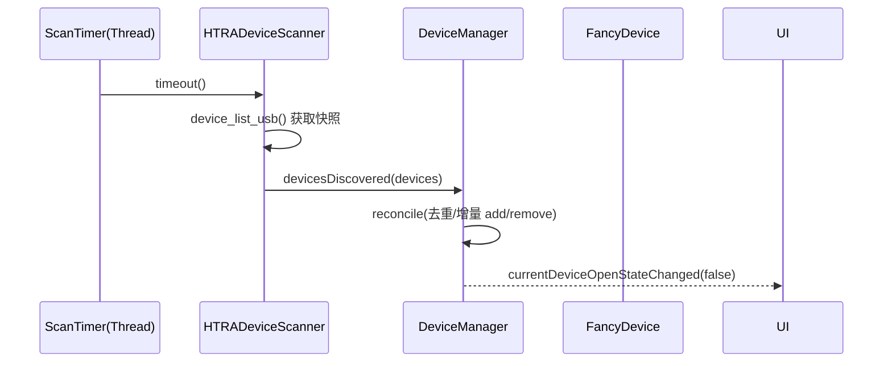
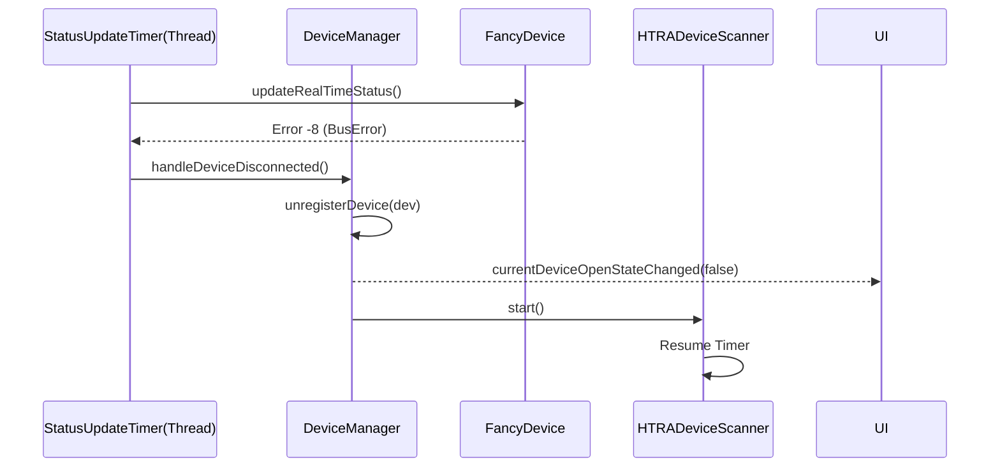

# 设备发现与管理架构

## 1. 背景

职责分离为三层：**Scanner (发现)**、**Manager (调度)**、**Device (执行)**，统一了线程模型和生命周期管理。

## 2. 核心架构设计

### 2.1 架构分层
*   **Core 层**: 定义标准接口 `IDeviceScanner`, `IDevice`，以及核心管理者 `DeviceManager`。
*   **Plugin 层 (HTRA)**: 实现具体的扫描器 `HTRADeviceScanner` 和设备驱动 `FancyDevice`。

### 2.2 线程模型
采用 "业务独占线程 + 消息驱动" 的模式，避免主线程阻塞。

| 线程名称 | 所属对象 | 职责 | 生命周期 |
| :--- | :--- | :--- | :--- |
| **Main Thread** | QApplication | UI 渲染、信号槽调度 | 整个 App 生命周期 |
| **HTRADeviceScanThread** | HTRADeviceScanner | 执行设备枚举（`device_list_usb`）并产出快照 | 插件加载时创建，退出时销毁 |
| **DeviceStatusUpdateThread** | DeviceManager | 周期性查询设备硬件状态 (温度/GPS) | Core 加载时创建，退出时销毁 |
| **AllkindsOfBusinessThread** |AllKindsofBusiness | 设备配置，波形数据流式下发 

### 2.3 驱动层无状态设计原则 (Refactored)
*   **去除 QObject 继承**: `IDevice` 重构为纯 C++ 接口类，移除 `QObject` 继承。
    *   **解决线程亲和性 (Thread Affinity)**: 允许设备驱动对象在不同线程（扫描线程创建、管理线程维护、业务线程调用）之间自由传递和调用，无需担心 `QObject` 的线程归属限制。
*   **单一事实来源 (Single Source of Truth)**: 
    *   移除设备自身的 `openStateChanged` 信号。
    *   设备状态（连接/断开）完全由 `DeviceManager` 通过轮询 (`updateRealTimeStatus`) 判定。
    *   UI 状态更新仅依赖 `DeviceManager` 发出的信号（如 `currentDeviceOpenStateChanged`），避免 Driver 和 Manager 状态不同步。

---

## 3. 详细实现

### 3.1 IDeviceScanner 接口 (Core)
定义了通用的设备发现契约：
*   `scan()`: 执行一次扫描，返回发现的设备列表。
*   `start()` / `stop()`: 控制扫描器的启停。
*   `devicesDiscovered(QList<IDevice*>)`: 发现设备信号。

### 3.2 HTRADeviceScanner (HTRA Plugin)
负责具体的 HTR/HTRA 设备探测。
*   **实现机制**: 使用 `QTimer` + `moveToThread` 模式，在 `HTRADeviceScanThread` 中运行（默认 1s 间隔）。
*   **枚举快照逻辑（现状）**:
    - 周期性调用 `device_list_usb()` 获取 present 设备快照。
    - 对每条 `device_info`：
        - 若 UID 已存在对应 `IDevice` 对象：刷新其扫描信息（尤其是设备号 `dnum`）。
        - 若 UID 不存在：创建新 `FancyDevice` 并注入扫描信息。
    - **不在扫描阶段 open 设备**（避免与“阶段 A：同一时刻仅 open 一台”策略冲突）。
*   **错误防抖**: 缓存上一次错误消息，仅在错误内容变化时通过 `DeviceManager::postMessage` 通知用户，避免刷屏。
*   **扫描失败语义**: 扫描失败时不发射 `devicesDiscovered`，防止上层把“空列表”误当成“全部设备拔出”。

### 3.3 DeviceManager (Core)
全局设备生命周期管理者。
*   **Scanner 管理**: 维护注册的 Scanner 列表。
*   **设备注册（快照对账）**:
    - 接收 Scanner 的 `devicesDiscovered(QList<IDevice*>)`。
    - 以 `DeviceUID` 为键去重，并计算增量：新增则 register；缺失则 unregister（视为物理拔出）。
    - 新增设备不会抢占 current（除非 current 为空）。
    - 仅 `managedByScannerSnapshot() == true` 的设备参与这套 reconcile 语义；手工 ETH 这类 manual-managed 目标会显式跳过，避免被 USB 快照误删。
*   **状态轮询**: 
    - 维护 `DeviceStatusUpdateThread` 和 `QTimer` (1s 间隔)。
    - 定期调用当前设备的 `updateRealTimeStatus()`。
    - **断开检测**: 在状态轮询中，若 `connected=false` 或错误码为 `-8 (BusError)`，判定为设备断开。
*   **断开处理流程**:
    1. 通过 `DeviceManager::unregisterDevice(...)` 统一清理（内部包含停止状态更新、通知 UI、销毁设备）。
    2. **重启扫描**: 遍历所有 Scanner 调用 `start()`。

补充（2026-04-09）：
- 当前手工 ETH 是通过 `IManualEthDeviceFactory` 创建的 manual-managed device，并不属于 scanner 发现结果。
- 这是一条过渡 seam：它把“设备来源”问题从 USB scanner 语义里分离出来，但并没有改变 `DeviceManager` 仍然是唯一 open/close 编排者这一主事实。
- 详见 [manual_eth_connect_temporary_design.md](manual_eth_connect_temporary_design.md)。

### 3.4 FancyDevice (Driver)
纯粹的驱动封装，移除原有自主线程。
*   **纯 C++ 实现**: 
    - 任何线程均可安全调用（内部通过 `QMutex` 保证线程安全）。
*   **按 dnum 打开**:
    - 说明：`device_info` 结构体中没有 `dnum` 字段；当前 SDK 语义中 `dnum` 实际为 `device_list_usb()` 返回数组的索引 `i`。
    - 扫描阶段注入 `dnum=i`，open 时调用 `device_open_usb(&device, dnum, ...)`。
*   **USB / ETH 生命周期分流**:
    - USB 发现设备仍以扫描注入的 `dnum` 为首次 open/reopen 基础。
    - 手工 ETH 设备通过 `configureManualEthTarget(...)` 写入 endpoint，并通过 `ethEndpoint(...)` 暴露 `IP + Port` 供 Core 层做“同 endpoint 已打开设备复用”。
    - 切换生命周期不再按 transport 或 ETH pair 分支：任意已打开旧设备切到非空目标时均 retain；同 IP 的 5000/5001 只用于标题栏 A/B 投影。
    - retained USB UID 持续保留在 `InstanceStateRegistry::ownedUsbKeys`，当前多实例 startup gate / runtime owner 过滤仍可阻止其他实例 claim，详见 [multi_instance_usb_ownership_and_startup_gate.md](multi_instance_usb_ownership_and_startup_gate.md)。
*   **断开后资源释放**:
    - USB 断开后进入 `DisconnectedPendingClose`，后续 `close()` / 析构仍会执行一次 `device_close()`。
    - ETH 断开在实时状态查询路径里直接执行 `device_close()`，不再保留“断开后析构跳过 close”的旧语义。
*   **状态查询**: `updateRealTimeStatus()` 作为虚函数由 Manager 线程调用，保证线程安全。

---

## 5. 单 current 假设的集中点
当前实现建立在“系统仅有一个受控设备”的前提上，主要集中于以下位置：
*   **DeviceManager 状态模型**: 仍以唯一 `currentDevice` 为中心；retained USB/ETH 可以保持 open 并自主 Playback，但不是第二条实时控制链路。
*   **状态轮询**: 轮询线程只针对 `currentDevice`（可扩展但当前不需要）。
*   **UI/业务驱动链路**: UI 与 Business 默认围绕 `currentDevice` 工作（多设备并发控制不在阶段 A 范围）。

## 6. 多设备扩展的核心演进路径
为适配未来 API 支持多设备，需要在不破坏现有行为的前提下逐步演进：
1. **设备集合模型化**
    * 维护设备索引（如 `DeviceId/Uuid`），提供 `deviceAdded/removed/updated` 信号。
    * 保留 `currentDevice` 作为“活动设备”语义，兼容现有 UI 与业务。
2. **发现逻辑批量化**
    * `onDevicesDiscovered` 处理完整列表：去重、增量注册、状态刷新。
    * 不再默认“新设备 = 旧设备断开”，避免强制替换。
3. **状态轮询可扩展化**
    * 轮询所有在线设备（单线程遍历或按设备独立定时器）。不要连接设备成功后旧停止Scanner
4. **信号语义分层**
    * 新增 `deviceOpenStateChanged(DeviceId, bool)` 等“设备级信号”。
    * 现有 `currentDeviceOpenStateChanged(bool)` 保留为活动设备投影。
5. **业务与 UI 上下文化**
    * 业务与设备绑定（按设备维护 Profile/状态缓存）。
    * UI 增加设备选择与多设备展示，默认仍选中“首个活动设备”。

---

## 4. 关键流程图

### 4.1 设备发现与上线

### 4.2 设备断开与恢复扫描

