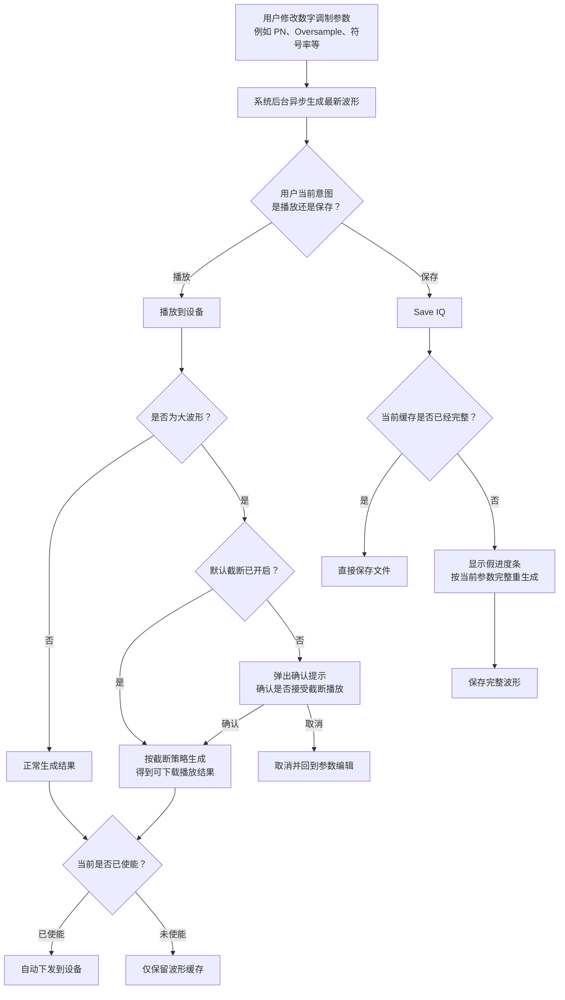

# 数字调制业务用户交互流程

## 核心结论

数字调制这个业务，从用户视角可以稳定收敛为两个意图：

1. 根据当前参数生成波形，并下发到设备内存中播放。
2. 保存波形，用于离线分析或后续流式播放。

当前交互设计的核心思想，是把这两个意图明确拆开：

- 播放链路优先保证“可播放、可确认、可预期”。
- 保存链路优先保证“保存结果完整”，不沿用截断播放的语义。

## 用户视角的整体流程

### 1. 参数编辑阶段

- 用户在数字调制界面修改参数，例如 `PN`、`Oversample`、符号率等。
- `Oversample` 菜单不是固定开放 2~32 的全部偶数：普通调制按 `Rb * SPS`，FSK 按 `max(Rb * SPS, 4 * (Rb + MaxDF))` 计算候选采样率，再与当前设备 Playback 采样率域求交集。
- 对返回 `OPTION_BW_320M_TX` 的设备，连续档只到 200 MHz，400 MHz 是精确离散点；落入 200~400 MHz 空洞的 SPS 不可选，只有计算结果精确命中 400 MHz 时才开放该项。未返回该选件时上限为125 MHz。
- 系统不会要求用户手动点“重新生成”，而是按当前参数在后台异步生成最新波形。
- 生成期间，用户可以继续停留在当前界面；界面重点是保持编辑连续性，而不是暴露底层计算过程。

### 2. 生成完成后的分流

异步生成完成后，系统根据用户当前意图分成两条主线：

#### 主线 A：播放到设备

- 如果数字调制当前已经处于使能状态，新的波形生成完成后，系统会自动刷新并下发到设备内存中播放。
- 如果当前未使能，系统会先保留最新波形结果，等待用户后续启用。
- 这样用户在调参数时，不需要频繁手动触发“生成 + 下发”，也不会在未使能时被强制播放。

#### 主线 B：保存波形

- 用户点击 Save IQ 时，目标不再是“保存当前播放缓存”，而是“保存与当前参数一致的完整波形”。
- 因此保存业务和播放业务需要明确区分，不能简单复用同一份截断缓存。

## 大波形下的播放交互

当当前参数会生成超过设备内存上限的大波形时，播放链路会进入大波形策略。

这里的“设备内存上限”来自当前能力快照：未返回 `OPTION_BW_320M_TX` 时为125 MiB，返回该选件时为1000 MiB。提示判断、`SymbolLength` 反推和实际生成上限使用同一个值；等于上限仍合法，只有严格大于上限才进入 trim 语义。

### 1. 默认策略

- 界面提供 `Default Trim Download` 选项。
- 如果用户保持勾选，系统默认接受“截断生成后下发”的播放语义。
- 如果用户取消勾选，系统在继续前必须弹出确认提示。

### 2. 用户感知到的交互

- 默认截断开启：用户修改参数后，系统直接按截断策略生成可下载波形；如果当前已使能，生成完毕后自动刷新下发。
- 默认截断关闭：用户修改到大波形参数时，系统先弹出提示态。

### 3. 这条链路的体验目标

- 用户只需要判断一件事：是否接受“为了播放而截断”。

## 已有 trimmed 波形再次使用时的交互

- 如果当前缓存本身就是一次 trimmed 结果，系统不会把它伪装成“完整波形”。
- 当用户关闭默认截断策略后，再次启用或继续沿用这份 trimmed 缓存时，系统会重新弹出确认提示。
- 确认后直接复用现有 trimmed 缓存，不重新生成。
- 取消则保持未使能，或关闭当前使能状态。

这样可以保证：

- 旧的 trimmed 结果可以复用，提高交互效率。
- 但系统不会在用户已经改变策略偏好后，静默继续沿用截断播放语义。

## 设备切换时的交互

- 临时断连或尚未得到可用能力时，保留当前 Digital 参数，不提前复位。
- 新设备能力确认后，如果当前整组参数产生的采样率仍合法，则保留参数，并按新设备的125/1000 MiB容量重新生成播放结果。
- 如果从含带宽选件档切换到无带宽选件档后当前采样率越界，Digital 不逐项做复杂钳位，而是关闭使能并把整组参数恢复为默认配置。
- 上述设备切换收口全部静默执行，不弹窗。设备切换场景唯一保留的容量弹窗属于文件 Playback：已加载文件因新设备容量不足而被自动卸载。

## Save IQ 的整体业务流程

Save IQ 应当代表“保存完整波形”，而不是“把当前缓存原样落盘”。

### 目标交互原则

- 如果当前缓存已经是完整波形，可以直接保存。
- 如果当前缓存不是完整波形，例如它来自截断播放结果，则不能直接保存。
- 这时系统应该显示一个假的进度条，并按当前参数现场生成完整波形，再执行保存。

### 用户能理解的行为

1. 用户点击 Save IQ。
2. 系统检查当前缓存是否已经完整。
3. 若缓存完整，直接保存。
4. 若缓存不完整，弹出进度条。
5. 系统按当前参数重新生成完整波形。
6. 完整波形生成完成后写出文件。

从用户体验角度，这样可以避免两个误解：

- 用户以为自己保存的是完整波形，实际拿到的却是截断片段。
- 用户以为保存行为只是“导出当前播放状态”，而不是“导出当前参数对应的完整结果”。

## 当前状态与下一步边界

### 已落地的体验

- 参数修改后异步生成最新波形。
- 生成完成后，如果当前业务已使能，则自动刷新下发到设备播放。
- 大波形支持默认截断策略和确认提示。
- Trim 结果不会再导致数字调制自动使能。
- 已有 trimmed 缓存再次使用前会重新确认。
- SPS 可选项和大波形阈值随当前设备能力刷新。
- 设备切换导致 Digital 参数越界时，整组默认复位并关闭使能，不弹窗。
- Save IQ 已实现“完整缓存直接保存 / trimmed 缓存按当前参数完整重生成后保存”，并在完整重生成期间显示进度。

### 已完成的算法边界收口

- Digital、DSSS、OFDM 的 current domain/capacity 决策均位于各自 business；第三方 generator 不再缓存 `PlaybackCapabilities`。
- business 将永久回写后的 profile 与精确 generation plan 一起提交；generator 只负责算法归一化、第三方调用、租约、外部指针接管及结果计算。
- HTRA 其他生成型 Playback 也采用同一边界，因此设备切换策略不会下沉到算法实现。

## 整体流程图

下面保留一份 Mermaid 源码，便于后续直接导入 draw.io 继续编辑。

在 draw.io 中可通过 Insert -> Advanced -> Mermaid 粘贴下方内容；如果希望直接导入独立源文件，也可以使用同目录下的 `digital_modulation_user_interaction_flow.mmd`。

建议后续以 Mermaid 或 `.mmd` 作为流程图源文件维护，SVG 只作为汇报展示产物，这样更适合版本管理，也更方便在 draw.io 中继续调整节点和连线。

- 这张图只保留用户能理解的业务流程，不展开底层线程、对象和算法细节。
- 播放链路强调“异步生成完成后，按使能状态自动下发”。
- 保存链路强调“保存结果必须完整，而不是复用截断播放缓存”。

## 管理层汇报口径

- 数字调制当前已经把“参数编辑 -> 异步生成 -> 按使能自动播放”的主线体验做顺了。
- 大波形播放已经从复杂的多分支提示收敛为“是否接受截断播放”的单一决策。
- 整体业务已经形成“播放”和“保存”两条清晰主线，后续重点是把 Save IQ 补齐为完整波形保存流程。
