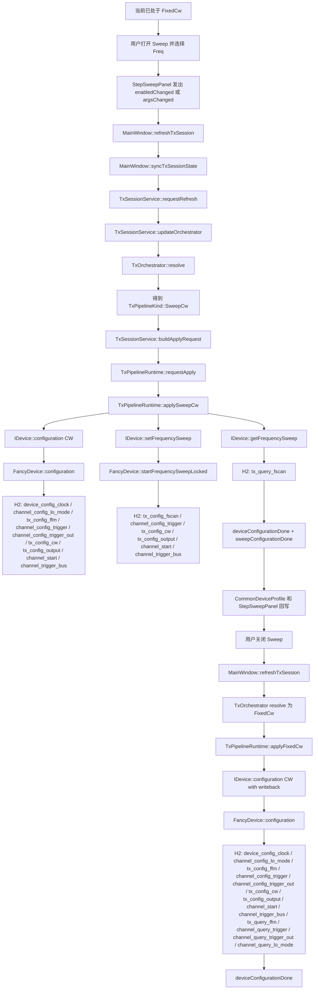

# FixedCw -> SweepCw(FScan) -> FixedCw 切换 API 总结

## 1. 适用范围与术语

本文基于当前仓库代码现状，整理下面这条切换链路在运行时会发生的所有关键调用：

1. 当前已经处于 `FixedCw`
2. 用户打开 Sweep，并选择 `Freq` 扫描
3. pipeline 变成 `SweepCw`，且 `carrier.kind = FScan`
4. 用户再关闭 Sweep， 回到 `FixedCw`

1. 设备已经打开，`DeviceManager::currentDevice()` 有效。
2. `RF = ON`。
3. `MOD = OFF`，因此不存在 playback/stream provider 参与。
4. 当前设备实现是 `FancyDevice`，底层调用 H2 API。

## 2. 一句话结论

这条 round trip 当前已经完全走共享 core-managed 主线：

- `FixedCw` 和 `SweepCw(FScan)` 都由 `TxSessionService -> TxPipelineRuntime` 执行。
- 切到 `SweepCw(FScan)` 时，runtime 会先做一次 `device->configuration(CW)`，再做一次 `device->setFrequencySweep(...)`，最后 `device->getFrequencySweep(...)` 回写 sweep 真值。
- 切回 `FixedCw` 时，runtime 只会再做一次 `device->configuration(CW, &writeback)`，不会再调用 `setFrequencySweep()`。
- 当前代码现状里，`SweepCw(FScan) -> FixedCw` 并没有显式 `channel_stop()`；KnowledgeBase 认为这在“退出运行中的 sweep”场景下是一个应该单独关注的边界。

## 3. 总流程图

## 4. 起点：当前 FixedCw 稳态本身是怎样建立的

在进入本次 round trip 之前，当前设备已经处于 `FixedCw`。这意味着最近一次成功 apply 实际已经执行过一次下面这套链路：

1. `TxSessionService::requestRefresh()`
2. `TxOrchestrator::resolve()` 得到 `TxPipelineKind::FixedCw`
3. `TxSessionService::buildApplyRequest()` 构造 `carrier.kind = Fixed`
4. `TxPipelineRuntime::applyFixedCw()`
5. `IDevice::configuration(profile.mode = CW, &writeback, ...)`
6. `FancyDevice::configuration()`
7. H2 API：
   - `device_config_clock()`
   - `channel_config_lo_mode()`
   - `tx_config_ffm()`
   - `channel_config_trigger()`
   - `channel_config_trigger_out()`
   - `tx_config_cw()`
   - `tx_config_output()`
   - `channel_start()`
   - `channel_trigger_bus()`
   - `tx_query_ffm()`
   - `channel_query_trigger()`
   - `channel_query_trigger_out()`
   - `channel_query_lo_mode()`

换句话说，本次真正的新变化不是“从空白态进入 CW”，而是“从已运行的 FixedCw 重新切到 SweepCw(FScan)，再回到 FixedCw”。

## 5. 第一段切换：FixedCw -> SweepCw(FScan)

### 5.1 UI 触发层

以 `MainWindow` 为例，用户从固定 CW 切到 FScan Sweep 时，入口通常是：

1. 用户在 `StepSweepPanel` 上打开 Sweep 按钮。
2. 如果 sweep type 还不是 `Freq`，会切到 `SweepType::Freq`。
3. 若用户继续修改 start/stop/step/dwell，也会触发同一条 apply 主线。

对应到 Qt 信号，实际会走：

1. `StepSweepPanel::enabledChanged`
2. 或 `StepSweepPanel::argsChanged`
3. `MainWindow::refreshTxSession()`

其中 `StepSweepPanel::argsChanged` 有显式 enabled 态门控：只有 Sweep 按钮已打开时，参数变化才会上冒到 `MainWindow::refreshTxSession()`。

### 5.2 Session / Orchestrator 层

`MainWindow::refreshTxSession()` 内部做两件事：

1. `syncTxSessionState()`
2. `TxSessionService::requestRefresh()`

其中 `syncTxSessionState()` 会注入两类状态：

1. `setSelectedBusiness(...)`
   - 即使 `MOD = OFF`，这里仍可能写入当前选中的 business。
   - 但由于 orchestrator 看到 `modEnabled = false`，最终不会走 provider 分支。
2. `setCarrierPlan(...)`
   - Sweep 打开时，取 `m_sweepPanel->carrierPlanKind()`。
   - 当 sweep type = `Freq` 时，这里写入的是 `CarrierPlanKind::FScan`。

随后 `TxSessionService::updateOrchestrator()` 会重新快照共享状态：

1. 从 PropertySystem 读取 `RF` 和 `MOD`
2. 读取前面注入的 `CarrierPlanKind::FScan`
3. 读取 selected business 的 provider 信息，但此时 `MOD = OFF`
4. 交给 `TxOrchestrator::resolve()`

`TxOrchestrator::resolve()` 的关键裁决条件是：

1. `RF = ON`
2. `MOD = OFF`
3. `carrierPlan != Fixed`

因此结果直接落到：

- `TxPipelineKind::SweepCw`

### 5.3 Build request 层

拿到 `SweepCw` 后，`TxSessionService::buildApplyRequest()` 会构造本次执行快照：

1. 从 `CommonDeviceProfile` 拿公共参数，填入 `TxCommonSettings`
   - `center`
   - `level`
   - `triggerCount`
   - `triggerSource / triggerAction / triggerEdge`
   - `triggerOutAction / triggerOutEdge / triggerOutState`
   - `refClockSource / refClockFrequency`
   - `loMode`
   - `systemClockOut`
2. 通过 `setCarrierPlanContextProvider(...)` 注入的 callback 调 `StepSweepPanel::fillCarrierPlanContext(...)`
3. 把下面这些 FScan 参数装进 `TxCarrierPlanContext`
   - `kind = FScan`
   - `fscanStartFreq`
   - `fscanStopFreq`
   - `fscanFreqStep`
   - `dwellTime`
4. provider 相关字段保持为 `None`/空，因为当前 `MOD = OFF`

此时形成的就是：

- `pipeline = SweepCw`
- `context.common = CommonDeviceProfile 快照`
- `context.carrier = FScan 快照`

### 5.4 Apply 分流层

`TxSessionService::applyResolvedPipeline()` 看到：

1. `SweepCw` 属于 core-managed
2. 当前 request 可被 `TxPipelineRuntime::canManageRequest()` 接收

因此不会再走旧的 `ContinuesWaveBusiness` 执行路径，而是直接：

1. 若当前有 legacy active business，则先 terminate
2. 调 `m_pipelineRuntime->requestApply(request)`

对这条 `MOD = OFF` 的 CW/sweep 路径来说，真正做设备配置的是 runtime，不是 legacy business。

### 5.5 Runtime 层精确调用

`TxPipelineRuntime::requestApply()` 收到 `SweepCw` 后会调用 `applySweepCw()`，内部顺序固定如下：

1. `fillDeviceProfile(&profile)`
   - 把 `TxCommonSettings` 写入 `IDevice::Profile`
2. `profile.mode = CW`
3. `device->configuration(profile, nullptr, &errorStr)`
   - 注意这里 `writeback` 是 `nullptr`
   - 目的不是回写，而是先把公共设备参数和 CW 执行态准备好
4. `device->setFrequencySweep(start, stop, step, level, dwell, triggerCount, &errorStr)`
5. `querySweepWriteback(...)`
   - 内部走 `device->getFrequencySweep(...)`
6. 成功后发信号：
   - `deviceConfigurationDone(writeback, {})`
   - `sweepConfigurationDone(carrierWriteback, {})`

### 5.6 `FancyDevice` 翻译成 H2 API 的实际顺序

#### 阶段 A：`device->configuration(profile.mode = CW, nullptr, ...)`

这一段由 `FancyDevice::configuration()` 完成，内部先走公共设置，再走 mode 配置。

实际 H2 API 顺序是：

1. `device_config_clock()`
2. `channel_config_lo_mode()`
3. `tx_config_ffm()`
4. `channel_config_trigger()`
5. `channel_config_trigger_out()`
6. `tx_config_cw()`
7. `tx_config_output(STATE_ON, STATE_OFF)`
8. `channel_start()`
9. `channel_trigger_bus()`

这里有两个容易忽略的点：

1. 尽管目标 pipeline 是 FScan sweep，这一步仍然会先执行一次 `tx_config_ffm()`，把公共 center/level 写到固定载波配置里。
2. 因为 runtime 传入的是 `writeback = nullptr`，所以这一阶段不会触发 `fillWritebackProfileLocked()`，也就不会在这里调用 `tx_query_ffm()` / `channel_query_trigger()`。

#### 阶段 B：`device->setFrequencySweep(...)`

这一段对应 `FancyDevice::setFrequencySweep()` -> `startFrequencySweepLocked()`。

实际 H2 API 顺序是：

1. `tx_config_fscan()`
2. `channel_config_trigger()`
3. `tx_config_cw()`
4. `tx_config_output(STATE_ON, STATE_OFF)`
5. `channel_start()`
6. `channel_trigger_bus()`

也就是说，切到 `SweepCw(FScan)` 并不是“在原来的 CW 上增量打补丁”，而是先做一次完整的 CW 公共配置，再做一次 sweep 专属 arm/start。

#### 阶段 C：`device->getFrequencySweep(...)`

这一步对应 `FancyDevice::getFrequencySweep()`，实际会调用：

1. `tx_query_fscan()`

需要注意：H2 的 `tx_query_fscan()` 本身只回读频扫参数和 dwell，不回读 repeat 次数；当前实现里的 repeat 来自 `FancyDevice::m_frequencySweepRepeat` 这个软件侧缓存值。

### 5.7 第一段切换的线性 API 清单

如果只看底层 H2 API，这一段从 `FixedCw` 切到 `SweepCw(FScan)` 实际顺序可以线性展开为：

1. `device_config_clock()`
2. `channel_config_lo_mode()`
3. `tx_config_ffm()`
4. `channel_config_trigger()`
5. `channel_config_trigger_out()`
6. `tx_config_cw()`
7. `tx_config_output()`
8. `channel_start()`
9. `channel_trigger_bus()`
10. `tx_config_fscan()`
11. `channel_config_trigger()`
12. `tx_config_cw()`
13. `tx_config_output()`
14. `channel_start()`
15. `channel_trigger_bus()`
16. `tx_query_fscan()`

## 6. 第二段切换：SweepCw(FScan) -> FixedCw

### 6.1 UI 触发层

用户关闭 Sweep 按钮时，`StepSweepPanel::enabledChanged(false)` 会直接连到：

1. `MainWindow::updateSweepAndBusinessAvailability()`
2. `MainWindow::refreshTxSession()`

这一步不需要再经过 `argsChanged()`，因为“是否启用 sweep”本身就是 pipeline 输入。

### 6.2 Session / Orchestrator 层

`MainWindow::syncTxSessionState()` 这次会把 carrier plan 写回：

- `CarrierPlanKind::Fixed`

随后 `TxSessionService::updateOrchestrator()` 再次快照共享状态：

1. `RF = ON`
2. `MOD = OFF`
3. `carrierPlan = Fixed`

`TxOrchestrator::resolve()` 因此得到：

- `TxPipelineKind::FixedCw`

### 6.3 Build request 层

`TxSessionService::buildApplyRequest()` 这次会得到：

1. `context.common` 仍来自 `CommonDeviceProfile`
2. `context.carrier.kind = Fixed`
3. 不再采集任何 FScan 参数
4. provider 相关字段仍为空

也就是说，返回固定 CW 时，请求里的 sweep 上下文已经被完全裁掉，只剩公共设备参数。

### 6.4 Runtime 层精确调用

`TxPipelineRuntime::requestApply()` 收到 `FixedCw` 后进入 `applyFixedCw()`，顺序是：

1. `fillDeviceProfile(&profile)`
2. `profile.mode = CW`
3. `device->configuration(profile, &writeback, &errorStr)`
4. 成功后发 `deviceConfigurationDone(writeback, {})`

这里有三个重要差异：

1. 不会再调用 `device->setFrequencySweep(...)`
2. 不会再调用 `device->getFrequencySweep(...)`
3. 也不会再发 `sweepConfigurationDone(...)`

### 6.5 `FancyDevice` 翻译成 H2 API 的实际顺序

因为这次只是重新进入 `FixedCw`，所以实际仍然只有 `FancyDevice::configuration()` 这一段。

H2 API 顺序是：

1. `device_config_clock()`
2. `channel_config_lo_mode()`
3. `tx_config_ffm()`
4. `channel_config_trigger()`
5. `channel_config_trigger_out()`
6. `tx_config_cw()`
7. `tx_config_output(STATE_ON, STATE_OFF)`
8. `channel_start()`
9. `channel_trigger_bus()`
10. `tx_query_ffm()`
11. `channel_query_trigger()`
12. `channel_query_trigger_out()`
13. `channel_query_lo_mode()`

和第一段不同，这里 runtime 传入了 `writeback`，因此 `FancyDevice::configuration()` 末尾会调用 `fillWritebackProfileLocked()`，把固定 CW 的设备真值查回来。

### 6.6 第二段切换的线性 API 清单

从 `SweepCw(FScan)` 回到 `FixedCw`，底层 H2 API 的线性顺序就是：

1. `device_config_clock()`
2. `channel_config_lo_mode()`
3. `tx_config_ffm()`
4. `channel_config_trigger()`
5. `channel_config_trigger_out()`
6. `tx_config_cw()`
7. `tx_config_output()`
8. `channel_start()`
9. `channel_trigger_bus()`
10. `tx_query_ffm()`
11. `channel_query_trigger()`
12. `channel_query_trigger_out()`
13. `channel_query_lo_mode()`

## 7. Writeback 是怎么回到 UI 的

这条 round trip 在 UI 层最终会有两类回写：

### 7.1 切到 `SweepCw(FScan)` 时

runtime 成功后会发：

1. `deviceConfigurationDone(writeback, {})`
2. `sweepConfigurationDone(carrierWriteback, {})`

在 `MainWindow` 构造阶段，这两个信号分别接到：

1. `CommonDeviceProfile::setProfile(...)`
2. `StepSweepPanel::applyCarrierPlanWriteback(...)`

因此切入 FScan 后：

1. 公共参数镜像会更新
2. sweep 面板上的 start/stop/step/dwell 也会按设备实际值回写

### 7.2 切回 `FixedCw` 时

runtime 只会发：

1. `deviceConfigurationDone(writeback, {})`

不会再发 `sweepConfigurationDone(...)`，因为当前 request 里已经没有 sweep 计划。

## 8. 这条路径里不会发生哪些 API

因为本文限定的是 `MOD = OFF` 的 `FixedCw <-> SweepCw(FScan)` 往返，所以当前路径里不会出现：

1. `tx_config_playback()`
2. `tx_clear_waveform()`
3. `tx_download_waveform()`
4. `tx_config_stream()`
5. `tx_send_stream()`
6. `tx_query_lscan()`
7. `tx_config_lscan()`
8. `tx_config_mscan()`

也就是说，这条 round trip 完全是 “CW + FScan” 的设备配置路径，没有任何 provider/download/streaming 参与。

## 9. 当前代码现状与 KnowledgeBase 建议的边界

这里要把“当前代码实际做了什么”和“知识库建议应该关注什么”分开。

### 9.1 当前代码现状

在 `SweepCw(FScan) -> FixedCw` 这一步，当前代码实际执行的是：

1. 重新 resolve 成 `FixedCw`
2. 调 `TxPipelineRuntime::applyFixedCw()`
3. 直接走 `device->configuration(CW, &writeback, ...)`

也就是说，当前代码路径里没有显式：

- `channel_stop()`

### 9.2 KnowledgeBase 的建议

`.github/KnowledgeBase/htra_h2_api_v2_0_usage.md` 明确写了：

1. 常规“配参数 -> start -> trigger”链路不必每次都先 stop。
2. 但如果当前有正在运行的 sweep/stream，要明确退出旧执行态，应该考虑显式 `channel_stop()`。

因此这条路径当前的结论应该写成：

1. **现状调用链**：没有 `channel_stop()`。
2. **文档建议**：退出运行中的 sweep 时，`channel_stop()` 是应当单独评估的收尾 API。

## 10. 最终结论

如果只压缩成一句最核心的话，那么当前仓库里：

1. `FixedCw -> SweepCw(FScan)` 是“`configuration(CW)` 一次 + `setFrequencySweep(FScan)` 一次 + `getFrequencySweep()` 一次”。
2. `SweepCw(FScan) -> FixedCw` 是“`configuration(CW, writeback)` 再执行一次”。
3. 这两段都走 `TxSessionService -> TxPipelineRuntime -> IDevice(FancyDevice) -> H2 API` 主线，不经过旧 `ContinuesWaveBusiness` 执行配置。
4. 当前实际代码没有显式 `channel_stop()`；这不是文档遗漏，而是当前实现边界本身如此。