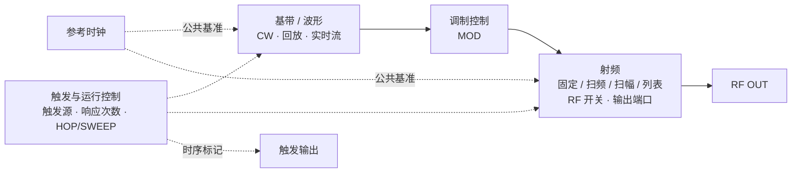

# 单通道 H2 发射业务与 USG 风格 Home 的合理性

> 2026-09-14，设计分析，尚未实施。范围按用户最新要求收敛：只依据当前 `h2_api.h`，不以 SGStudio 其他代码的既有结构约束设计。当前产品均为单通道设备；通用 API 的通道数组不构成多通道产品需求。

## 1. 结论

采用 USG 风格的“信号功能总览 Home + 模块设置子页面”是合理的。依据是 H2 API 已将单路发射拆为基带内容、载波参数、输出开关以及触发/时钟等不同职责。Home 可以把这些职责之间的关系和当前配置同时展示出来，详细参数放入对应子页面。

建议主干为 **基带/波形 → 调制控制 → 射频输出**。固定频率、扫频、扫幅和列表扫描属于射频模块内部的载波计划。参考时钟与触发是配套控制，不应成为主信号线上前后串联的处理节点。

此图是可操作的业务功能图，不声称复原内部电路拓扑，也不规定用户必须按从左到右的顺序操作。

## 2. 证据与阅读边界

- API 真源：[h2_api.h](D:/development/vsg2.0/3rdParty/h2_api/include/h2_api.h)。本次读取的文件将宏、结构体和函数声明集中在同一头文件中。
- USG 使用手册 V1.0 (2025.09)：第 13–15 页为 Home/功能区/触摸操作，第 81 页为基带 Custom 子页面，第 117 页为射频扫描子页面。上述 PDF 页序与印刷页码一致。
- USG5000V 数据手册 V1.2 (2026.03)：第 7 页为信号流图引导交互，第 23 页为 5.0 寸、800×480 屏幕规格；第 20–21 页为 I/Q、回放、触发与 AWGN 能力。
- SMW200A User Manual en 42：第 89–94 页说明状态栏、功能块、任务栏及设置对话框。只借鉴总览与设置分工，当前单通道产品不需要其多路映射布局。

H2 的声明可证明接口职责及注释明确写出的限制，不能单凭函数同时存在就证明全部模式组合都可用，也不能替代 SDK 对配置顺序与执行时序的完整说明。

## 3. 从 H2 API 得到的业务分工

| 业务问题 | 当前 API 依据 | 对 Home / 子页面的含义 |
| --- | --- | --- |
| 信号内容从哪里来 | `tx_stream::mode` 为 `TX_CW / TX_REALTIME / TX_PLAYBACK`；`tx_config_stream()` | 基带/波形入口，内部按模式呈现参数 |
| 回放什么内容 | `tx_download_waveform()`；`waveforms / waveform[] / repeat[] / playback_srate[]` | 波形选择和回放序列是基带子任务 |
| 实时送入什么数据 | `tx_send_stream()`、`realtime_srate` | 实时流属于同一基带来源的另一工作方式 |
| 发射频率和幅度怎样变化 | `tx_config_ffm/fscan/lscan/mscan()` | 射频模块内的固定/扫频/扫幅/列表配置 |
| 是否使用调制、是否打开 RF | `tx_config_output(state_rfout, state_mod)` | MOD 与 RF 分别显示和操作，不合成一个总开关 |
| 何时响应、一次推进多少 | `stream_trigger`、`channel_config_trigger()` | 触发与运行控制入口 |
| 启动、停止和发一次总线事件 | `channel_start/stop/bus_trigger()` | 执行操作，与编辑模式/开关配置分开 |
| 对外输出哪个时序标记 | `device_config_trigger_out()` | 触发输出属于控制信号支路 |
| 使用什么频率基准 | `device_config_clock/query_clock()` | 全局参考时钟入口及锁定状态 |

### 3.1 一个通道，一条当前有效的基带流

用户明确当前硬件全部为单通道。头文件还明确：`tx_send_stream()` 当前仅 stream0 可用，`tx_config_stream()` / `tx_query_stream()` 将非零序号归一化为 0，`channel_config_trigger()` 当前绑定 stream0。

因此，Home 无需 TX A/B、stream 选择、I/Q Stream Mapper 或多路合成器。`tx_stream` 中的多个 waveform 索引表示回放内容列表，不是多个 RF 通道。`channel_config_port()` 的标准/高功率端口选择也属于同一路输出的端口选择，不应画成两条独立发射链。

### 3.2 基带内容与载波计划是两个配置维度

`tx_stream` 管的是 CW/回放/实时模式、采样率、回放内容及频率/相位偏移；`tx_config_ffm/fscan/lscan/mscan()` 管的是 RF 频率、幅度及其变化计划。

所以，“选择什么波形”和“让载波怎样扫描”不是同一个问题。扫描不应与各类波形作为同一种来源互斥排列，也不应画成基带经过调制后的额外串联滤波/加工步骤。更准确的理解是：射频模块执行一套载波计划，基带模块提供信号内容。

这是接口分工，不保证任意基带模式与任意扫描都可组合；实际开放组合仍需设备契约支持。

### 3.3 四类状态不能混为一谈

头文件分别提供了：

1. `tx_stream::state`：流使能。
2. `tx_config_output(..., state_mod)`：调制使能。
3. `tx_config_output(..., state_rfout, ...)`：RF 输出使能。
4. `channel_start/stop()` 和触发配置：执行控制。

因此，“选了波形”“流已使能”“MOD 已打开”“RF 已打开”“已开始执行”不能用一个绿色勾表示。Home 的价值正是让这些条件在同一处可见。仅凭 header，不能把 `TX_CW`、流关闭、MOD 关闭三者规定为完全相同的底层状态，也不能推断任意开关组合下的未说明行为。

### 3.4 触发属于控制关系

`stream_trigger::source` 选择 BUS、外部上/下沿或 XPPS；`response_count` 是响应触发的次数，-1 表示无限次响应。它与 `tx_stream::repeat[]` 的每个波形回放次数是不同参数。

`channel_config_trigger()` 进一步决定 stream 触发事件到来时执行 HOP 还是完整 SWEEP。触发输出则选择本通道事件或原始触发事件，不能画成 RF 信号经过触发模块再输出。

尤其不能把“无限次响应”直接解释为“设备自动不断产生触发”。同样，选择 BUS 是配置，调用 `channel_bus_trigger()` 是一次执行事件，两者不同。

### 3.5 时钟是共同基准

`device_config_clock()` 同时配置参考源、参考频率及参考输出；`device_query_clock()` 还返回锁定状态。它是设备级公共条件，适合在 Home 以参考源/锁定摘要呈现，并通过一个入口编辑。

GNSS/PPS 可作为触发相关能力呈现，不应仅因存在 XPPS 触发源就把 GNSS 当成所有发射必经的数据节点。

## 4. 建议的 Home 功能图

实线表示发射功能关系，虚线表示控制/基准关系；不将箭头解释为芯片级信号路径。CW 模式应显示明确的 CW 摘要，不用一条亮起的“调制正在执行”连线代替它。

在实际 5 寸 Home 上，三个主块足够醒目；时钟和触发可以是主干下方的两块紧凑入口，无需照搬图中每一条虚线。MOD 当前若只有开关需要操作，可以画成连接处的大开关及状态，不必为了形式对称创建一个内容空泛的设置页。

建议页面归属：

- **基带/波形**：CW、回放、实时流；回放内进入波形/序列编辑，实时流内编辑采样率等参数。`fc_offset / phase_offset` 的单位和意义按 `tx_stream` 展示，不能未经契约确认就与 RF `fc` 合并成同一个“最终频率”。
- **射频**：频率、幅度、固定/扫描方式；扫描内编辑起止、步进、驻留或点表；本振模式、端口、幅度补偿可收在射频的进一步设置。
- **触发与运行**：输入源、响应次数、HOP/SWEEP；另分 Trigger Out；开始/停止/软件触发作为操作，不伪装成普通参数。
- **参考时钟**：内外参考、频率、参考输出和锁定信息。
- **系统**：连接、能力、温度、电源和风扇等，通过独立系统入口访问，不塞入主信号线。

频率、电平、RF/MOD 仍可保留直接操作入口。Home 负责总览，子页面负责详细编辑；点开模块不隐式打开该模块，返回 Home 不隐式停止输出。

## 5. 为什么和 USG 相似，以及应借鉴到哪里

USG 的 Home 把基带、调制和射频组织为功能关系；进入基带后显示 Custom/ARB 等局部内容，进入射频后显示频率/幅度/扫描。这与 H2 将 `tx_stream` 和 RF 载波配置分开的职责吻合。

H2 不需要复制其全部节点。当前公开 header 没有提供可据以建立通用“噪声叠加器”“外部 I/Q 路由器”“多流映射器”节点的 TX 接口；也没有以 AM/FM/QAM 名称声明独立 TX 模式。若上层生成这些内容，它们属于波形内容的组织问题，不能仅凭其他厂商的功能图就宣布 H2 具有相同独立硬件处理级。

因此，相似性主要体现在 **单路发射的功能总览、基带与射频分工、独立输出状态、模块内局部菜单**。无需借助 SMW 的多通道复杂度来证明这种设计合理。

## 6. 发射业务过程为何支持这种总览

可以按业务依赖理解为：建立设备会话并取得能力 → 配置公共基准、基带内容、载波计划与触发 → 使能相应输出并启动 → 按触发条件执行。

其中，回放波形必须先取得可用波形索引再被回放配置引用；实时流通过 `tx_send_stream()` 提供数据；BUS 触发需要区分配置和实际发送事件。其余配置调用的精确先后、能否运行中修改、是否必须先停止，header 没有完整规定，不把这条业务概括当成可直接执行的 SDK 时序。

Home 展示的是这些依赖当前是否准备好及如何配置。用户可以任意进入某一模块修改，不需要每次按业务概括逐步走完一个向导。

## 7. 状态显示的证据边界

| 可以获取的证据 | 合理的显示 | 不应推导成 |
| --- | --- | --- |
| `tx_query_output()` | 查询到的 RF/MOD 开关配置 | 外部端口已测得预期波形 |
| `tx_query_ffm/fscan/lscan/mscan()` | 固定参数或已配置扫描计划 | 当前实际扫描点/扫描进度 |
| `tx_query_stream()` 的配置结果 | 模式、波形索引、采样率等配置 | 波形持续正常输出 |
| `tx_query_stream()` 的 `trg_o` | Host 缓存的触发配置，header 有明确说明 | 设备硬件实时触发状态 |
| `device_query_clock()` 的锁定位 | 参考时钟锁定/未锁定 | 全部 TX 部件正常 |
| `channel_start()` 的成功返回 | 启动命令成功 | 已收到外部触发、正在发射或已完成 |

当前 header 没有通用的“正在等待触发/正在发射/已完成/当前扫描点”实时查询接口。可以在 Home 标明触发配置及已发送命令，真实执行状态需要进一步的设备状态契约；不能用估计时间或仅凭 RF ON 把全链路涂成运行状态。

## 8. 本阶段范围

已完成单通道 H2 业务模型与 Home 合理性论证。没有修改产品代码、SDK header 或既有架构文档，也没有验证设备运行。后续再基于这份业务模型讨论具体页面布局与现有代码改造。
