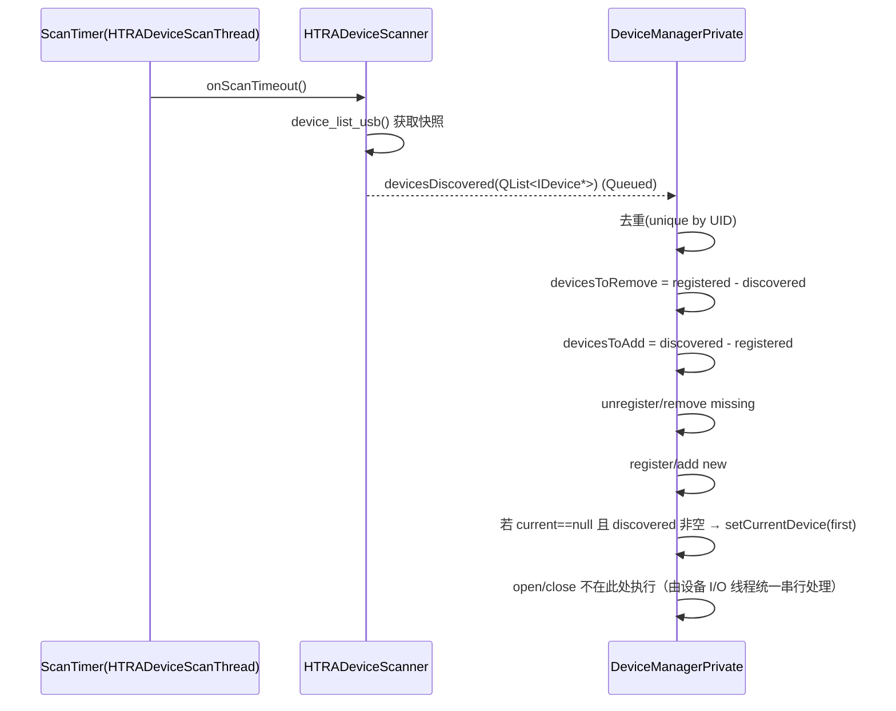
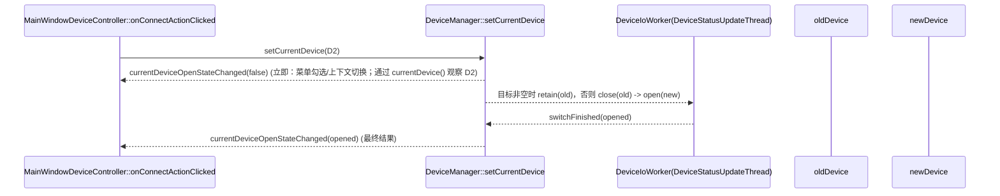

# HTRA 多设备（阶段 A）设计与调试手册

日期：2026-02-12
更新：2026-02-25（合并 Stage B 连接仲裁/Connecting 状态，并同步为当前实现）
补充：2026-06-05（同步默认 switch-away 已改为 release，以及多实例 owner 当前边界）
补充：2026-08-17（USB 显式切换改为 retain-open，使已下发 Playback 可继续自主输出）  
补充：2026-08-18（为切换到 retained manual ETH 增加异步 ping P0 防护）
补充：2026-08-19（ETH Connect 支持共享 IP 下 5000/5001 顺序独立尝试与部分成功保留）
补充：2026-08-19（统一 Default/Last/重启/更新后的启动连接意图，并默认关闭启动 ETH 弹窗）
补充：2026-08-20（ETH Connect 改为不可中途取消的异步模态流程，watchdog abort 等待真实回切终态）

本文用于后期维护与 Debug，描述当前工程中 HTRA 设备从“可枚举多设备”到“可在 UI 中切换当前设备（current device）”的完整设计、线程模型、关键流程与排障清单。

> **阶段 A 边界（已确认）**：
> - App 进程内：可以同时“看见”多台设备（present），并在 UI 中切换 `currentDevice`。
> - UI / Business 主链路和状态轮询同一时刻只围绕 1 个 `currentDevice` 工作。
> - 从已打开 USB 切到非空目标时保留旧 handle；双 ETH A/B 也保留旧连接。旧设备已下发的普通 Playback 可以自主继续输出，但旧设备不再接受 UI 实时控制，Streaming sender 仍在切换前停止。
> - 显式断开、物理拔出、固件更新关闭和应用退出仍真实释放设备。

相关参考：
- Core 设备发现与管理总览：[device_discovery_architecture.md](device_discovery_architecture.md)
- 设备打开 → UI → Business 配置流程：[device_open_ui_config_flow.md](device_open_ui_config_flow.md)
- HTRA H2 API v2.0 使用指南：[htra_h2_api_v2_0_usage.md](htra_h2_api_v2_0_usage.md)
- 连接仲裁与 Connecting 状态：见本文第 9 节

---

## 1. 关键术语与状态语义

为避免“枚举/注册/打开/当前”混用导致误判，本文统一使用以下术语：

- **present**：底层 `device_list_usb()` 枚举快照里可见（USB 上真实存在）。
- **registered**：Core 的 `DeviceManager` 已持有并管理该 `Core::IDevice*` 对象。
- **current**：`DeviceManager::currentDevice()` 指向的设备对象（UI/业务默认围绕它工作）。
- **open**：`IDevice::isOpen()==true`，底层 `device_open_usb()` 成功并获得可用句柄。

阶段 A 的关键约束：
- “present/registered”允许多台并存；
- UI / Business 同一时刻只围绕 1 台 `current` 设备工作；
- 已打开 USB 和双 ETH A/B 可以在切走后保留 handle，让普通 Playback 自主继续输出；非 current 设备不参与状态轮询和实时业务控制。

### 1.1 启动连接意图与传输恢复

启动时首先由 `src/app/main.cpp` 计算一次不可变的 `SGStudio.RestoreLastDeviceConnection` 应用属性，然后才加载插件。该属性为 true 的条件是：

- `APP/Reboot=True`，即语言、主题、显示模式等应用连续性重启；
- 命令行带有 `--UpdateCompleted`，即更新完成后的重启；
- `APP/StartSetting=Last`，即普通启动选择上次运行配置。

HTRA plugin 只有在该属性为 true 时才会尝试恢复上次成功的 manual ETH endpoint，并继续检查 ETH 传输类型、合法 IPv4、5000/5001 端口、无 current 和无竞争实例。普通 `Default`、`User` 启动不会因为 `Settings.ini` 仍记录 ETH 而创建 manual ETH，USB scanner 保持自动选择 owner；没有 USB 时保持无 current。

成功连接时，`DeviceRuntimeBridge` 将最后成功传输和 ETH endpoint 写入 `Settings.ini`。USB 成功连接只更新传输类型为 USB，并保留上次 ETH 地址/端口供 ETH Connect 回填。启动恢复只尝试上次成功的一个 ETH 端口，不自动恢复共享机箱的另一个 A/B 端口。

启动 ETH open 失败会注销临时 manual ETH；若随后发现 USB，fallback 仍通过 `runtimeFallbackSelectionRequested` 交给 `DeviceRuntimeProfileCoordinator` 恢复 USB UID profile。网络 ETH 没有 scanner 恢复路径，网络恢复后仍需用户通过 ETH Connect 手动重新创建。

启动 ETH 自动恢复不等于启动弹窗。`SGS_ENABLE_STARTUP_ETH_CONNECT_DIALOG` 是 Core 的编译选项，默认 `OFF`，只为特殊设备构建启用启动后的 ETH Connect 弹窗；默认构建不会弹窗。

---

## 2. 设备身份（UID and dnum）

底层 H2 API 的关键点：
- `device_list_usb(device_info* infos, uint32_t* count)`：返回一组设备快照。
- `device_open_usb(&device, dnum, channels, &channelCount, &deviceInfo)`：**按 `dnum` 指定打开**。

重要更正：
- `device_info` 结构体中**没有** `dnum` 字段。
- 当前 SDK 语义中使用的 `dnum` 实际就是 `device_list_usb()` 返回数组的索引 `i`（即 `devInfo[i]` 对应的设备号）。

工程侧采用的身份策略：
- **稳定键**：`uid_l64`（必要时加 `uid_h32`），用于判断“是不是同一台物理设备”。
- **打开参数**：`dnum`（= 枚举索引 `i`），来自最新的扫描快照，需要随扫描刷新。

对应实现要点：
- `FancyDevice::updateDeviceInfoFromScan(const device_info&, uint8_t deviceNumber)` 在设备 closed 状态下刷新 `deviceInfo` 与 `m_deviceNumber`。
- `FancyDevice::open()` 使用 `m_deviceNumber` 调用 `device_open_usb()`。

> 维护提示：如果未来发现 `dnum`（枚举索引）在插拔/重启后会变化，**以 UID 作为对象归属判断**仍然成立；但务必保证每次枚举都能刷新到该 UID 的最新 `dnum`。

---

## 3. 模块职责（谁负责什么）

### 3.1 HTRADeviceScanner（发现层）

文件：
- `src/plugins/htra/htradevicescanner.h`
- `src/plugins/htra/htradevicescanner.cpp`

职责：
- 在独立线程里周期性调用 `device_list_usb()` 获取“present 设备快照”。
- 把快照转成 `QList<Core::IDevice*>`：
  - UID 已存在：复用现有对象并刷新 `deviceNumber(i)/device_info`。
  - UID 不存在：创建新 `FancyDevice`，注入扫描信息后返回。
- 扫描失败时做**防抖**：同样的错误消息不会重复弹窗刷屏。

重要行为约定：
- **Scanner 只负责枚举，不负责 open 验证**；设备 retain/open/close 统一由 `DeviceManager` 的 I/O worker 编排。
- 扫描失败时 `devicesDiscovered` 不发射，以避免“空列表快照”误触发 DeviceManager 删除设备。

型号过滤（现状硬编码）：
- 扫描阶段会过滤 `devInfo[i].model == 132`，只有型号 132 的设备才会进入可连接列表。

### 3.2 DeviceManager（管理/调度层）

文件：
- `src/plugins/core/devicemanager.cpp`

职责：
- 维护 `registeredDevice` 列表与 `currentDevice` 指针。
- 接收 scanner 的 `devicesDiscovered(QList<IDevice*>)`，执行**快照对账（reconcile）**：
  - 以 `DeviceUID` 为键去重。
  - 枚举消失 → 视为物理拔出：调用 `unregisterDevice()` 删除对象。
  - 枚举新增 → register；不会抢占 current（除非当前为空）。
- 负责阶段 A 的“**切换 current 时决定 retain/close，再 open 目标**”策略（重要：不在 UI/Scanner 线程执行 I/O）：
  - 任意旧 current 已打开且目标非空：`keepOldOpen=true`，不调用 `closeForSwitch()`；旧 Playback 和 handle 保留。
  - 显式切到 `nullptr`：调用 `close()` 真实释放当前设备。
  - retained USB 的 UID 持续保留在当前 session 的 `ownedUsbKeys`；只有真实关闭或注销后才释放，避免其他实例误抢仍打开的设备。
  - 对新 current 执行 open（同样在设备 I/O 线程中）；open 成功才启动状态轮询。
  - `setCurrentDevice()` 是异步 open：current 选择立即生效于 UI，open 结果通过 `currentDeviceOpenStateChanged(opened)` 后续回传。

### 3.3 FancyDevice（驱动层封装）

文件：
- `src/plugins/htra/fancydevice.h`
- `src/plugins/htra/fancydevice.cpp`

职责：
- 封装 h2 API 的 open/close/config/波形下发/状态查询。
- 线程安全：内部使用 `QMutex`，允许由 status thread / 业务线程调用关键接口。

关键约定：
- `updateDeviceInfoFromScan()` 只能在 closed 状态调用（Debug 下 `Q_ASSERT(!m_isOpen)`）。
- `updateRealTimeStatus()` 在检测到 `STATUS_ERROR_DISCONNECT (-8)` 时：
  - USB 路径会把 `m_usbSessionState` 置为 `DisconnectedPendingClose`，后续 `close()` / 析构仍会执行一次 `device_close()`；
  - ETH 路径会在检测到断开时直接执行 `device_close()` 释放句柄。

### 3.4 MainWindowDeviceController（UI：Connect 菜单）

文件：
- `src/plugins/core/mainwindowdevicecontroller.cpp`

职责：
- Device→Connect 菜单在 `aboutToShow` 时重建列表：
  - 从 `DeviceManager::allDevices()` 获取设备对象，使用 `device->name()` 展示。
  - `QActionGroup(exclusive=true)` 保障勾选互斥。
  - 若 USB 已被其他实例持有，会继续展示但置为 disabled。
  - 点击 action 通过 `IDevice::find(uuid)` 找到对象并调用 `DeviceManager::setCurrentDevice(device)`。

---

## 4. 线程模型（与生命周期）

当前涉及的主要线程：

- **Main Thread**：UI 线程，菜单刷新、信号分发、Business 的 UI 侧交互（禁止执行 open/close）。
- **HTRADeviceScanThread**：扫描线程，`QTimer` 触发扫描；通过 `Qt::DirectConnection` 执行 `onScanTimeout()`。
- **DeviceStatusUpdateThread**：设备 I/O 线程（复用原状态线程）：
  - 轮询 current 且 open 的设备，调用 `updateRealTimeStatus()` 并向 UI 发出 `deviceRealTimeStatusUpdated(status)`；
  - 串行执行设备生命周期 I/O（close/open/切换），避免 UI/Scanner 线程直接触碰底层驱动。

注意点：
- Scanner 线程回调里会调用 `FancyDevice::updateDeviceInfoFromScan()`；该函数要求设备 closed。
- Manager 对 `devicesDiscovered` 使用 `Qt::QueuedConnection` 接收，避免跨线程直接改动管理数据结构。

---

## 5. 核心流程（数据流/控制流）

### 5.1 周期扫描 → 快照对账 → 设备列表维护

实现提示：
- 目前 scanner 内部数组容量为 16（`device_info deviceInfos[16]`），若现场可能超过 16 台设备，需要扩容策略。

### 5.2 UI 切换 current（retain old output / open target）

说明：
- 阶段 A 下，切换 current 等价于“把 UI / 业务焦点切到目标设备”。
- 任意已打开 USB/ETH 切到非空目标时都会保留旧 handle，使普通 Playback 继续由设备自主输出；Streaming 在切换前停止。
- retained 设备不再是 current，不参与状态轮询，也不支持同时实时交互控制；显式断开和生命周期清理仍真实释放。

retained manual ETH 的 P0 防护：
- manual ETH 没有 scanner 保活，非 current 设备的 `isOpen()` 只是最后一次本地缓存状态。远端断开后，旧 H2 handle 可能已经失效。
- 当目标是“非 current、manual ETH、缓存为 open”时，`DeviceRuntimeProfileCoordinator` 先通过 `QProcess` 异步执行一次系统 ping。检查期间 `isSwitchInProgress()` 保持 true，Device List 和标题栏 A/B 不接受重复切换。
- ping 成功后才进入既有的“保存源 UID profile → suspend pipeline → stop active business → switch current → restore 目标 UID profile”流程。
- ping 失败、超时或进程启动失败时，current、源 profile、active business 和 pipeline 均保持不变，并统一显示一条“远端 ETH IP 不可达”消息（从 ETH Connect 发起时在连接对话框显示失败）；随后按共享机箱语义调用 `DeviceManager::unregisterManualEthGroup(ip, false)`，注销同 IP 下全部非 current 的 5000/5001 manual ETH，使它们从 Device List 和标题栏 A/B 投影中消失。下次必须由用户通过 `ETH Connect` 手动重新创建并打开。
- reachability 失败不再向 UI 区分 ping 工具缺失、退出码、超时或目标在检查期间注销；日志保留具体原因。`includeCurrent=false` 仍保护当前设备，避免异步检查期间误删 current。
- **能力边界**：ICMP 成功只能证明 IP 主机有响应，不能区分同一 IP 的 5000/5001 endpoint，也不能证明 H2 服务、session 或旧 handle 仍有效。它是防止明显失联目标进入旧句柄下发路径的 P0 fail-fast，不是完整健康检查。

共享机箱双端口手工连接：
- `ETH Connect` 可以按界面顺序提交 5000/5001 两个 endpoint，但同一时刻仍只有一个协调器切换和一个 DeviceManager I/O 生命周期任务在执行。
- 连接弹窗使用异步模态路径；批次活动期间禁用 `Cancel`、隐藏标题栏关闭并忽略 `reject()`，用户不能操作 MainWindow 配置或中途取消。正常失败或全部请求结束后才恢复关闭/重试能力。
- 每一行必须同时观察到目标结果与协调器 terminal（包含 profile rollback/watchdog abort）后，才解析并尝试下一行；后续行只保存 IP/port，不保存 `IDevice *`。watchdog abort 只使旧请求失效并发起 source/no-current 回切，必须等该 I/O 结果真正返回后才能结束 coordinator busy、解除 pipeline suspension 和清理 provisional endpoint。
- 两行是有序的独立尝试：成功 endpoint 立即保留；失败的新建 endpoint 只在该次协调器事务终止后移除，不再触发批次级 current 恢复或删除其他成功 endpoint。
- 任一行成功时，最后成功的 endpoint 保持 current，全部请求行结束后关闭连接弹窗；只有全部失败才保留弹窗并显示汇总。标题栏 A/B 继续只根据同 IP、已打开的 5000/5001 自动投影，连接弹窗不直接写 A/B 状态。

### 5.3 断开检测 → 清理 → 恢复扫描

断开判据（现状）：
- `DeviceManagerPrivate::onStatusUpdateTimeout()` 轮询后读取 `status.connected` / `status.errorCode`。
- 当 `!status.connected` 或 `status.errorCode == -8` 时判定断开。

断开处理：
- USB current 统一走 `DeviceManager::unregisterDevice(current)`，随后启动 scanner，等待重新发现。
- manual ETH current 以同 IP 共享机箱为失联故障域，走 `DeviceManager::unregisterManualEthGroup(ip, true)`：
  - 先对同 IP 的 5000/5001 对象统一调用 `markConnectionLost()`，再注销对象，current 最后注销。
  - `currentDevice()` 清空，并发出 `currentDeviceOpenStateChanged(false)`；Device List 和标题栏 A/B 中不再保留同机箱 endpoint。
  - 异步析构跳过 `device_preset()`，仅对仍存在的旧 handle 调用 `device_close()`；UID profile 文件不删除。
  - ETH 没有 scanner 恢复路径；网络恢复后必须通过 `ETH Connect` 手动重新创建并执行 `device_open_eth()`。

补充（当前实现策略）：
- 对“运行中断开（原本已 open）”采用保守策略：**先注销、等重新发现、再重新连接**。
  - 目的：避免在已失效对象上持续 open，减少底层驱动不确定行为。
  - USB 由 scanner 重新发现；manual ETH 只能由用户重新连接。
  - 任何 current 设备运行期注销后，如果 `DeviceManager` 选择 USB fallback，实际切换都通过 `runtimeFallbackSelectionRequested` 交给 `DeviceRuntimeProfileCoordinator`，在 pipeline suspension 内恢复目标 UID profile 后再 refresh，避免把断连设备的 UI 状态下发给 fallback 目标。

### 5.4 Open 失败 → 自动重试（不阻塞 UI）

说明：为避免耗时 I/O 与线程安全问题，**Scanner 线程与 UI 主线程都不执行任何 `open()/close()`**。

当前策略：
- Scanner 只负责发现并上报 `devicesDiscovered(...)`。
- 连接尝试（open/close/切换/重试）统一由 `DeviceManager` 的 I/O 线程串行执行（见本文第 9 节）。
- 当 open 失败时，当前版本会复用 `DeviceStatusUpdateThread` 中的 status timer 周期性触发 retry-open（不阻塞 UI，也不在 Scanner/UI 线程做 I/O）。
  - UI 表现：current 已选中但未 open 时，显示为 **Connecting**（而非强制认为 Disconnected）。
  - 弹窗策略：同一次 `setCurrentDevice` 请求内，`Device Open Failed` 仅弹一次；后续自动重试失败不会重复弹窗刷屏。
  - 若用户再次点击 Connect 菜单同一设备，可触发一次新的连接请求（新的 requestId），从而允许再次首弹一次失败提示。
- 历史上的 `deviceAutoOpened/onDeviceAutoOpened` 路径已停用/移除，仅保留本文档说明用于排查旧版本行为。

---

## 6. 与 Business 配置链路的关系（现状）

当前 `BusinessManager` 仅监听：
- `DeviceManager::currentDeviceOpenStateChanged(bool)`

行为：
- `isOpen==true`：调用 `activedBusiness->startBusiness()` + `onDeviceProfileChanged()`。
- `isOpen==false`：调用 `activedBusiness->stopBusiness()`。

这意味着：
- 只有当 `setCurrentDevice()` 的 open 成功时，才会触发业务启动与配置下发。
- 切换 current 的“open 失败”不会进入业务链路（符合预期）。

---

## 7. Debug 手册（定位建议）

### 7.1 关键断点/观察点

建议按问题类型放断点：

- **看不见设备**
  - `HTRADeviceScanner::scan()`：`device_list_usb()` 返回码、`deviceCount`、是否命中防抖。
  - `DeviceManagerPrivate::onDevicesDiscovered()`：是否收到快照、是否被 UID==0 或者设备Model == 132 过滤。

- **菜单不刷新/点击无效**
  - `MainWindowDeviceController::updateConnectMenu()`：列表是否为空、action 的 data(uuid) 是否正确、busy USB 是否被正确 disabled。
  - `MainWindowDeviceController::onConnectActionClicked()`：`IDevice::find(uuid)` 是否返回空。

- **切换后打不开/打开了又立刻断开**
  - `DeviceManager::setCurrentDevice()`：是否正确投递到 I/O 线程；requestId 是否被更新。
  - `DeviceIoWorker::switchDevice()`：keepOldOpen 判定、retain/closeForSwitch 分支、open 返回值与错误码。
  - `FancyDevice::open()`：`device_open_usb` 返回码；`m_deviceNumber`（枚举索引 i）是否正确。
  - `FancyDevice::updateRealTimeStatus()`：是否返回 -8；USB 是否进入 `DisconnectedPendingClose`，ETH 是否已同步释放句柄。

### 7.2 常见故障与排查

- `device_list_usb` 返回错误（扫描失败）
  - 现象：Connect 菜单长期为空或停留旧设备；可能弹出 “Device Scan Failed”。
  - 排查：确认底层驱动/权限/USB 栈；确认是否多进程争用同一设备。

- open 失败（`Device Open Failed`）
  - 现象：菜单可见但切换后无法连接。
  - 排查：
    1) `FancyDevice::open()` 的错误码与 UID。
    2) 是否因为校准文件缺失等硬性错误。
    3) `m_deviceNumber` 是否来自最新扫描（`updateDeviceInfoFromScan(..., i)` 是否被调用过）。
  - 重试：当前版本由 `DeviceManager` 在 I/O 线程内自动重试 open（周期性 retry-open）；同一次连接请求仅首弹一次失败窗。

- 设备拔出后析构崩溃/卡死
  - 设计缓解：USB 在 -8 时进入 `DisconnectedPendingClose`，后续 `close()` / 析构仍执行 `device_close()`；ETH 则在断开检测时直接释放句柄。
  - 排查：确认断开是否走了 `updateRealTimeStatus` 的当前分支；重点看 USB session state 是否正确落到 `DisconnectedPendingClose`。

- 多 EXE 并行时配置文件互相覆盖
  - 现象：`configuration/DeviceHistory.json`、`Settings.ini`、`Profile.json` 等互相写坏。
  - 建议：多进程方案需做配置目录隔离或写入加锁（本阶段仅在文档中提示，未落地实现）。

---

## 8. 回归/验收用例（阶段 A）

- 插入 2 台设备：Connect 菜单出现 2 条，名称为 `0x<uid_l64 hex>`。
- 点击切换：已打开旧设备保持 open，目标设备按需 open，UI 的设备信息更新，业务自动按当前模式配置。
- 拔掉当前设备：状态轮询识别断开，current 置空（或切到其他设备需由用户操作/后续策略），扫描继续。
- open 失败自动重试：首次 open 失败会弹窗提示一次；随后系统自动重试且不重复弹窗，UI 显示 Connecting；用户再次点击同一设备可触发新的连接请求。

---

## 9. 连接仲裁与“Connecting”状态（合并自 Stage B）

本节用于统一回答一个问题：当设备存在“发现/切换/打开失败/拔插”时，系统如何保证线程安全且 UI 不被阻塞。

### 9.0 目标（必须）
- **唯一所有者（Single Owner）**：全系统只有一个组件负责决定何时 open/close/retry，以及何时发出连接状态事件。
- **串行化（Serialization）**：所有与设备生命周期相关的操作（open/close/retry/切换）必须在同一串行队列执行，避免并发。
- **open 不阻塞 UI**：任何可能阻塞的硬件调用不得在 UI/Scanner 线程执行。

### 9.1 核心约束（最重要）
- **Scanner 线程禁止调用 `open()/close()`**。
- **UI 主线程禁止调用 `open()/close()`**。

### 9.2 currentDevice 与菜单语义
- `currentDevice`：Connect 菜单中被勾选的设备（目标设备）。
  - 是否已 open 不影响 current 的语义；连接结果由 DeviceInfoWidget 显示。

实现提示：
- Connect 菜单的勾选应以 `device == currentDevice` 为准，不依赖 `device->isOpen()`。

### 9.3 三态连接状态（DeviceInfoWidget）
- Disconnected：无 current；或 current 未连接且当前未进行 open。
- Connecting：current 已选中，系统正在执行 open（或已安排一次重试）。
- Connected：current open 成功。

补充：
- 本工程当前仍沿用 `currentDeviceOpenStateChanged(bool)` 作为连接结果通知；Connecting 是一种“当前正在 open/重试”的 UI 状态表达。

### 9.4 单一 I/O 线程串行化
- 复用 `DeviceStatusUpdateThread` 作为“唯一设备 I/O 线程”。
- 在该线程上运行 I/O worker（例如 `DeviceIoWorker`），负责 close/open/switch。
- status poll（`updateRealTimeStatus`）与 lifecycle I/O 在同一线程串行执行，避免底层驱动并发。

### 9.5 反陈旧（requestId）
- 每次 `setCurrentDevice`（以及显式重试）递增 `requestId`。
- I/O worker 完成后回传结果携带 `requestId`；主线程若发现已过期，直接丢弃。

与弹窗去重的关系：
- 同一次 `requestId` 内，open 失败的弹窗仅展示一次；避免自动重试导致刷屏。

### 9.6 信号时序（简化版）
1) UI 触发 `setCurrentDevice(device)`：立即发 `currentDeviceOpenStateChanged(false)`，并通过 `currentDevice()==device` 暴露目标切换。
2) I/O 线程执行 retain/close(old) 与 open(new) 后：发 `currentDeviceOpenStateChanged(opened)`（最终结果）。

> 这能保证：菜单选择即时响应、UI 不阻塞、open/close 不跨线程乱跑。

---
