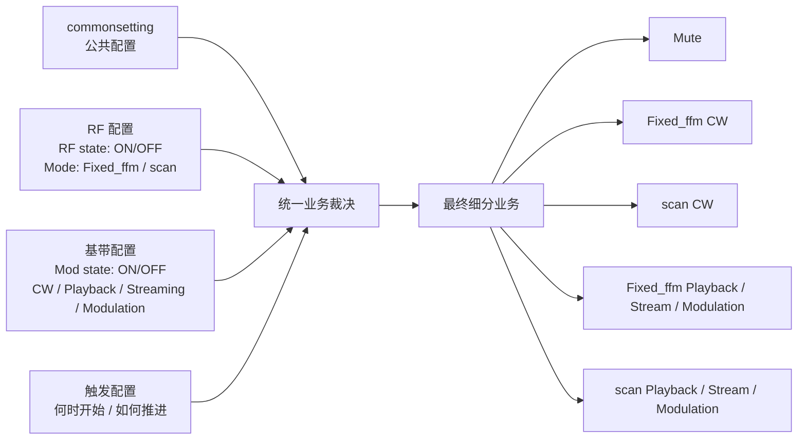
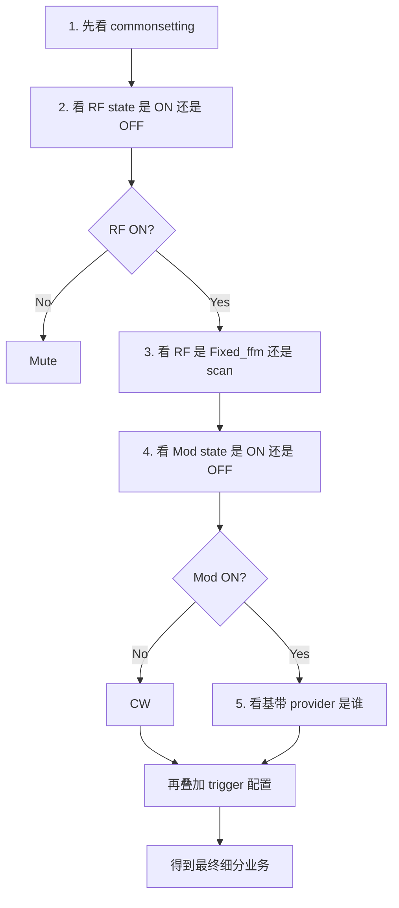

# 面向 Leader 的 RF / Mod 业务总览

## 一页结论

当前系统可以先被理解成四层配置共同决定最终业务：

1. `commonsetting`：所有业务共享的公共设置
2. `RF 配置`：决定 RF 的 `ON/OFF state`，以及 RF 工作在 `Fixed_ffm` 还是 `scan`
3. `基带配置`：决定 Mod 的 `ON/OFF state`，以及基带是 `CW`、Playback、Streaming 还是其他 modulation provider
4. `触发配置`：决定业务何时开始、如何推进、推进一次是跳一步还是跑完整段

也就是说，系统不是先看“当前打开了哪个页面”，而是先看：

- `commonsetting` 是什么
- `RF state` 是 `ON` 还是 `OFF`
- `Mod state` 是 `ON` 还是 `OFF`
- RF 当前是 `Fixed_ffm` 还是 `scan`
- 当前基带来源是谁
- trigger 如何推进

最后才得到具体细分业务。

---

## 一张图看懂整体业务流程

这张图的重点只有一个：

- **细分业务不是单独由某一个页面决定，而是由四类配置组合出来。**

---

## 一、四个配置域分别在做什么

## 1. commonsetting：公共配置

`commonsetting` 是所有细分业务共享的公共设置，不属于某一个页面，也不属于某一种基带类型。

当前可以把它理解成“所有发射链路的公共底座”，典型包括：

- Center
- Level
- RefClockSource
- RefClockFrequency
- SystemClockOut
- TriggerSource
- TriggerCount

它的业务意义很简单：

1. 不管是 `Fixed_ffm` 还是 `scan`，都需要公共时钟、公共触发源、公共基础频点/功率语义。
2. 不管 Mod 是 `OFF` 还是 `ON`，这些公共设置都仍然有效。
3. 因此 `commonsetting` 必须被视为公共配置，而不是某个业务自己的私有参数。

可以把它理解成：

- **所有业务共用一套底层设备公共设置，然后在其上叠加 RF、基带和 trigger。**

## 2. RF 配置：决定有没有射频，以及 RF 怎么跑

RF 配置只回答两个问题：

1. `RF state` 是 `ON` 还是 `OFF`
2. 如果 RF 是 `ON`，当前 RF 工作在 `Fixed_ffm` 还是 `scan`

这里要特别强调：

- `Fixed_ffm` 和 `scan` 都是 **RF 配置**
- 它们不是基带业务名
- 它们也不是页面名字

可以这样理解：

1. `RF OFF`
   - 没有射频输出
   - 系统最终进入静默态

2. `RF ON + Fixed_ffm`
   - RF 在固定频点、固定功率附近工作
   - 适合固定载波类业务

3. `RF ON + scan`
   - RF 按扫描计划工作
   - 例如频率扫描、电平扫描、多点扫描

所以 RF 这一层决定的是：

- **有没有射频输出**
- **射频输出是固定方式还是扫描方式**

## 3. 基带配置：决定 Mod 是否启用，以及基带从哪里来

基带配置首先要看 `Mod state`：

1. `Mod OFF`
2. `Mod ON`

### `Mod OFF`

当 `Mod state = OFF` 时，系统不启用外部基带数据。

这时应统一理解为：

- 基带语义就是 `CW`

也就是说：

- 不再说 `No Baseband`
- 统一说 `CW`

### `Mod ON`

当 `Mod state = ON` 时，系统启用基带来源。

这时具体业务要继续看当前 provider 是谁，例如：

- Playback
- Streaming
- Modulation data provider

所以基带配置这层做的事是：

1. 决定 Mod 是不是开启
2. 如果开启，决定基带来源来自哪里

一句话概括：

- `Mod OFF = CW`
- `Mod ON = 基带来自 Playback / Streaming / Modulation provider`

## 4. 触发配置：决定什么时候开始、怎么推进

触发配置不是 RF，也不是基带，它是第四层独立配置。

它回答的问题是：

1. 什么时候开始执行
2. 收到一次触发时推进一步，还是推进完整一轮
3. 需要推进多少次

所以 trigger 更像：

- **执行控制**

而不是：

- RF 参数
- 基带参数

这一层尤其重要，因为同样一个 RF + Mod 组合，在不同 trigger 配置下，运行方式会明显不同。

---

## 二、从 RF state 和 Mod state 组合看细分业务

先只看最核心的两个 state：

- `RF state = ON/OFF`
- `Mod state = ON/OFF`

再叠加 RF 工作模式：

- `Fixed_ffm`
- `scan`

就能得到主要细分业务。

## 组合矩阵

| RF state | Mod state | RF 模式 | 基带语义 | 最终细分业务 |
| :--- | :--- | :--- | :--- | :--- |
| OFF | OFF | 无意义 | 无意义 | `Mute` |
| OFF | ON | 无意义 | 无意义 | `Mute` |
| ON | OFF | Fixed_ffm | `CW` | `Fixed_ffm CW` |
| ON | OFF | scan | `CW` | `scan CW` |
| ON | ON | Fixed_ffm | Playback | `Fixed_ffm Playback` |
| ON | ON | Fixed_ffm | Streaming | `Fixed_ffm Stream` |
| ON | ON | Fixed_ffm | Modulation provider | `Fixed_ffm Modulation` |
| ON | ON | scan | Playback | `scan Playback` |
| ON | ON | scan | Streaming | `scan Stream` |
| ON | ON | scan | Modulation provider | `scan Modulation` |

这张表想表达的是：

1. 只要 `RF state = OFF`，最终就是 `Mute`
2. 只要 `RF state = ON` 且 `Mod state = OFF`，最终就是 `CW`
3. 只要 `RF state = ON` 且 `Mod state = ON`，最终就要继续看 provider 类型
4. `Fixed_ffm` 和 `scan` 决定的是 RF 工作方式
5. Playback / Streaming / Modulation 决定的是基带来源

---

## 三、各类细分业务可以怎么直观理解

## 1. `Mute`

含义：

- `RF state = OFF`
- 不管 `Mod state` 是什么，最终都不输出射频

这可以理解为：

- 系统静默态

## 2. `Fixed_ffm CW`

含义：

- `RF state = ON`
- `Mod state = OFF`
- RF 工作在 `Fixed_ffm`

这可以理解为：

- 固定载波连续波输出

## 3. `scan CW`

含义：

- `RF state = ON`
- `Mod state = OFF`
- RF 工作在 `scan`

这可以理解为：

- 扫描载波连续波输出

## 4. `Fixed_ffm Playback / Stream / Modulation`

含义：

- `RF state = ON`
- `Mod state = ON`
- RF 工作在 `Fixed_ffm`
- 基带来源来自 Playback、Streaming 或某种 modulation provider

这可以理解为：

- 固定载波下叠加具体基带业务

## 5. `scan Playback / Stream / Modulation`

含义：

- `RF state = ON`
- `Mod state = ON`
- RF 工作在 `scan`
- 基带来源来自 Playback、Streaming 或某种 modulation provider

这可以理解为：

- 扫描载波下叠加具体基带业务

---

## 四、触发配置在不同细分业务中的特殊点

trigger 不是每种业务都同样关键。

下面这张表可以帮助快速理解差异。

| 细分业务 | trigger 是否关键 | 特殊点 |
| :--- | :--- | :--- |
| `Mute` | 低 | 基本不依赖 trigger，重点是 RF 关闭 |
| `Fixed_ffm CW` | 中 | trigger 更多决定启动方式，推进逻辑相对简单 |
| `scan CW` | 高 | trigger 会直接决定 scan 是一步一步推进，还是完整跑一轮 |
| `Fixed_ffm Playback` | 高 | trigger 不只控制开始，还可能控制 waveform list 的推进 |
| `scan Playback` | 很高 | 同时涉及 scan 推进和 playback 推进，业务逻辑更复杂 |
| `Fixed_ffm Stream` | 高 | trigger 仍然存在，但还叠加连续实时送数语义 |
| `scan Stream` | 很高 | trigger、scan、实时连续送数三者叠加，复杂度最高 |
| `Fixed_ffm Modulation` | 高 | 常见为先生成数据，再按 playback 类思路执行 |
| `scan Modulation` | 很高 | 既有 modulation 数据语义，又有 scan 推进语义 |

## 触发配置可以再拆成三句话理解

### 1. 对 `Mute`

- trigger 基本不是重点
- 因为 RF 已经关闭

### 2. 对 `CW`

- `Fixed_ffm CW` 的 trigger 相对简单
- `scan CW` 的 trigger 很关键，因为它直接决定 scan 推进方式

### 3. 对带基带的业务

- Playback / Stream / Modulation 都不只是“开一下就完了”
- trigger 往往还会影响数据推进、列表切换、扫描推进或持续运行节奏

所以对 leader 来说，可以直接记住：

- **trigger 在简单业务里是启动控制，在复杂业务里是执行推进控制。**

---

## 五、最简业务判断顺序

如果只用一套最直观的顺序判断当前业务，可以按下面这五步理解：

这个判断顺序的核心价值是：

1. 先看公共配置
2. 再看 RF 有没有打开
3. 再看 RF 是固定还是扫描
4. 再看 Mod 有没有打开
5. 最后看基带来源是谁，并叠加 trigger

---

## 六、给 Leader 的一句话总结

如果只保留一句最重要的话，可以这样总结：

- **当前系统的细分业务，本质上是“公共配置 + RF ON/OFF state + Mod ON/OFF state + RF 模式（Fixed_ffm / scan）+ 基带来源 + trigger 配置”共同组合出来的结果。**

进一步说：

1. `commonsetting` 是公共的
2. `RF` 决定有没有射频，以及射频是 `Fixed_ffm` 还是 `scan`
3. `Mod` 决定是 `CW` 还是启用某类基带 provider
4. trigger 决定业务如何真正执行和推进

所以系统后续架构演进的方向，不应再按页面名字组织，而应按这四类配置统一收敛和裁决。