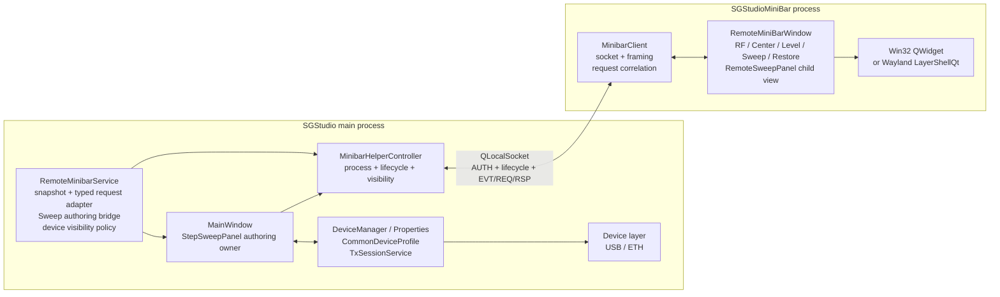
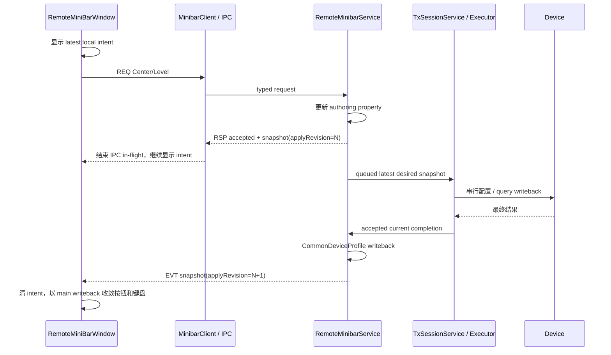

# Minibar Helper IPC Architecture

## Branded executable identity

The internal CMake target remains `SGStudioMiniBar`, but the built executable and
Qt application identity are packet-specific:

| Packet | MiniBar application/output name | Windows filename |
| :--- | :--- | :--- |
| standard and other non-neutral/non-BNC packets | `SGStudioMiniBar` | `SGStudioMiniBar.exe` |
| BNC | `VectorCoreMiniBar` | `VectorCoreMiniBar.exe` |
| neutral | `VSGMiniBar` | `VSGMiniBar.exe` |

Root CMake defines `SGS_MINIBAR_EXECUTABLE_FILE_NAME`. The MiniBar target uses it
as `OUTPUT_NAME`, and the shared `MinibarIpc` identity functions use the same
value. `MinibarHelperController::helperExecutablePath()` joins the branded
filename to `QCoreApplication::applicationDirPath()`, so the main process starts
the matching helper on Windows and Linux/aarch64. The CMake target name, IPC
options, local-server naming, and protocol remain brand-neutral and unchanged.

On Win32, the helper's main `RemoteMiniBarWindow` is an unparented frameless
`Qt::Window` with `Qt::WindowSystemMenuHint` and `Qt::WindowStaysOnTopHint`, so
minibar mode has one icon-bearing taskbar button without giving up its floating
always-on-top presentation. Helper-owned
Sweep/MOD/keyboard auxiliary windows retain their `Qt::Tool` roles and do not
create additional taskbar buttons. The helper target reuses the selected packet's
`.rc/.qrc` application icon resources; a packet with no `app_icon` resource keeps
the existing no-icon policy. Linux X11 and Wayland keep the `Qt::Tool` main-window
role and their existing presentation paths.

## ListMode MiniBar boundary (2026-08-24)

- Sweep plan identity is transported by stable string IDs: `fscan`, `lscan`, `mscan`, and `unsupported`. Numeric `Sweep::SweepType` values never cross the IPC boundary.
- `mscan` is included in `supportedPlanIds`. The helper may select ListMode, change its authoritative enabled state, and switch in all directions among Freq, Power, and List.
- When ListMode is configured, the MiniBar Sweep button remains present and clickable, displays `List Mode`, and keeps the existing checked style as its enabled-state indication.
- The ListMode Sweep popup keeps the ordinary Sweep title plus editable Enabled/Sweep Type controls. Only the numeric/table area is replaced by one centered row: `List scan editing is only supported in main-window mode.`
- The ListMode table is not serialized to the helper. Its rows, range, and per-row/global dwell authoring remain owned by the main `StepSweepPanel/ListModePanel`; selecting List from the helper reuses that existing main-side table.
- `unsupported` remains reserved for an unknown or genuinely unsupported future plan and must not be used as the ListMode identity.
- `SweepSnapshot::available` describes MiniBar common Sweep authoring support, not the device's instantaneous open state: it is true when the main Sweep panel exists and the configured plan is Freq, Power, or List. Device open state remains an independent snapshot/lifecycle concern.
- Sweep snapshots and revisioned complete-state requests always carry Enabled, selected plan, retained Freq parameters, retained Power parameters, and shared analog dwell. List table contents stay main-only. Consequently, main-side scalar edits advance the Sweep revision, stale helper writes conflict/rebase, and an accepted response returns the authoritative scalar state without either UI keeping a second parameter truth.

本文记录当前双进程 minibar 的稳定架构边界。主 SGStudio 进程保留普通
MainWindow、设备和完整 runtime；独立 `SGStudioMiniBar` 只承载轻量 UI，并
通过本机 IPC 交换生命周期、snapshot 和浅层用户意图。

## 架构决策

1. main 是唯一事实源，也是唯一设备/business/runtime/apply owner。
2. helper 是私有 UI executable，不是第二个产品入口。
3. main 与 helper 正常切换只做显隐，两边窗口和进程保持存活；MainWindow
   恢复可见引发的业务 Panel `showEvent/widgetShowed` 不得被解释为参数变化或波形
   重新生成意图。
4. 只有 helper 进程在 Wayland 上启用 layer-shell；main 始终是普通
   xdg-shell。
5. main 在 helper 初始化、Minibar 可见期间的权威变化和请求最终确认时推送完整
   snapshot；accepted request response 返回 handler 同步处理完成时的 main authoring
   snapshot。helper 隐藏期间不接收普通 property/profile/Sweep/MOD debounce EVT，
   下次显示时从 Main 当前状态重新初始化。helper 不轮询设备，也不维护独立业务事实；
   允许保存短生命周期的 UI intent，使交互立即生效。Center/Level 还会继续等待请求所
   触发的 `applyRevision` 前进，再以设备 writeback 后的 snapshot 收敛最终显示。
6. helper 写操作使用 SCPI-like command name 表达意图，但 envelope 是带
   version/id 的 JSON。
7. helper 只开放可由稳定 DTO 表达的浅层操作。当前 SweepCw 使用完整
   authoring snapshot + revisioned carrier-plan request；一次请求提交完整 authoring
   state 给同一个 main owner，但不另造“单次设备 apply”语义。provider、波形生成、
   文件和设备管理仍回到 MainWindow。
8. Minibar 可见期间不展示 `Controls::MessageDialog`。helper 不承载主进程弹窗，
   IPC 错误通过结构化 RSP 和权威 snapshot 收敛；MainWindow 隐藏期间的 popup prompt
   由 main 统一 suppression，恢复后不重放。

## 当前结构



## 进程职责

### Main

`MinibarHelperController`：

1. 创建 `QLocalServer` 和随机 session token。
2. 启动并持有一个 `SGStudioMiniBar` `QProcess`。
3. 完成 AUTH/READY、消息 framing 和 64 KiB 上限检查。
4. 驱动 MainWindow/helper 的显隐状态机与 transition timeout。
5. helper 异常时恢复 MainWindow；SGStudio 退出时统一结束 helper。

`RemoteMinibarService`：

1. 从 main 内部对象构建权威 snapshot。
2. 订阅 RF、Center、Level、Center/Level metadata step、Sweep authoring、common profile
   和设备打开状态。
3. Minibar visible/showing 时以 50 ms debounce 合并普通状态变化；隐藏或进入隐藏流程时
   不排队，并取消尚未发送的普通 snapshot。
4. 验证并执行 helper 的 RF、Center、Level 请求。
5. 从 main 的 `StepSweepPanel` 构建 Sweep authoring snapshot，并把完整、带
   revision 的 high-level request 提交回同一个 panel，复用 preview/normalize、
   `TxSessionService` 和 runtime writeback。
6. 在 minibar 模式中处理设备断开延迟隐藏与重连显示。
7. 订阅 main 的 applied/configuration completion，在当前异步 generation 完成后推进
   `tx.applyRevision`；成功快照位于 `CommonDeviceProfile` writeback 之后。

### Helper

`MinibarClient` 负责：

1. 连接 main 的 local server 并发送 AUTH/READY。
2. 解析 lifecycle、EVT 和 RSP。
3. 分配 request id，并把窗口用户意图编码为 REQ。
4. 为每个 in-flight request 维护独立的 3 秒超时；只允许最新请求的 response
   snapshot 进入 UI，旧 response payload 只完成对应请求、不回写显示。
5. 单独关联 Sweep request 的完成结果，让 `RemoteSweepPanel` 在不放宽全局 response
   过滤的前提下串行确认 revisioned full-state request。
6. 单独关联 Center/Level request completion；RSP 只结束 IPC in-flight，不代表设备
   apply 已结束。

helper `main.cpp` 只负责应用初始化、窗口/client wiring 和进程退出。

`RemoteMiniBarWindow` 当前负责：

1. 渲染最新 RF、Center、Level、Sweep 和 MOD business snapshot；MOD 使用 main
   过滤后的业务菜单和 helper-hosted editor，不加载业务插件 panel。
2. 发出 RF/Center/Level、完整 Sweep carrier-plan 与 revisioned MOD editor intent。
3. collapsed/expanded、Restore、拖动和 owned-transient 行为。
4. Win32 数字键盘与 Wayland managed keyboard overlay；Center/Level 键盘在每次打开时
   使用 main snapshot 中的权威步进，不在 helper 内维护第二套步进事实。
5. 承载 fullscreen Sweep overlay；独立 `RemoteSweepPanel` child view 渲染 typed
   snapshot，并在请求确认前叠加 latest UI intent，再串行发出完整 carrier-plan
   intent。
6. MOD `QMenu` 的 native outside-dismiss 与 minibar collapse 分开处理：`aboutToHide` 后保留一个事件循环的 dismiss guard，避免 Win32/Wayland 随后的 deactivate 或 mouse event 把同一次外点再次解释为收起 minibar。
7. Wayland 的 MOD `QMenu` 不依赖 compositor popup grab；helper 在 menu 下方使用透明 fullscreen layer-shell overlay 捕获并消费外点，menu 关闭时同步撤销 overlay。Win32 仍使用原生 `QMenu::popup()` outside-dismiss。
8. 在 Linux 上按 `ui.vibrationFeedbackEnabled` 处理全局 `TouchBegin`，通过 detached
   `hlc --trigger-feedback` 模拟与 Main 相同的 PGA 触觉反馈；该分支不消费触摸事件。
9. Center/Level 各自维护一个 optimistic numeric intent；快速编辑时每个资源最多一个
   REQ in flight，其余编辑合并成 latest value。普通 authoring EVT/RSP 只更新权威缓存，
   更高 `applyRevision` 才清除 intent 并回灌最终值。

helper 禁止：

1. 加载 Core plugin 或业务 plugin。
2. 创建/访问 `DeviceManager`、`TxSessionService` 或 `IDevice`。
3. 参与 USB ownership、scanner 或多实例 startup gate。
4. 生成 waveform、处理 IQ 文件或操作隐藏的 MainWindow widget。

helper 链接 `Business`、`Controls`、`Utils` 只用于 UI 控件、数字键盘、
单位 adapter 与格式化，不改变上述 ownership。

## 提示与错误反馈边界

当前 C/S Minibar 的正常运行路径没有 `MessageDialog` 转发或 helper-side
`MessageDialog`：

1. `src/app/minibarhelper` 不调用 `Controls::MessageDialog`、`showMessage()` 或
   `execMessage()`。Sweep/MOD 的 `QDialog` host、数字键盘和 helper-owned 文件选择器
   是 helper 自身 UI，不属于消息提示框。
2. `MinibarHelperController` 在隐藏 MainWindow 前设置
   `GUIContext::popupPromptsSuppressed(true)`；恢复 MainWindow、异常回退和退出清理时
   恢复为 false。设备断开导致 helper 与 MainWindow 暂时双隐藏时，suppression 继续
   保持。
3. suppression 生效时，main 中 `MessageDialog::execMessage()` 立即返回
   `QDialog::Rejected`；标准按钮版 `showMessage()` 立即回调 `Rejected`；按钮列表版
   不调用任一按钮 callback。`Dialog::runAsync/runAsShow` 和
   `NotificationPopup` 也会短路。提示不会排队，恢复 MainWindow 后不会补弹。
4. MOD 等已知同步 remote handler 使用 `ScopedRemoteMiniBarInteraction` 临时标记
   main-side panel。Analog、Digital、QuickWaveform 等相关业务据此选择确定的
   non-interactive 分支；这个标记解决“远程操作不应等待隐藏 UI 的用户决策”，不是
   popup ownership 或窗口层级标记。异步 completion 仍由全局 suppression 兜底。
5. main 拒绝 helper 请求时通过 `sendErrorResponse()` 返回结构化
   `error.code/error.message`。helper 完成对应 in-flight request，并按资源规则回滚、
   重试或用权威 snapshot 刷新；协议没有“弹消息框”命令。
6. helper 生命周期发生致命错误时，controller 先恢复 MainWindow 并解除 suppression，
   再在主窗口显示 warning。这是失败回退后的主窗口提示，不是 Minibar 运行期弹框。

上述策略没有 Win32/Linux 条件分支；Win32 与 aarch64 的产品行为一致。平台差异仅在
helper 的 QWidget/LayerShellQt 呈现和 owned-transient 几何处理。

## IPC

Transport：

```text
QLocalServer / QLocalSocket
COMMAND [compact-json]\n
single authenticated helper session
64 KiB maximum line length
```

Lifecycle：

```text
AUTH <token>
READY
SHOW_MINIBAR <x>,<y>
VISIBLE
RESTORE_REQUEST
HIDE_MINIBAR
HIDDEN
SHUTDOWN
```

Structured families：

```text
EVT  main -> helper state event
REQ  helper -> main user intent
RSP  main -> helper request acceptance/error
```

当前 command surface：

```text
STAT:SNAP?
OUTP:STAT
SOUR:FREQ:CENT
SOUR:POW:LEV
SOUR:SWEEP:CONF
SOUR:MOD:CONF
```

`RESTORE_REQUEST` 仍是 lifecycle message，不是 SCPI command。

`SOUR:POW:LEV` 继续以 `dbm` 传输内部和设备基准值；Helper 的 Level 键盘还在同一
request 中携带 `levelUnit` 显示意图。Main 只接受 `PowerUnitAdapter` 支持的
`dBm/dBmV/dBμV`，并更新 Level property 的 `currentUnit` 与
`metadata.displayText`。显示单位不进入设备 profile，也不改变功率换算和配置基准。

当前开发协议仍为 version 1，MOD editor action 统一使用 `SOUR:MOD:CONF`。Main 与
helper 在开发阶段成套构建和部署，因此 MOD snapshot/request 的字段语义调整不单独
提升协议版本。Quick Waveform 的
`select-file` action 在 `arguments.path` 中携带文件路径，并与其他 editor action 一样
携带 `expectedRevision`。main 通过目标 business 的既有路径/WAV 校验与异步加载流程
执行意图，同时保留通用 MOD enabled-business 和 Tx session 同步语义。同步接受响应
包含 `loadInProgress` 的权威 snapshot；加载完成后由 business 的
`providerExecutionContextChanged` 发布包含新文件和属性的后续 snapshot。

MOD request 中的 `enabled` 是可选 intent：只有用户操作 hosted editor 的 Enabled
开关时才携带该字段，main 也只有在字段存在时才修改 business selection、`Mod`
property 和 Tx selected business。菜单项点击只切换当前显示的 remote editor；普通
profile/editor action 不携带 `enabled`，因此浏览或编辑其它 MOD panel 不会转移、关闭
或开启任何 business。

## 状态同步

当前 snapshot 包含：

1. `ui.mainVisible/minibarVisible/vibrationFeedbackEnabled`。
2. `device.present/open/interface/connection/model/uid`。
3. `tx.rf/rfText`。
4. `tx.applyRevision/applySucceeded`：main 配置完成序列和最近一次完成结果。
5. `tx.centerHz/centerText/centerUnit/centerStepHz`。
6. `tx.levelDbm/levelText/levelUnit/levelStepDb`。
7. `sweep`：availability、revision、enabled、configured `fscan/lscan`、两套保留
   参数和共享 dwell。
8. `mod`：`businesses[]` 使用稳定的 `id`、来自 `IBusiness::name()` 的 `name`，以及来自
   `IBusiness::fullName()` 的 `text`。helper 的 MOD 菜单显示规范化后的 `name`，hosted
   editor 标题仍使用 `text`；`enabled` 镜像 main 的全局 `Mod` property，只驱动 helper
   的 MOD 按钮；`enabledBusinessId` 只从过滤后列表中 business panel 自身的 Enabled
   状态推导，只驱动菜单勾选和 hosted editor Enabled，不消费 MainWindow
   current/selected 状态。`Playback`/`Streaming` 不进入远程列表，因此它们使能时可以
   表现为 MOD 按钮 ON 且菜单无勾选项。许可校验通过 `BusinessManager` 显隐变化触发新
   snapshot。
9. 单调 `seq`。

Sweep 类型切换仍提交完整 authoring state。若新选中的 Freq/Power 计划保留了非正的
step，或共享 dwell 非正，helper 只把这些会被主进程拒绝的字段恢复为协议 DTO 的既有
默认值，并把修正字段纳入本地 edit mask；已有效的保留参数保持不变。这样 Power/Freq
可以互相切换，不会因未激活计划的旧无效值而在权威 snapshot 到达后回退。

`seq`、Sweep/MOD `revision` 与 `tx.applyRevision` 是三个不同维度：

- `seq` 对所有 EVT/RSP snapshot 做传输新旧排序。
- Sweep/MOD `revision` 保护 main authoring state 的 compare-and-submit。
- `applyRevision` 只在 main 配置完成边界前进。core-managed 成功路径由
  `TxSessionService::appliedStateChanged()` 发布；此时 runtime 已过滤旧
  epoch/generation/device completion，并且设备 profile writeback 已先落入
  `CommonDeviceProfile`。失败由最终 configuration completion 推进 revision，并令
  `applySucceeded=false`。

`applyRevision` 不是设备 SDK generation，也不要求 helper 理解 pipeline。它只提供
“RSP 中看到的 revision 之后，main 是否已经产生新的最终配置结果”这一跨进程确认点。

`centerStepHz` 与 `levelStepDb` 来自 main 中对应 property metadata 的当前 `step`。
metadata 的 `stepChanged` 会触发新 snapshot；helper 只在创建 Center/Level 数字键盘时消费
最近一次权威值。helper 仍保持 `stepEditable=false`，这条同步只决定上下步进键实际使用的
步长。字段缺失或值无效时分别回退到 `1 MHz` 与 `1 dB`，以兼容成套升级过程中的短暂
版本错位。

`levelDbm` 始终是基准 dBm；`levelUnit/levelText` 是 Main 持有的显示事实。Helper 的
Level optimistic intent 同时保存 dBm 与用户选中的显示单位，因此 RSP 到达前不会先跳回
旧单位。纯单位切换不改变 `levelDbm`，Main 不触发设备配置；accepted RSP 返回新的
`levelUnit/levelText` 后即可结束该 intent。

`vibrationFeedbackEnabled` 来自 Main 当前 `IHardwareSettings`；只有支持震动设置的 PGA
hardware settings 才可能发布 true。Main 的 `TouchEventFilter` 在 enable 状态变化时触发
新 snapshot。helper 不构造第二个 `PGAHardwareSettings`，避免重复执行音量等无关硬件
初始化；它只消费这个权威布尔值，并复用 Main 已验证的 `hlc --trigger-feedback` 命令。
字段缺失时 helper 默认关闭反馈，非 Linux 平台不执行 HLC。

Quick Waveform 的 business snapshot 通过 `profile` 与 `editorState` 同步文件加载结果：
`editorState.loadedFilePath/loadInProgress/loadError/samplesInFile/signalLength/periodLength`
由 main business 生成，helper 只据此刷新文件标记和左侧属性。文件加载成功前不乐观
改写 `loadedFilePath`。

Sweep 的 `revision` 与 snapshot `seq` 不是同一个维度：`seq` 对整个 payload
排序，`revision` 只保护 authoring state 的 compare-and-submit。helper 修改任一
字段时发送完整状态与 `expectedRevision`；main 发现冲突就拒绝并立即推送新
snapshot。disabled Sweep 仍保留 configured plan，不能从 applied `Fixed` 推导。
这里的完整提交只约束 IPC authoring 语义；main 仍复用 `StepSweepPanel` 的既有
preview/normalize、enabled/args refresh 和 runtime writeback。若 preview 同时
规范化 common settings，会按现有 `CommonDeviceProfile` 路径刷新。

snapshot 通过两类路径返回：

1. helper READY 和 `miniBarVisibleChanged(true)` 发布初始化 EVT。
2. helper 请求由对应 RSP 返回 handler 同步处理后的 snapshot；Center/Level 请求产生的
   成功 applied state 或最终 configuration failure 还会推进 `tx.applyRevision` 并发布
   最终确认 EVT。
3. Minibar visible/showing 期间，RF/Center/Level/profile、Sweep
   enabled/type/参数/preview normalization/runtime writeback，以及 MOD business 的
   `enabledChanged`、`providerExecutionContextChanged` 等普通变化，经 50 ms debounce
   合并后发布 EVT。Quick Waveform 文件加载开始、成功或失败也属于该路径。
4. 设备打开/关闭和请求 conflict/error 等需要立即纠正当前 helper 的路径仍可直接发布
   EVT，不经过普通 debounce。

`miniBarVisibleChanged(false)` 会取消已排队的普通 snapshot。Helper READY 但 Minibar
已隐藏时，新的普通 property/profile/Sweep/MOD 变化不再排队；这些状态保留在 Main
事实源中，下次显示时由新的初始化 snapshot 一次性同步。请求 RSP、请求所引起的最终
writeback 和设备显隐状态机不属于这项普通调度抑制。

helper 忽略旧 sequence 和未知字段。snapshot 是业务事实的唯一来源；可交互控件先
显示用户 intent，response/EVT snapshot 用于确认或纠正该临时显示状态。
`RSP ok=true` 只表示请求已被当前 main 适配层接受，response 中的 snapshot
表示 handler 同步处理结束时的 main 状态，不表示设备异步配置已经完成。

## C/S 异步配置与最终回写

Center/Level 使用两阶段确认：



具体约束：

1. Center 与 Level 分别串行；同一资源只有一个 IPC request in flight。
2. 请求飞行期间的新编辑只覆盖 `desired` 并增加 local generation。旧 RSP 完成后立即
   发送 latest value，不并发发送两个旧意图。
3. accepted RSP 中的 Center/Level 可以更新 helper 的权威缓存，但不会覆盖仍等待设备
   apply 的 optimistic intent；普通 property EVT 同样不能回滚正在显示的新值/单位。
4. Helper 在发送请求时比较基准值与最近的 Main 权威值。只有基准 Hz/dBm 真正变化时，
   latest RSP 才记录 `applyRevision=N` 并等待后续 snapshot 满足
   `applyRevision > N`。Level 纯显示单位变化在 accepted RSP 即完成，不等待不存在的
   设备 apply。
5. 最终 snapshot 可以包含设备 clamp/normalize 后的 Center/Level。helper 清除 intent
   后同时刷新 collapsed/expanded 按钮；若数字键盘仍打开，也用同一个最终值回灌。
6. rejected、timeout 或 transport failure 不等待 applied revision；没有 newer intent
   时立即恢复最近的 main snapshot，有 newer intent 时继续提交 latest value。
7. `TxPipelineRuntime::markDesiredStateDirty()` 与 generation filter 保证：Center/Level
   authoring 变化后，旧 executor completion 不会推进一个可见的最终 writeback。因此
   helper 不需要跨进程复制 executor generation。

Sweep 与 MOD/Digital editor 采用 authoring 确认语义：

1. Sweep request 携带完整 authoring state 和 `expectedRevision`。main 在
   `StepSweepPanel::applyAuthoringState()` 内完成同步 preview/参数规范化，再把新的
   authoring revision 和 snapshot 放入 RSP；helper 据此 rebase latest edit mask。
2. Digital 等 hosted MOD editor request 在 main 中执行既有
   `applyRemoteEditorAction()` / `setProfile()` / Enabled selection 路径。若参数约束和
   钳位在该同步 authoring 路径中完成，RSP 已包含规范化结果，因此体感上几乎立即同步。
3. 波形生成、下载和设备配置仍可在 RSP 之后异步进行。MOD/Digital editor 的参数或
   Enabled 显示同步，不等价于设备 I/O 已经完成；设备错误和后续 business snapshot
   仍由 main 的既有通道发布。
4. Sweep/MOD authoring `revision` 不能替代 `tx.applyRevision`。前者解决编辑冲突和
   UI 收敛，后者解决 Center/Level 的设备最终 writeback。

## 响应关联与差分渲染

pending request 只属于传输层，不再映射成 UI disabled 状态。RF、Center、Level、
Sweep 和 hosted MOD editor 控件在请求飞行期间保持可交互，也不因等待 response
临时切到 disabled QSS。UI 操作先改变本地显示；helper 只保存尚未确认的 intent，
不把它当作业务事实，也不越过 main 直接操作 property/runtime/device。

多请求并发按以下规则收口：

1. `MinibarClient` 给每个成功发送的 request 分配 id 和独立 timeout timer。
2. `latestRequestId` 只过滤 `RSP.payload`：只有发送时序上最新请求的、仍在
   pending 集合中的 response snapshot 可以发布为 `snapshotReceived`。
3. 较旧 response 仍停止自己的 timer 并完成对应 request，但其 payload 被丢弃，
   不允许覆盖新意图之后的界面。
4. 普通 `EVT STAT:SNAP` 不参与 request-id 过滤。READY 初始状态、设备变化、
   property/profile 变化和 main-side correction/writeback 都可能通过 EVT 到达。
5. accepted RF/Center/Level/Sweep/MOD handler 在同步 property/authoring 更新之后构建
   snapshot，并把它放入对应 RSP；不再依赖一个无法与 request id 关联的额外
   immediate EVT 作为该请求的确认值。
6. RSP snapshot 与普通 EVT 共用同一个递增 `seq`。即使两类消息交错，窗口层
   仍以 sequence 拒绝较旧 payload，保证“请求相关性”和“全局状态新旧”两层
   排序同时成立。
7. Sweep 额外保持单请求 in flight：请求期间的新编辑只更新 latest intent；前一
   response 确认后，用其新 revision 作为 base，只叠加确认期间再次编辑的字段并提交。
   因此旧回写不会覆盖新 UI，也不会产生两个基于同一旧 revision 的并发 full-state
   request。
8. RF 与 MOD enabled 使用标量 latest-intent：点击/开关编辑先更新本地显示，每类最多
   一个 enabled request in flight；期间再次操作只替换待发送意图，前一请求完成后再发
   最新值。无更新意图时，拒绝、超时或传输失败恢复最近的权威 snapshot。
9. MOD 顶层按钮是导航入口，点击只打开或关闭 business list menu，不产生 enabled
   intent，也不允许 Qt 自动切换 checked。MOD 乐观状态只来自 hosted business editor
   发出的 `hasEnabled=true` 请求，并同步驱动顶层按钮、菜单勾选和当前 editor switch。
10. RF/MOD 专用 request completion 只提取自己资源的 RSP 字段，并分别按资源 sequence
    更新权威缓存；它们不会绕过全局 `latestRequestId` 过滤，把旧 response 的 Center、
    Level、Sweep 或其它 MOD editor 字段整包写回 UI。
11. Center/Level 也使用资源专用 completion，旧 RSP 只更新对应 numeric resource。
    基准值发生变化的 latest accepted RSP 进入 awaiting-apply，最终由更高
    `tx.applyRevision` 收敛；Level 纯单位变化由 accepted RSP 收敛，不再依赖全局
    `latestRequestId` 或一个共享的 keyboard writeback pending bit。

差分渲染按逻辑状态而不是消息到达次数执行：

1. `RemoteMiniBarWindow` 只在 text、checked、enabled 或 Sweep title 真正变化时
   写控件；不再为相同 snapshot repolish 整个 `LabelButton` 复合树。
2. `RemoteSweepPanel` 先忽略完全相同的 Sweep snapshot，再分别比较 switch
   status、plan、popup item availability、field text/checked/enabled 和 page index。
   请求未确认时，渲染目标是权威 snapshot 加 latest UI intent，而不是旧 snapshot。
3. `EnumTextButton::setCurrentEnum()` 会发送 `currentItemToggled`，因此正常 snapshot
   只在最终目标 plan 与当前显示不一致时调用；用户选择不会为了等待回写先恢复旧值。
4. 数字编辑器的 checked/active 状态不由普通 snapshot 重置；只有相应编辑会话
   或 snapshot 缺失路径改变它。
5. `RemoteModEditorHost` 始终接收最新 business revision，但只有 profile、
   `editorState` 或 enabled 真正变化时才重放 editor snapshot。用户编辑 Enabled switch
   后立即把本地显示值记入差分缓存；相同的权威确认不刷新，拒绝或 main-side correction
   与本地值不同时才恢复控件。其它 editor action 仍保留一次权威刷新机会，以便纠正
   回到旧缓存值的拒绝结果。
6. hosted MOD editor 的 spacer/初始尺寸整理属于构造和 popup show 阶段。可见期间的
   普通 snapshot 不调用 editor/host `adjustSize()`，避免右对齐 `labelText` 因容器先缩
   后扩而产生可见的横向移动。
7. Center/Level 的按钮文本来自 `intentActive ? desired : authoritative`；Level 的
   `desired` 同时包含基准 dBm 与显示单位。数值变化的键盘只在对应 request 失败或更高
   `applyRevision` 到达时回灌，Level 纯单位变化则由 accepted RSP 确认；任意无关 EVT
   不再消费其等待状态。

Sweep request 仍提交完整 authoring state 并带 `expectedRevision`。快速 Sweep 操作
不会禁用 UI，也不会并发发送两个旧 revision request：panel 合并 latest intent，等
当前请求确认后基于新 revision 续发。若 Main 在此期间发生独立修改导致 conflict，
panel 保留最新 intent，等待 conflict EVT 后把用户实际编辑过的字段叠加到新 snapshot
再重试，未编辑字段服从 Main 的最新值。
MOD editor action 同样允许多次快速提交；若后一个 action 使用了已过期 revision，
main 拒绝并发布权威 snapshot，而不是在 helper 侧恢复 pending 禁用。

## 显隐与设备

普通切换：

```text
MainVisible -> start/reuse helper -> hide MainWindow -> SHOW -> MinibarVisible
MinibarVisible -> RESTORE_REQUEST -> HIDE -> show existing MainWindow
```

设备断开/重连：

```text
MinibarVisible + device close
  -> push disconnected snapshot
  -> wait 2000 ms
  -> hide helper if no open current device
  -> keep main hidden and session alive

device reopen while waiting
  -> push fresh snapshot
  -> show the same helper window
```

当前没有冷启动 `AutoMinibarOnDevice` policy。main/helper 双隐藏只会出现在
已经进入 minibar 后设备断开的状态。若部署要求无设备冷启动时完全隐藏，必须
在 main startup 层新增显式 policy 和可恢复的失败策略。

## 跨平台窗口边界

Win32：

1. helper 使用普通 Qt frameless/tool top-level。
2. 软键盘和 native windowHandle 被识别为 helper-owned transient。
3. Sweep 同样使用 fullscreen transparent overlay top-level + child panel；外点由
   overlay 消费，不创建第二个 panel surface。
4. main 只恢复自己的 QWidget。

Wayland：

1. helper base surface 是 `LayerOverlay`、
   `AnchorTop | AnchorRight`、`exclusiveZone=0`。
2. 拖动以 top/right margins 提交 compositor visual geometry。
3. base/overlay 使用
   `sgstudioLayerShellVisualTopLeft/VisualSize` 共享坐标契约。
4. Center/Level 键盘使用 fullscreen transparent managed overlay host。
5. helper-owned keyboard/overlay 不触发 expanded minibar 误收起。
6. Sweep panel 是 fullscreen transparent overlay host 内的 `Qt::Widget` child；
   只有 host 创建 native layer-shell surface，并显式配置 layer/output/anchors/
   margins/size/scope。`OverlayContainer` 处理外部点击，panel 内部点击和其
   `windowHandle()` 属于 owned interaction。
7. Sweep Type 使用共享 `EnumTextButton`。panel 本体仍是 overlay host 的 child；
   `PopupWidget` 的 QObject/native window 都属于 helper-owned interaction，并在
   Wayland `Show` 后按 overlay visual geometry 配置独立 layer-shell transient。
   compositor 最终定位和关闭顺序仍需随 Sweep hosted panel 一起实机验证。

详细窗口约定见
[minibar_helper_layershell_parity_gaps.md](minibar_helper_layershell_parity_gaps.md)
和
[minibar_wayland_layer_shell_qt_integration.md](minibar_wayland_layer_shell_qt_integration.md)。

## 当前扩展边界

1. `MinibarIpc` static target 集中 version、command/field constants、JSON
   codec、envelope builder、typed Sweep/MOD DTO 和 line framing。
2. `MinibarClient` 集中 helper socket、request correlation、timeout 和 EVT/RSP
   dispatch。
3. main 的 `StepSweepPanel` 继续是唯一 Sweep authoring owner；MOD business、
   profile、waveform/file 操作和 apply 也继续由 main 中现有 owner 执行。
4. helper 不持有 PropertySystem、DeviceManager、TxSessionService、IDevice 或 Core
   widget，只渲染 snapshot 并发出 typed intent。
5. unsupported Sweep plan 不伪装成 FScan；任何新增命令都必须先找到稳定 DTO 和
   main-side owner，不能为了 UI 便利把业务对象或设备 API 下沉到 helper。
6. 命令继续增长且 `RemoteMinibarService` 的职责出现明确聚类时，再提取窄
   snapshot builder/command adapter；不预先复制第二套 runtime。

## 维护规则

1. helper 只表达用户意图，不拥有业务事实；请求确认前可以持有临时 UI intent，
   但必须在权威值不一致、请求失败或连接结束时纠正/清理。
2. 新状态必须先确定 main-side owner 和变化信号，再加入 snapshot。
3. 新命令必须映射到现有 main runtime owner，不能直达设备 API。
4. 新 helper top-level/overlay 必须遵守对应平台的 owned-transient 和 geometry
   约定。
5. legacy in-process minibar 源码已删除；历史视觉/平台排障结论保留在
   KnowledgeBase，新 helper 功能不做双维护。
6. `RemoteMinibarService` 在已验证的同步 MOD 请求期间统一设置并用 RAII 恢复
   non-interactive remote context；business/panel 只读取该上下文以跳过隐藏主窗口的
   modal prompt，不再自行打标，也不再用 QObject/window 归属关系推断 minibar host。
7. 新错误反馈默认扩展 RSP/snapshot 语义，不向 helper 增加 MessageDialog 转发；若
   产品确实需要可见提示，应先设计 helper-native 的非阻塞反馈协议，而不是复用隐藏
   MainWindow 的 modal prompt。
