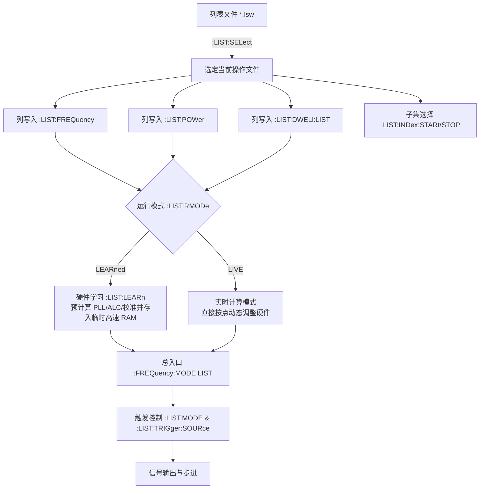

# R&S 信号源 List Mode (列表模式) SCPI 规范与设计参考

本文档基于罗德与施瓦茨（Rohde & Schwarz，以 R&S®SMW200A / SMBV100B 矢量信号发生器体系为基准）官方用户手册第 14.20.14 节（`SOURce:LIST` 子系统）、14.20.14.1 节（`List mode settings`）及第 8.10.6 节（`List mode` 核心概念与硬件行为），系统梳理 R&S 在列表跳频/跳功率（List Mode）上的 SCPI 命令架构、状态机、参数体系与典型执行时序，为本项目的 MScan / List 模式 SCPI 接口与底层驱动设计提供权威参考。

---

## 1. 核心架构与设计思想

R&S 的 List Mode 设计核心是**在多频点、多电平、变驻留时间跳变场景下，通过预计算与数据解耦实现微秒（$\mu\text{s}$）级的极速、确定性切换**。其 SCPI 设计具备以下几个显著特征：



### 1.1 文件与多通道解耦（File-Centric & Path-Independent）
* **文件作为数据容器**：列表数据统一存储在内部文件系统中，扩展名为 `*.lsw`。所有数据填充指令（`FREQ`, `POW`, `DWEL`）均作用于当前由 `:LIST:SELect` 选定的文件。
* **文件操作路径无关**：列表文件是公共资源，不同射频通道（Path A / Path B）可以同时引用同一个列表文件。因此文件操作类命令（`SELect`, `DELete`, `CATalog?`）省略 `<hw>` 通道后缀（若传入通道后缀会返回错误）。
* **配置状态持久化**：`*RST` 仅复位仪器的运行时状态与工作模式，**不会删除或影响内部已保存的列表文件**。

### 1.2 数据列正交填充与变长传输（Orthogonal Column Population）
* R&S 没有采用单条指令传输整行元组（Tuple）的方式，而是将**频率列**（`FREQuency`）、**功率列**（`POWer`）和**单点驻留时间列**（`DWELl:LIST`）彻底解耦为三个正交的并列向量。
* 支持两种数据输入形式：
  1. **ASCII 文本列表**：逗号分隔的浮点数，如 `100MHz, 200MHz, 300MHz`。
  2. **IEEE 488.2 二进制块（Definite-Length Block Data）**：遵循 `:FORMat[:DATA]` 规范，单精度（4 字节）或双精度（8 字节）浮点二进制流，用于上万点海量数据的高速写入。
* 严格的长度一致性约束：功率点数必须与频率点数严格相等；若驻留时间采用 `LIST` 模式，驻留时间点数也必须相等。

### 1.3 双运行模式：硬件学习（LEARned） vs 实时计算（LIVE）
这是 R&S List 模式性能卓越的关键设计：
* **`LEARned`（学习模式，推荐用于高速场景）**：
  * 在射频开启状态下，调用 `:LIST:LEARn` 事件命令。
  * 仪器在后台预先遍历整张列表，计算每个点对应的 PLL 频综分频比、VCO 频段、步进衰减器、ALC 硬件控制字及当前温度校准值，全部存入 FPGA/高速 RAM。
  * 运行时直接按索引回放预存硬件配置字，将单点切换时间压缩至微秒级（典型驻留时间 $< 2\text{ ms}$）。
* **`LIVE`（实时模式）**：
  * 仪器在跳变到该点时实时计算硬件寄存器参数，适用于驻留时间 $\ge 2\text{ ms}$ 的长驻留场景。
  * 允许在运行期间动态改变外部调制和系统参数，且能实时跟踪环境温漂。

### 1.4 双轨制驻留时间（Dwell Time Model）
* **`GLOBal` 模式**：所有点统一使用全局常数驻留时间（通过 `:LIST:DWELl` 设置，范围 $0.5\text{ ms} \sim 100\text{ s}$，步进 $1\ \mu\text{s}$）。
* **`LIST` 模式**：每个点在数据列表中配置独立的驻留时间（单位 $\mu\text{s}$），实现不规则时序跳频。

### 1.5 灵活的子集范围切片（Range Subgroup Slicing）
* 通过 `:LIST:INDex:STARt` 与 `:LIST:INDex:STOP`，用户可以在不改变原列表数据、不重新上传文件的前提下，指定只在 $[Start, Stop]$ 的子区间内循环扫描。

---

## 2. 14.20.14.1 `List mode settings` 完整命令参考

所有命令均位于 `[:SOURce<hw>]:LIST` 节点下。其中 `<hw>` 为射频通道索引（如 `1` 代表 RF A，`2` 代表 RF B；单通道设备可省略）。

### 2.1 驻留时间设置

#### `[:SOURce<hw>]:LIST:DWELl <Dwell>`
* **功能**：设置全局驻留时间（Global Dwell Time）。当驻留时间模式为 `GLOBal` 时生效。
* **参数类型**：浮点数（float）。
* **取值范围**：$0.5\times 10^{-3} \sim 100$（$0.5\text{ ms} \sim 100\text{ s}$）。
* **步进**：$1\times 10^{-6}$（$1\ \mu\text{s}$）。
* **复位值（\*RST）**：`0.01`（$10\text{ ms}$）。
* **对应手动界面**：*List Mode > General > Global Dwell Time*。

#### `[:SOURce<hw>]:LIST:DWELl:MODE <DwelMode>`
* **功能**：选择驻留时间工作模式。
* **参数枚举**：
  * `LIST`：使用列表数据表中为每个频点/功率点单独指定的驻留时间。
  * `GLOBal`：全局模式，所有点统一采用 `:LIST:DWELl` 设定的常数驻留时间。
* **复位值（\*RST）**：`GLOBal`。

#### `[:SOURce<hw>]:LIST:DWELl:LIST <Dwell>`
* **功能**：向当前选中的列表中写入逐点驻留时间序列。
* **参数格式**：`<Dwell#1>{, <Dwell#2>, ...}` 或 IEEE 488.2 二进制块（Block Data）。
* **单位说明**：以纯数值输入时默认单位为微秒（$\mu\text{s}$）；亦可显式附带时间单位（如 `10ms, 500us`）。二进制块格式下每个点占用 8 字节（双精度）或 4 字节（单精度）浮点数。
* **行为**：覆盖当前列表中的驻留时间数据。

#### `[:SOURce<hw>]:LIST:DWELl:LIST:POINts?`
* **功能**：查询当前列表中已配置的逐点驻留时间点数。
* **返回值**：整数（`0` 至 `INT_MAX`）。
* **用法**：Query only。

---

### 2.2 频率与功率数据列表

#### `[:SOURce<hw>]:LIST:FREQuency <Frequency>`
* **功能**：向当前选中的列表写入频率点序列。
* **参数格式**：`<Freq#1>{, <Freq#2>, ...}` 或 IEEE 488.2 二进制块（Block Data）。
* **取值范围**：$300\text{ kHz} \sim RF_{max}$（取决于设备型号与选件）。
* **单位支持**：`Hz`, `kHz`, `MHz`, `GHz`。
* **行为**：覆盖原有数据。

#### `[:SOURce<hw>]:LIST:FREQuency:POINts?`
* **功能**：查询当前列表中的频率点总数。
* **返回值**：整数。
* **用法**：Query only。

#### `[:SOURce<hw>]:LIST:POWer <Power>`
* **功能**：向当前选中的列表写入输出功率（电平）序列。
* **参数格式**：`<Power#1>{, <Power#2>, ...}` 或 IEEE 488.2 二进制块（Block Data）。
* **默认单位**：`dBm`。
* **约束条件**：**功率点数必须与频率点数严格保持一致**，否则在激活或学习时报错。

#### `[:SOURce<hw>]:LIST:POWer:POINts?`
* **功能**：查询当前列表中的功率点总数。
* **返回值**：整数。
* **用法**：Query only。

---

### 2.3 索引控制与子范围切片

#### `[:SOURce<hw>]:LIST:INDex <Index>`
* **功能**：
  * **设置（Set）**：在 `LIST:MODE STEP` 步进模式下，手动指定当前执行跳转到的列表项索引（从 `0` 开始）。
  * **查询（Query）**：在任意运行模式下，查询当前硬件正在输出或停留的列表索引。
* **参数类型**：整数（0-based）。
* **复位值（\*RST）**：`0`。

#### `[:SOURce<hw>]:LIST:INDex:STARt <Start>`
* **功能**：设置当前列表执行的起始索引（子区间起点）。
* **参数类型**：整数，范围为 `0` 到列表总长度 $- 1$。
* **复位值（\*RST）**：`0`。

#### `[:SOURce<hw>]:LIST:INDex:STOP <Stop>`
* **功能**：设置当前列表执行的结束索引（子区间终点）。
* **参数类型**：整数，范围为 `0` 到列表总长度 $- 1$。
* **行为**：启动列表模式后，仪器仅在 $[Start, Stop]$ 索引区间内的点之间按设定规则循环/步进，区间外的点被完全忽略。

---

### 2.4 执行模式与硬件学习

#### `[:SOURce<hw>]:LIST:MODE <Mode>`
* **功能**：设置列表的处理步进方式。
* **参数枚举**：
  * `AUTO`：自动全表扫描。接收到一个触发事件后，仪器依照各点驻留时间自动连续执行完整列表（或由 `STARt/STOP` 决定的子区间）。
  * `STEP`：单步步进。接收到一个触发事件后，仅执行当前步，然后等待下一个触发事件，按索引升序前进。
  * `INDex`：索引定位模式。每次触发直接应用 `:LIST:INDex` 所指定的单点参数。
* **复位值（\*RST）**：`AUTO`。

#### `[:SOURce<hw>]:LIST:RMODe <RMode>`
* **功能**：选择列表运行底层的硬件驱动模式。
* **参数枚举**：
  * `LEARned`：预存学习回放模式。回放由 `:LIST:LEARn` 预先算好并保存在易失高速内存中的硬件寄存器镜像。
  * `LIVE`：实时模式。直接从数据库读取频点/电平并实时计算硬件参数。
* **复位值（\*RST）**：`LIVE`。

#### `[:SOURce<hw>]:LIST:LEARn`
* **功能**：执行列表硬件参数预计算学习（Learn List Mode Data）。
* **类型**：Event 命令（无参数、无查询）。
* **先决条件**：必须先打开射频输出（`:OUTPut<hw>:STATe ON`），并且已加载有效列表文件。
* **时机建议**：当修改了列表中的任何频点/电平、或者调整了影响射频链路的硬件全局设置（如 ALC 状态、衰减器模式、基带设置）后，均需重新执行 `:LIST:LEARn`。

---

### 2.5 触发系统与状态监控

#### `[:SOURce<hw>]:LIST:TRIGger:SOURce <Source>`
* **功能**：配置列表模式的触发源。
* **兼容性映射表**（R&S 专用名与标准 SCPI 语法等效支持）：

| R&S 参数枚举 | SCPI 标准对齐枚举 | 适用列表模式 | 触发与执行行为 |
| :--- | :--- | :--- | :--- |
| `AUTO` | `IMMediate` | `MODE AUTO` | **自由运行连续循环**：触发条件持续满足，列表执行完毕后立即自激重启。 |
| `SINGle` | `BUS` | `MODE AUTO` 或 `MODE STEP` | **软件/总线单次触发**：由 `:LIST:TRIGger:EXECute` 或 `*TRG` 触发，执行一次全表或前进一步。 |
| `EXTernal` | `EXTernal` | `MODE AUTO` 或 `MODE STEP` | **硬件外部触发**：由前面板/后面板的 `INST TRIG` 外部 TTL 信号跳变触发。 |

* **复位值（\*RST）**：`AUTO`。

#### `[:SOURce<hw>]:LIST:TRIGger:EXECute`
* **功能**：手动发送软件触发事件，强制启动或单步推进列表执行（对应前面板 *Execute Single* 按钮）。
* **类型**：Event 命令。

#### `[:SOURce<hw>]:LIST:RUNNing?`
* **功能**：查询当前列表模式是否处于激活发信状态。
* **返回值**：`1`（或 `ON`，正在执行输出） | `0`（或 `OFF`，未运行）。
* **用法**：Query only。

#### `[:SOURce<hw>]:LIST:RESet`
* **功能**：强制将列表当前指针复位重置到起始点（`STARt` 索引位置）。
* **类型**：Event 命令。

---

## 3. 关联支撑命令（文件管理与模式总开关）

为了形成完整的自动化闭环，以下周边子系统命令必须与 14.20.14.1 配合使用：

### 3.1 列表文件操作（14.20.14.2）
* **`:LIST:SELect <Filename>`**：选择或新建列表文件。例如 `:LIST:SEL "/var/user/my_list.lsw"`。
* **`:LIST:CATalog?`**：查询内部存储中所有已存在的 `*.lsw` 列表文件名。
* **`:LIST:DELete <Filename>`**：删除指定列表文件。
* **`:LIST:DELete:ALL`**：删除所有列表文件（前提是当前列表模式已关闭且无文件被占用）。
* **`:LIST:FREE?`**：查询可用于存储列表文件的剩余空间（单位：字节）。

### 3.2 模式激活总开关（14.20.8 `SOURce:FREQuency`）
* **`[:SOURce<hw>]:FREQuency:MODE LIST`**：正式切入列表模式，接管射频通道。
* **`[:SOURce<hw>]:FREQuency:MODE CW`**：切回定频（CW）模式，停用列表模式。

---

## 4. 典型场景 SCPI 控制时序

### 场景 A：高速跳频配置（全表自动循环 + 独立驻留时间 + 硬件预学习）

```scpi
*RST; *CLS

// 1. 指定/新建列表文件
:SOURce1:LIST:SELect "/var/user/freq_hop.lsw"

// 2. 写入频率向量、功率向量与单点驻留时间向量 (单位: us)
:SOURce1:LIST:FREQuency 1.0GHz, 1.2GHz, 1.5GHz, 1.8GHz, 2.0GHz
:SOURce1:LIST:POWer -10dBm, -10dBm, -5dBm, -5dBm, 0dBm
:SOURce1:LIST:DWELl:LIST 200, 200, 500, 500, 1000

// 3. 校验数据点数完整性
:SOURce1:LIST:FREQuency:POINts?        // 返回 5
:SOURce1:LIST:POWer:POINts?            // 返回 5
:SOURce1:LIST:DWELl:LIST:POINts?       // 返回 5

// 4. 配置运行模式为自动循环、内部自激触发、列表驻留时间
:SOURce1:LIST:MODE AUTO
:SOURce1:LIST:TRIGger:SOURce AUTO
:SOURce1:LIST:DWELl:MODE LIST

// 5. 配置为高速硬件学习模式并学习
:SOURce1:LIST:RMODe LEARned
:OUTPut1:STATe ON                      // 必须先开启射频
:SOURce1:LIST:LEARn                    // 启动硬件计算学习并固化

// 6. 激活列表模式开始发信
:SOURce1:FREQuency:MODE LIST
:SOURce1:LIST:RUNNing?                 // 查询状态，返回 1
```

---

### 场景 B：外部脉冲触发单步步进与局部子区间回放

```scpi
// 1. 选择已有列表
:SOURce1:LIST:SELect "/var/user/freq_hop.lsw"

// 2. 限定只在索引 1 到 3 之间跳变 (跳过首尾两点)
:SOURce1:LIST:INDex:STARt 1
:SOURce1:LIST:INDex:STOP 3

// 3. 设置为单步步进、外部硬件触发、全局固定 10ms 驻留
:SOURce1:LIST:MODE STEP
:SOURce1:LIST:TRIGger:SOURce EXTernal
:SOURce1:LIST:DWELl:MODE GLOBal
:SOURce1:LIST:DWELl 0.010

// 4. 重置指针到起跳点并切入列表模式
:SOURce1:LIST:RESet
:SOURce1:FREQuency:MODE LIST

// 5. 此时外部输入 TRIG 信号上升沿，每来一个脉冲前进一步；
// 亦可通过软件命令强制推进：
:SOURce1:LIST:TRIGger:EXECute
:SOURce1:LIST:INDex?                   // 查询当前停在哪个点

// 6. 停止并切回定频
:SOURce1:FREQuency:MODE CW
```

---

## 5. 对比与设计启示（R&S 对 MScan SCPI 设计的借鉴意义）

在对比本项目既有的 [2026-09-03_mscan-scpi-command-list.md](../../../skills/.github/TaskLog/2026-09-03_mscan-scpi-command-list.md) 设计时，R&S 的设计提供了极具价值的工程参考：

1. **预计算机制与 `APPLy` 契约**：
   * MScan 目前设计了 `:SOURce:LIST:APPLy` 将 `DRAFT` 应用到 `APPLied`。
   * R&S 则通过显式的 `:LIST:LEARn` 与 `RMODe LEARned` 机制，将耗时的硬件参数计算、锁相环预校准明确隔离开来，使得上层调度能精确掌控何时处于“校准耗时状态”，何时处于“极速执行状态”。
2. **多列解耦 vs 整体 CSV Block**：
   * MScan 采用了现代化的 `:SOURce:LIST:DATA <block>` 一次性传入三列 CSV，非常适合整表原子下发。
   * R&S 拆分为 `:LIST:FREQ`、`:LIST:POW`、`:LIST:DWEL:LIST`，优势在于如果仅微调功率或驻留时间，不需要重传整个庞大表格；对于上万点的高速跳频，R&S 还支持 IEEE 488.2 二进制浮点数组，显著降低了文本解析的 CPU 消耗。
3. **子范围切片（Subgroup Range）**：
   * R&S 的 `:LIST:INDex:STARt` 和 `:LIST:INDex:STOP` 设计非常实用，使测试工程师能够在同一张大表里快速切换“频段 A 子集测试”或“频段 B 子集测试”，而无需频繁生成、保存、切换不同的文件。
4. **运行模式与触发源解耦**：
   * 运行模式（`AUTO` 自动轮询 vs `STEP` 步进）与触发源（`AUTO/IMMediate` 内部自激 vs `SINGle/BUS` 软件单次 vs `EXTernal` 外部硬件引脚）构成正交笛卡尔积，逻辑严密且通用性强。
