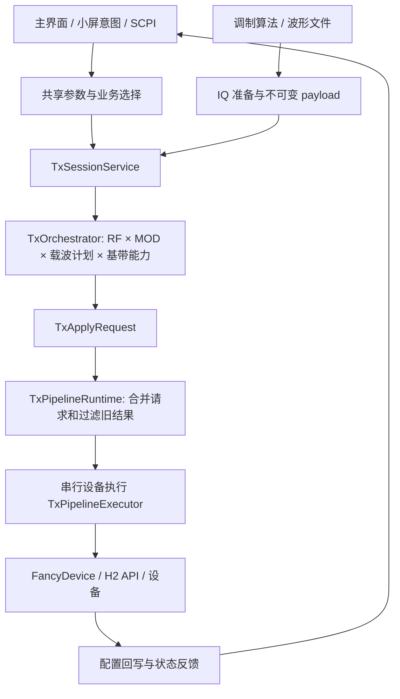

# SGStudio 与 SMA100B：5 寸台表控制端的架构差异与交互边界

日期：2026-09-09。源码基线：SGStudio `cfd1d450`。验证级别：static。

本文是架构比较与候选产品设计，不表示小屏 UI 已实现。用户给定 5 寸、1024×600，参考 SMA100B；具体 HTRA 型号、实体旋钮/按键、目标系统、同机或跨机控制尚未确定。以下按当前单个 TX 通道、横屏、主要触控讨论。

## 1. 结论与证据边界

可以借鉴 SMA100B 的“顶部频率/电平 + 功能摘要入口 + 全局输出状态”。SGStudio 已有公共参数、载波计划、基带来源、触发和设备能力这些基础，不需要为了采用这种信息组织方式重写 H2 驱动。

影响交互组织的主要差异是：SGStudio 当前选中一个基带业务；SMA100B 公共功能模型则包含调制源、调制路径、多个调制状态及总 MOD 开关。用户已确认 SGStudio 不支持调制组合，小屏沿用这一产品边界即可，不要求补齐组合功能。扫描时顶部频率/电平的含义仍需明确。

用户补充的现场证据（2026-09-09）：现有波形生成期间 Save 禁用，生成下发结束后恢复可用。因此生成/下发的准备过程已有交互反馈，本次小屏适配优先复用，新增影响评为低。底层执行有阶段差异，不等于需要重大 UI 改造；此前将这一项评为高的判断已修正。本轮未另行逐业务审阅 Save 的信号链。

不能给出“内部架构相差百分之多少”：没有 SMA100B 内部软件源代码或完整硬件设计，用户手册也不能证明线程、调度、内部总线、每个调制器的模拟/数字实现。本文比较的是公开控制能力和可观察操作语义。不能推断 SMA100B 所有操作瞬时完成；手册 p.54–55 明确有忙碌和进度显示。

手册来源：桌面 `C:/Users/jsl/Desktop/SMA100B_UserManual_en_14.pdf`，903 页，编号 1178.3834.02–14；本文引用位置的 PDF 页序与印刷页码一致。官方同版链接：
https://scdn.rohde-schwarz.com/ur/pws/dl_downloads/pdm/cl_manuals/user_manual/1178_3834_01/SMA100B_UserManual_en_14.pdf

## 2. SGStudio 当前代码中的控制模型

边界：此图主体适用于 core-managed CW/Playback；Streaming 仍有独立 session/legacy 执行边界，不能认为所有路径已完全统一。主窗口业务选择、部分 panel、SCPI 仍存在 UI 依赖；图中“意图”不代表已有完整无界面公共服务。

当前代码确认的结构：

| 维度 | 当前表示 | 对 UI 的含义 |
| --- | --- | --- |
| 设备/通道 | device 会话、channel、UID、能力版本 | 所有范围与可用功能跟随当前设备 |
| RF 载波 | Fixed / FScan / LScan / MScan | 扫描是载波计划，可与支持的基带组合 |
| 基带来源 | None / Playback / Streaming | AM、FM、Pulse、Digital 等是内容来源，不是各自独立硬件执行引擎 |
| 执行开关 | RF / MOD | 与当前页面及准备状态分开 |
| 时机 | 触发源、次数、动作 HOP/SWEEP、Trigger Out | RF 打开、通道启动和一次触发不是同一操作 |
| 提交状态 | desired、in-flight、pending-latest、applied | 输入可即时反馈，设备结果异步收敛 |

代码入口：
- `src/plugins/core/txpipelinestate.h:16`：载波、基带和流水线枚举；`:111` 附近明确扫描时 Center/Level 可能只是 fixed fallback。
- `src/plugins/core/txsessionservice.cpp:127`：单个 selectedBusiness；`:350` 附近把当前 provider 输入裁决。
- `src/plugins/core/txorchestrator.cpp:58` 附近：RF/MOD/能力组合裁决，不满足组合条件时可能得到 Mute。
- `src/plugins/core/txpipelineruntime.cpp`：requestApply 合并请求与 generation/epoch；连续输入并不保证每个中间值都在硬件上停留。
- `src/plugins/core/txpipelineexecutor.cpp:238`：core-managed 范围；`:797` 附近 FixedPlayback 两阶段。
- `src/plugins/htra/fancydevice.cpp:1293` 附近：输出开关、channel_start、按触发源决定是否发送 bus trigger。
- `3rdParty/h2_api/include/h2_api.h:552`：tx_stream；`:579` 附近 tx_channel_capabilities；`:1185` 之后输出、固定/扫描、下载与 stream API。

源码纳入已核对：根 CMake → src → plugins/core、plugins/htra、条件启用 analog/scpi；libs/business、controls、scpi；3rdParty/h2_api 通过 HTRA::HTRA 提供 include 和导入库。

## 3. 差异矩阵

| 项目 | SMA100B 手册可确认的语义 | SGStudio 当前证据 | UI 影响程度及建议 |
| --- | --- | --- | --- |
| 首页组织 | p.52–57：频率/电平可直接编辑，功能 tile 打开配置，状态/选中/不可用分开 | CommonPanel、Property、单位适配与业务面板已存在 | 低：可借鉴信息层级，但重新做物理尺寸布局 |
| 调制组合 | p.77–80：LF/噪声/脉冲/外部源；可启用多个调制，总 MOD 恢复此前组合；FM 与 PhiM 互斥 | 单个 selectedBusiness、单个 provider context；用户确认不支持组合 | 功能模型差异明显，但实现边界明确：沿用“调制类型选择 + 参数 + 总 MOD”，不新增组合能力 |
| 调制源路由 | p.78–79：Ext、Pulse Ext、LF、Pulse Video 等有明确路径和共享端口约束 | 本次审阅的 TX API/应用主路径没有同等外部模拟调制路由契约 | 高：只开放已经存在的输入/输出能力；不能把 Trigger In 当成外部 AM/FM 输入 |
| 参数生效过程 | p.54–55 有忙碌/进度；用户按调制源与参数配置功能 | 执行分阶段；用户确认已有生成期间 Save 禁用、生成下发结束恢复的交互 | 低：复用现有完成反馈与输入提交节奏，按小屏布局调整表现即可，不据此新增状态机 |
| 波形可实现范围 | 各调制功能有独立规格和选件 | IQ 生成受采样率、样点布局、带宽与内存制约；Pulse 宽度/周期关联到样点计划 | 高：范围和步进随实际能力/参数组合变化；不要照搬 SMA100B 最小脉宽或调制带宽 |
| 扫描与列表 | p.187–195：频扫/电平扫/List，驻留和触发模式，列表可逐点改变频率/电平/驻留 | FScan、LScan、MScan 及相应 query/set 已有，支持的 Playback 可叠加载波扫描 | 中：保留扫频/扫功率/列表；三角、对数、反向步进、任意索引、Retrace 等须逐项验证，不能凭 API 名字认为完全兼容 |
| 扫描中顶部数值 | p.188：List 处理期间顶部频率/电平显示禁用；扫描时在状态栏输入一个值会立即停止扫描 | TxCommonSettings 说明扫描时 Center/Level 可为固定模式保留值 | 高：扫描时顶部显示扫描范围/模式；明确“停止扫描并设固定频点”的动作，不能把保留值标成瞬时输出 |
| 触发 | p.189–195 区分 Auto/Single/Step/External 等，含首点、逐点、结束行为 | H2 区分触发源与 HOP/SWEEP 动作；当前 arm 流程在适当来源下主动 bus trigger | 中高：按“触发来自哪里”和“一次触发执行多少”组织；首点、重复、结束保持需设备验收 |
| 电平 | p.231–232：ALC、衰减、外部检测等明确控制能力 | Level 回写、波形 RMS 推算、UNLEVEL；本次未确认同等 ALC/外部功率闭环 | 中高：保留设定电平与 RMS 区别，RMS 标为估算；不把 SDK 查询称为实测功率 |
| 附加仪器功能 | p.53：Clk Syn/FE/Pow Sens 中多项依赖选件 | 时钟参考/系统输出与独立时钟合成器不是同一能力 | 低（布局）/高（功能补齐）：不支持的 tile 不占首页；不能仅重命名后视为支持 |
| 远程与完成同步 | 手册章节 14–15 有远程与状态体系 | *OPC? 固定返回 1，*WAI 直接成功；部分命令直接驱动 MainWindow/panel | 同机中、跨机高：当前 SCPI 不足以单独承担可靠的“硬件已完成”判断 |

“没有同等契约”指本次当前应用/API审阅未发现，不断言设备内部没有某种硬件。具体模块资料或后续 API 可改变该结论。

## 4. 三个必须先定清楚的交互契约

### 4.1 复用现有生成/下发反馈

`TxPipelineExecutor::applyFixedPlayback()` 中，没有 payload 时完成基础设备配置就返回 true 并发布配置回写；有 payload 后才下载并 triggerStart。因此“成功”必须解释为本次阶段成功，不能直接作为“新波形已输出”的证据。

上述源码事实不证明现有 UI 把阶段成功误判成整体完成。用户明确说明现有 Save 的禁用/恢复已经体现生成下发过程，因此小屏首先沿用这一反馈，无需为了底层存在异步阶段再设计一套流程。如果小屏隐藏 Save，或 Save 移到次级页面，可将同一就绪状态表现为调制卡片上的简短忙碌标记；仅在当前页面需要这项反馈时使用。

失败保留用户目标与清楚错误；设备断联时输出状态标成未知/断联，不能仅把开关涂灰并暗示 RF 已关闭。SDK set/query 与真实 RF 测量是不同证据层。

只有另行新增“正在输出”“已触发”等运行指示时，才需要为该指示核对相应状态证据；Save 可用不自动承担这些额外语义。本次不由生成/下发过程推导状态机重构。产品界面不显示 generation、payload identity 等实现细节。

### 4.2 查看页面与选择输出内容分离

候选操作：点首页“调制”只进入当前调制设置；在类型选择器中明确选择 FM 才切换内容来源。应避免因返回首页、展开详情或恢复窗口意外换信号。当前 selectedBusiness 会参与裁决，不能把所有页面导航都等价映射到 selectedBusiness 改变。

用户已确认不支持调制组合，本次小屏设计沿用单一调制业务选择，不规划组合 provider 或多个调制独立启用的 UI。

### 4.3 扫描状态下顶部编辑要说明后果

建议：Fixed 显示单频点；FScan 显示频率范围和固定电平；LScan 显示固定频率和电平范围；List 显示列表名/点数和执行配置。没有可靠当前点回读时，不显示虚构的当前频点动画。

如果要借鉴 SMA100B 的“输入频率即停止扫描”，用明确标注的“设为固定频点”入口承担模式切换。普通查看/编辑不应静默终止扫描。这是候选产品选择，尚未修改现有行为。

## 5. 1024×600、5 寸的候选布局

按屏幕有效区比例确为 1024:600、对角线 5 寸计算：约 237 PPI，宽 109.6 mm、高 64.2 mm。40 px 只有约 4.3 mm。像素容得下不等于手指点得准。

触控目标建议先按约 9–10 mm（约 84–93 个物理像素）制作主要数字键与操作按钮，再在真实屏幕做实尺寸评审；这是本设计起点，不是实测可用性结论。若 Qt 有缩放，先换算逻辑像素与物理尺寸，不直接把上述数值当 QWidget 固定尺寸。

一个可容纳的首页分配示例（物理像素，候选）：

| 区域 | 高度 | 内容 |
| --- | --- | --- |
| 顶部读数 | 112 | 频率/模式、电平；可点开数值编辑 |
| 状态行 | 48 | 设备身份、参考源、更新/错误摘要；不塞小型操作按钮 |
| 功能区 | 336 | 2×2 大卡片：调制、扫描、触发/参考、设备/预置；摘要限制 2–3 行 |
| 底部操作 | 104 | 常驻 RF、MOD、首页/返回；触发操作按模式呈现 |

不必保留 SMA100B 左侧多窗口任务栏、主界面完整 IP/固件文本、Clk Syn/Pow Sens 的固定占位。SMA100B 本身有 Freq/Level、RF/MOD 实体按键、数字/单位键和旋钮（p.35–36）；如果目标只有触摸屏，这些高频操作必须占用足够大的屏幕区域。

数值输入使用专门编辑层：清晰显示参数名、当前/目标值、范围、数字键、单位键、取消；保留可操作的 RF 控制。单位键完成输入，可借用 SGStudio 的 TouchNumKeyboard + BaseUnitAdapter + Frequency/Power/TimeUnitAdapter 语义。频率/电平提供大号 +/- 与步长入口；不要要求手指精准点击每一位小数字。

交互节奏优先沿用现有确认/单位键提交以及 editingFinished 触发生成的行为。用户未报告生成过程造成操作问题，因此不为小屏适配额外增加批量“应用”步骤。

RF OFF 控件应易达；这仅保证操作可达性。同步下载或串行 I/O 可能影响软件停止请求的完成时间，不能据此承诺紧急停止时延。是否需要实体 RF 开关取决于最终产品需求与实测。

## 6. 最小落地路径与工作量判断

1. **同机基础台表**：复用现有运行时、设备能力与单位输入，建立小屏布局和清晰状态表达。主体是前端工作，加有限的服务边界调整；没有证据要求重写设备 API。
2. **完整调制/ARB/文件/列表编辑**：需要逐项开放稳定的业务编辑与状态契约。现有 Minibar 的 main-owner、snapshot、revisioned intent 是先例，但它仍依赖主进程和部分主窗业务，List 表也未完整传给 helper；不能直接宣称换皮即可得到完整无界面后台。
3. **跨机独立控制端**：现有 QLocalSocket 小窗通道不能直接当网络协议。需要明确远程命令覆盖、状态订阅/查询、完成语义和断联行为。当前 SCPI 的 *OPC?/*WAI 及 UI 依赖是具体缺口。
4. **功能等同 SMA100B**：组合调制、外部调制路径、ALC/功率传感器闭环、特定触发/扫描能力需另立功能清单；一部分是应用开发，一部分依赖模块/API/硬件，不能以 UI 改版估算覆盖。

因此对“相差多少”的定性回答：基础操作的信息结构差异小；调制组合属于明确不支持的产品边界；生成/下发已有交互反馈，小屏新增适配影响低。扫描、触发和电平需要按 SGStudio 自身语义组织。完整独立仪器服务的工作量取决于同机/跨机和功能范围，不应把它自动计入小屏 UI 改版。缺少目标模块和设备时序数据，不给出人天、毫秒或相似度百分比。

## 7. 后续验收场景（本次未执行）

- RF OFF 编辑频率/电平，确认不会因输入意外启用输出。
- RF ON 改频率/电平，连续快速步进，最后目标与设备结果一致；旧结果不覆盖新意图。
- AM/FM/Pulse 改参数、生成失败和下载失败，目标/更新/错误显示准确。
- Playback 仅第一阶段完成，不能显示新波形已经输出。
- 切换调制类型、只查看另一页、回首页，输出变化只来自明确的业务意图。
- Fixed/FScan/LScan/List 切换，顶部读数语义、保留参数与编辑表一致。
- 单次/连续/外触发，首点、结束保持、是否需额外触发按真机证据确定。
- RF OFF 在大波形下载期间的实际响应时间，触屏与实体控制职责按需求验收。
- 断联、重连、型号/能力变化，界面不显示虚假的已输出/已关闭/已锁定。
- 5 寸实屏确认数字键、单位键、返回、RF/MOD、错误信息与键盘遮挡。

## 8. 当前文档与源码差异

知识库 `htra_h2_api_v2_0_usage.md` 引用的 `h2_typedef.h` 在当前 include 路径中不存在；当前 `h2_api.h` 已包含相关类型及 tx_channel_capabilities。本文以当前头文件及调用点为准，不据旧文档断言集成版本号。

较早 TX 文档中“MSCAN UI 暂时隐藏”属于历史状态；当前 Minibar 文档与 RemoteMinibarService 已识别 List 计划。本文不重复旧的“完全不支持 List”结论。

SCPI 完成语义的问题则仍能在当前代码确认：`src/libs/scpi/src/parser/parser.cpp:68` 返回固定 1；`src/plugins/scpi/register/scpiregister.cpp:784` 的 onWait 直接 true；`:889` 后可见 MainWindow 依赖。

本次仅新增分析文档与 TaskLog/索引；没有修改应用代码，没有构建或设备实验。参数更新耗时、频率连续性、瞬态输出、RF 实测准确度和硬件性能等仍需按目标模块验证。

## 9. SMA100B 左侧 Taskbar 的作用与取舍

SMA100B 手册将截图中的左栏定义为 `Taskbar`。它不是一级功能分类栏，而是全局入口、动态任务切换和状态入口的组合：

- `Home` 返回首页。
- `User Menu` 显示用户加入收藏的参数；至少创建一个收藏项后，任务栏才显示相应入口。
- `SCPI / VNC / SMB` 一类按钮显示当前远程访问连接，属于条件状态项。
- 已连接的 R&S NRP 功率传感器可成为动态项，并直接显示读数。
- 每个已打开的设置对话框会生成一个带名称的按钮；项目超出高度后，任务栏可以上下滑动。因此截图中的 `Pulse Modulation` 表示一个已打开对话框，不是常驻调制分类。
- `Info` 打开状态和错误信息；永久错误会用警告标志提示。

当前 instrument UI 使用单个 `QStackedWidget` 页面栈，同一时间只有一个前台页面，并已有底部 `Home / Back`。设备状态栏能够循环显示当前有效警告，设备错误还会弹窗，但当前没有与 SMA100B 等价的错误历史页、用户收藏、远程会话指示、功率传感器项或并行对话框任务模型。

因此首版不建议加入完整的固定左侧栏。它会重复 Home 导航，并为当前不存在的动态对象保留空位；即使只做 96 px 宽，也会长期占用约 9.4% 的横向空间，使已经容纳 `Level | Preset | RF` 的顶部右区和两列摘要卡进一步变窄。

可以分开吸收其中有价值的语义：

1. 保留现有底部 `Home / Back`，不再增加第二套常驻导航。
2. 若后续建立可查看的当前告警列表或错误历史，可在底部状态栏加入按需出现的 `Info`/警告按钮；仅有轮播文本时不创建空白详情入口。
3. 只有实现参数收藏模型后才增加 `User Menu`，入口可放首页或底栏，无需预留整条侧栏。
4. 远程控制连接和功率传感器只有在 SGStudio 提供对应能力时，作为状态栏的条件项出现。
5. 只有以后允许多个设置页同时保持打开并需要一键切换时，才重新评估 SMA100B 式 Taskbar；届时应考虑用它替换底部 Home，而不是同时保留两套入口。
