# Streaming Bridge / Rearm / Reboot 重构设计说明

本文档用于统一总结 `Streaming` 当前桥接实现，以及后续重构中需要明确的 `在线热切 / RearmSession / HardReboot` 分层方案。它的目标不是替代 `streaming_dataflow.md` 的数据流说明，而是给下一步重构提供一份“当前设计边界 + 参数分级 + 改造路线”的基线文档。

相关代码与文档：

- `src/plugins/core/mainwindow.cpp`
- `src/plugins/core/ibusiness.h`
- `src/plugins/core/idevice.h`
- `src/plugins/core/deviceoperator.{h,cpp}`
- `src/plugins/htra/streamingbussiness.{h,cpp}`
- `src/plugins/htra/fancydevice.{h,cpp}`
- `streaming_dataflow.md`
- `tx_execution_context_phase1_and_provider_migration.md`

---

## 1. 一页结论

当前 `Streaming` 的实际设计与当前阶段结论可以先概括成七句话：

1. `TxOrchestrator` 继续负责统一裁决，`FixedStream` / `SweepStream` 的 pipeline 身份已经进入主线裁决模型。
2. `StreamingBussiness` 仍然保留自己的 sender thread + generator thread，会话执行权还在 legacy streaming session 内部，不在同步 `TxPipelineRuntime` 里。
3. `TxSessionService::applyResolvedPipeline()` 已为 streaming pipeline 加了一层桥接：core 负责 resolve 和 build request，streaming business 负责消费桥接过来的 carrier plan。
4. 当前桥接已经解决 `FixedStream` / `SweepStream(FScan/LScan)` 的统一仲裁与统一入口问题，但运行期参数变化仍然是粗粒度的 `m_profileChanged`，没有形成显式的重配分级。
5. 后续重构不应再把所有参数变化都等价成“整条流重配”；需要明确区分 `GeneratorOnly`、`LiveRetune`、`RearmSession`、`HardReboot`、`RestartPipeline` 五种动作。
6. 理论上，`FixedStream` 下的 `center / level` 仍然最适合建模为 `LiveRetune`；但这只是目标分层，不等于当前设备 API 已经验证支持这种隔离语义。
7. 截至 `2026-03-31`，我们已经做过一次 sender-thread + device-lock 串行化前提下的 `FixedStream level live retune` 试验；由于 fixed streaming 改 `level` 仍会触发设备错误，而 sweep streaming 同类调整没有复现同样问题，因此当前工程结论是：**暂时不继续改代码，保留现有实现。它虽然冗余，但低成本正确，而且模块化封装仍然成立。**


---

## 2. 当前设计边界

## 2.1 已经进入主线裁决的部分

当前主线裁决已经统一到：

```text
TxSessionService::requestRefresh()
  -> TxOrchestrator::resolve()
  -> TxSessionService::buildApplyRequest()
  -> TxSessionService::applyResolvedPipeline()
```

其中对 `Streaming` 的意义是：

- `RF / Mod / CarrierPlan / SelectedBusiness / ProviderKind` 的组合，已经不再由 `StreamingBussiness` 自己单独决定；
- `FixedStream` 和 `SweepStream` 已经是主线 pipeline 的结果；
- `Streaming` 不再绕开 orchestrator 私自决定自己是 fixed 还是 sweep。

换句话说，当前已经统一的是“裁决入口”，还没有统一的是“session 执行模型”。

## 2.2 仍然保留 legacy session 的部分

`Streaming` 当前仍然不是一个同步 apply 的 provider，它的执行权仍然在：

- `StreamingBussiness::m_senderThread`
- `StreamingDataGenerator::m_workerThread`
- `StreamingBussiness::workerLoop()`

这意味着：

1. streaming 的真正设备配置仍然发生在 sender thread；
2. UI / orchestrator 不能把它当成“主线程同步 apply 完就结束”的路径；
3. 运行期参数变化也不能简单等价成“再调一次 configuration()”。

这也是后续 `RearmSession` 方案必须成立的根本原因。

---

## 3. 当前桥接设计

## 3.1 桥接目标

当前桥接的目标非常明确：

- **裁决不动**：`TxOrchestrator` 继续按统一规则 resolve `FixedStream` / `SweepStream`；
- **session 不动**：`StreamingBussiness` 继续保有自身线程模型与连续送数语义；
- **桥接 request**：core 将已 resolve 的 request 传给 streaming business，而不是让 streaming business 再自己判断 RF / Mod / sweep。

## 3.2 桥接接缝

当前接缝已经落在 `IBusiness::setBridgedApplyRequest(const TxApplyRequest &request)`。

设计含义是：

1. `IBusiness` 默认不关心 `TxApplyRequest`；
2. `StreamingBussiness` 是当前唯一需要消费桥接 request 的 legacy business；
3. 未来如果仍有其他 legacy session，需要接入主线裁决，也可以复用同一接缝。

## 3.3 当前实际时序

```mermaid
flowchart LR
   A["CommonDeviceProfile / SweepPanel / SelectedBusiness"] --> B["MainWindow::updateOrchestrator()"]
   B --> C["buildApplyRequest()"]
   C --> D["applyResolvedPipeline()"]
   D -- "FixedStream / SweepStream" --> E["StreamingBussiness::setBridgedApplyRequest()"]
   E --> F["cache carrier plan and set m_profileChanged"]
   F --> G["sender thread: workerLoop()"]
   G --> H["configuration(mode=STREAM)"]
   H --> I{"carrier kind"}
   I -- "Fixed" --> J["fixed stream configure"]
   I -- "FScan / LScan" --> K["sweep overlay"]
```



其中 `MainWindow::applyResolvedPipeline()` 的当前关键行为是：

1. 对 `FixedStream` / `SweepStream`，先调用 `targetBusiness->setBridgedApplyRequest(request)`；
2. 如果当前 active business 仍然是同一个 `StreamingBussiness`，则不做 terminate/reactivate，而是直接返回，让 sender thread 在原 session 内部消费这次桥接更新；
3. 只有当 target business 真的变化时，才执行 legacy 业务切换。

这一步很关键，它把“streaming pipeline 变化”从“业务切换”变成了“同 session 内部处理”。

这里补充一个历史边界：此前 Analog 大波形曾实现过一条 handover 到 `Streaming` 的自动入口，并已统一到 `BusinessManager::requestSelectBusiness("Streaming") -> applyResolvedPipeline()` 的主线顺序中；但该入口已在 2026-05 清理移除。当前 `Streaming` 仅通过手工切换 business 或 streaming provider bridge 进入，不再接受 Analog 大波形侧的自动跳转。

## 3.4 理论与现实的差距（2026-03-31 验证）

这一节单独记录一次很重要的工程结论：**理论上的理想分层，和当前底层设备 API 的现实语义，并没有完全对齐。**

### 理论预期

按我们对架构边界的理解：

- `StreamingBussiness` 的 sender thread 是 session owner；
- 所有 streaming 设备写操作都应收敛在 sender thread；
- `FancyDevice` 这一层如果继续用同一把设备互斥锁串行化配置与送数，那么 `FixedStream` 的 `center / level` 理论上就可以进一步拆成 `LiveRetune`；
- 也就是说，理论上应存在这样一条“只改 carrier，不碰 stream engine”的路径。

### 我们做过的尝试

围绕这个理论预期，我们做过一次针对 `FixedStream` 的试验性实现，思路是：

- 在 sender thread 内区分 `LiveRetune`、`RearmSession`、`HardReboot`；
- 对 `FixedStream center / level` 单独提供一条只打 `tx_config_ffm()` 的 carrier retune 路径；
- 保证它和实时送数仍然受同一个 session owner thread / device mutex 串行化保护。

换句话说，这次尝试不是“主线程偷打一把设备”，而是在我们认为最稳妥、最符合当前架构边界的方式下做的验证。

### 现实结果

验证结果并不支持继续推进这条路：

- 在 fixed streaming 中修改 `level`，设备侧仍然会报错；
- 同时观察到 sweep streaming 中修改 `level` 并没有复现同样的问题；
- 这说明问题不像是我们这一层“没加锁”或者“跨线程乱打设备”，更像是底层 API 对 `tx_config_ffm()` 在 active stream 期间的真实语义，并没有它表面上看起来那么隔离。

更直接地说：

- **理论上**，`FixedStream center / level` 应该属于 `LiveRetune`；
- **现实中**，当前设备 API 并没有被验证成足以稳定支撑这条路径，尤其是 `level` 在线改动。

### 最终结果

因此，当前阶段的工程决策已经收口为：

1. 保留这套 `GeneratorOnly / LiveRetune / RearmSession / HardReboot / RestartPipeline` 分层，作为分析模型和未来边界。
2. 明确承认当前底层 API 现实与这套理想分层之间存在差距。
3. 我们已经回退这次试验性实现，不把它保留在主线代码里。
4. 在设备 API 语义没有进一步澄清前，**暂时不继续推进 `FixedStream center / level live retune` 的代码落地**。
5. 当前实现虽然略冗余，但它仍然具备两个现实优点：
   - 低成本正确；
   - 模块边界清晰，外层生命周期与业务内部线程模型没有被破坏。

---

## 4. FixedStream / SweepStream 的当前设备语义

## 4.1 FixedStream

当前 `StreamingBussiness::workerLoop()` 在检测到 `m_profileChanged` 后，会：

1. 从 `getCurrentProfile()` 获取当前公共设备参数；
2. 从 generator profile 读取 `sampleRate`；
3. 强制 `triggerCount = -1`；
4. 强制 `mode = STREAM`；
5. 调用 `m_operator.configuration()`；
6. sender thread 继续进入送数循环。

设备层的 `FancyDevice::configuration()` 当前会执行：

```text
device_config_clock
 -> tx_config_ffm
 -> channel_config_trigger
 -> tx_config_stream
 -> tx_config_output
 -> channel_start
 -> channel_trigger_bus
```

这条路径说明当前的 fixed streaming 仍然是“公共配置 + stream mode 一次性整体配置”，还没有拆出 `center / level` 的 live retune 专门路径。

补充一点：`2026-03-31` 我们确实尝试过把这条 live retune 路径落成代码，并验证 fixed streaming 下 `level` 热改；但由于设备侧报错，最终该尝试已经回退。因此**当前真实主线实现**仍然应该按“没有正式 adopted 的 live retune 路径”来理解。

## 4.2 SweepStream

当前 `SweepStream` 采用“两阶段叠加”模式：

### Phase 1：先走 FixedStream 基础配置

```text
configuration(mode=STREAM)
 -> clock
 -> ffm
 -> trigger
 -> tx_config_stream
 -> output
 -> start
 -> trigger_bus
```

### Phase 2：再叠加 sweep carrier plan

```text
startStreamingFrequencySweep / startStreamingLevelSweep
 -> tx_config_fscan / tx_config_lscan
 -> channel_config_trigger(action=SWEEP, count=-1)
 -> tx_config_stream
 -> tx_config_output
 -> channel_start
 -> channel_trigger_bus
```

这样做的设计意义是：

1. 公共时钟、基础 stream mode、sampleRate 仍然复用 fixed streaming 的主路径；
2. sweep 只是 carrier plan overlay，不需要把整个 streaming session 改造成新的同步 runtime；
3. `FixedStream` 与 `SweepStream` 现在已经是同一条 streaming session 内的两种执行态，而不是两个完全独立的业务实现。

---

## 5. 当前桥接设计已经解决的问题

## 5.1 统一仲裁入口

`Streaming` 不再绕开 orchestrator 私自判断 fixed / sweep；`FixedStream` / `SweepStream` 的 pipeline 身份现在由主线 resolve 统一给出。

## 5.2 同 business 内的 fixed / sweep 切换

如果 target business 没变，`MainWindow::applyResolvedPipeline()` 不再 terminate/reactivate streaming，而是直接把 request 桥接给 `StreamingBussiness`，由其 sender thread 自行处理。

这为后续 `RearmSession` 奠定了基础，因为它已经把“运行态变化”从“业务切换”里剥离出来了。

## 5.3 移除空 fileList 的冗余 Mute 兜底

当前实现已经确认：

- `StreamingPanel` 清空 `fileList` 后会自动失能并取消选中；
- `FancyTabWidget` 随后重新仲裁；
- `StreamingBussiness` 内部不再需要额外把设备打成 Mute 来维持 UI / active 一致性。

因此“空 fileList 隐式 Mute”已经从 streaming workerLoop 中移除。

## 5.4 TriggerCount 在 streaming 中强制为连续运行

当前 sender thread 配置前会强制：

- `triggerCount = -1`

这意味着 streaming 当前已经明确采用“持续运行”的 trigger count 语义。

对后续重构来说，这个结论应该继续保留：

- `TriggerCount` 不是运行中可热切的 streaming 参数。

---

## 6. 理论上的下一步重构建议（当前暂缓）

截至 `2026-03-31`，当前工程结论已经是“先停在现有实现”，原因见 [3.4 理论与现实的差距（2026-03-31 验证）](#34-理论与现实的差距2026-03-31-验证)。

## 7. 当前推荐口径（2026-03-31 收口版）

如果只保留一句后续重构时最重要的话，可以这样总结：

- **当前 `Streaming` 已经完成“主线裁决 + legacy session 桥接”的第一阶段；这套 `LiveRetune / RearmSession / HardReboot / RestartPipeline` 分层仍然是正确的分析模型，但由于底层 API 现实语义与理想分层存在差距，当前工程决策是暂不继续改代码，先保留现有实现。**

进一步展开就是：

1. `FixedStream / SweepStream` 已经是统一 pipeline 的两种 streaming 执行态；
2. sender thread 仍然是 streaming session owner；
3. 所有 streaming 设备写操作都应继续收敛在 session owner thread；
4. 理论上，`center / level` 不该再被一刀切地塞进全量重配；但现实上这条 live retune 路径当前没有被设备 API 稳定支撑。
5. 因此当前更务实的选择是：接受现有实现的冗余，换取低成本正确和清晰封装，而不是继续强推在线热切落地。
6. `save/load`、设备切换、参考时钟切换这类 foundation-state 变化，仍然应该保留整体重建流程这一分析边界。

这份文档的作用，就是把这些边界和当前阶段结论固定下来，作为后续再次讨论 streaming 重构时的基线。