# Streaming Bridge / Rearm / Reboot 重构设计说明

本文档用于统一总结 `Streaming` 当前桥接实现，以及后续重构中需要明确的 `在线热切 / RearmSession / HardReboot` 分层方案。它的目标不是替代 `streaming_dataflow.md` 的数据流说明，而是给下一步重构提供一份“当前设计边界 + 参数分级 + 改造路线”的基线文档。

> 2026-09-03 更新：在原有单 Streaming session 与重配分层基础上，补充“由 Core 协调的独立长生命周期 session”定义、当前 A/B 双设备与未来真双通道的区别、H2 多通道 API 的已知/未知边界、双 Streaming 的目标架构与 API 行为。该更新不改变 2026-03-31 对 `FixedStream level live retune` 的实机结论；它澄清的是更上层的 session ownership 与多 endpoint 演进方向。

> 2026-09-03 产品方向收口：当前设备通过 USB 或吞吐更低的 ETH 与电脑连接，Realtime IQ 通过所选 transport 持续传入。62.5 MSps complex-int16 单路原始负载已为 250 MB/s，双路为 500 MB/s，短期不再以双 Streaming 为目标。当前目标调整为 **Level 1: Dual RF Channel**：两个 RF/vector channel 可同时工作，但每个物理设备只有一条共享 realtime ingress、最多一个 active Streaming session；第二通道优先使用设备内 CW/Playback 自主运行。Level 2 双 Streaming 保留为需要 transport/硬件升级和专项验证的未来能力。

相关代码与文档：

- `src/plugins/core/mainwindow.cpp`
- `src/plugins/core/ibusiness.h`
- `src/plugins/core/idevice.h`
- `src/plugins/core/deviceoperator.{h,cpp}`
- `src/plugins/htra/streamingbussiness.{h,cpp}`
- `src/plugins/htra/fancydevice.{h,cpp}`
- `streaming_dataflow.md`
- `tx_execution_context_phase1_and_provider_migration.md`
- `htra_h2_api_v2_0_usage.md`
- `htra_multi_device_stageA_design_and_debug.md`

---

## 1. 一页结论

当前 `Streaming` 的实际设计与当前阶段结论可以先概括成十二句话：

1. `TxOrchestrator` 继续负责统一裁决，`FixedStream` / `SweepStream` 的 pipeline 身份已经进入主线裁决模型。
2. `StreamingBussiness` 仍然保留自己的 sender thread + generator thread，会话执行权还在 legacy streaming session 内部，不在同步 `TxPipelineRuntime` 里。
3. `TxSessionService::applyResolvedPipeline()` 已为 streaming pipeline 加了一层桥接：core 负责 resolve 和 build request，streaming business 负责消费桥接过来的 carrier plan。
4. 当前桥接已经解决 `FixedStream` / `SweepStream(FScan/LScan)` 的统一仲裁与统一入口问题，但运行期参数变化仍然是粗粒度的 `m_profileChanged`，没有形成显式的重配分级。
5. 后续重构不应再把所有参数变化都等价成“整条流重配”；需要明确区分 `GeneratorOnly`、`LiveRetune`、`RearmSession`、`HardReboot`、`RestartPipeline` 五种动作。
6. 理论上，`FixedStream` 下的 `center / level` 仍然最适合建模为 `LiveRetune`；但这只是目标分层，不等于当前设备 API 已经验证支持这种隔离语义。
7. 截至 `2026-03-31`，我们已经做过一次 sender-thread + device-lock 串行化前提下的 `FixedStream level live retune` 试验；由于 fixed streaming 改 `level` 仍会触发设备错误，而 sweep streaming 同类调整没有复现同样问题，因此当前工程结论是：**暂时不继续改代码，保留现有实现。它虽然冗余，但低成本正确，而且模块化封装仍然成立。**
8. 需要长期保留的是 Streaming 的“长生命周期数据面 session”语义，不是 `StreamingBussiness`、全局 `activedBusiness()` 或运行时反复读取 `currentDevice()` 这些 legacy 单例边界。
9. Core 仍应按 `{deviceSessionId/UID, channelNumber, streamNumber=0, openEpoch}` 路由 Streaming；UI 当前选择只决定编辑对象，不能决定已运行 session 的实际目标。
10. 当前短期产品目标是 Level 1 Dual RF Channel：同一物理设备可有两个同时工作的 RF/vector endpoint，但共享 realtime ingress 的 capacity 为 1，任意时刻最多一个 active Streaming session。
11. 第二通道应主要依靠设备内 CW/Playback engine 和 waveform memory 自主输出；`Streaming + CW/Playback` 是否可并行必须由 capability/concurrency matrix 明确给出。
12. H2 API 的 `channel[]` 形态只证明多 channel 可寻址，不能推导双 Streaming、带宽、停止隔离或同步相干能力；Level 2 必须以 transport/硬件能力、明确 SDK 合同和实机矩阵为准。


---

## 2. 当前设计边界

## 2.1 已经进入主线裁决的部分

当前主线裁决已经统一到：

```text
TxSessionService::requestRefresh()
  -> TxOrchestrator::resolve()
  -> TxSessionService::buildApplyRequest()
  -> TxSessionService::applyResolvedPipeline()
```

其中对 `Streaming` 的意义是：

- `RF / Mod / CarrierPlan / SelectedBusiness / ProviderKind` 的组合，已经不再由 `StreamingBussiness` 自己单独决定；
- `FixedStream` 和 `SweepStream` 已经是主线 pipeline 的结果；
- `Streaming` 不再绕开 orchestrator 私自决定自己是 fixed 还是 sweep。

换句话说，当前已经统一的是“裁决入口”，还没有统一的是“session 执行模型”。

## 2.2 仍然保留 legacy session 的部分

`Streaming` 当前仍然不是一个同步 apply 的 provider，它的执行权仍然在：

- `StreamingBussiness::m_senderThread`
- `StreamingDataGenerator::m_workerThread`
- `StreamingBussiness::workerLoop()`

这意味着：

1. streaming 的真正设备配置仍然发生在 sender thread；
2. UI / orchestrator 不能把它当成“主线程同步 apply 完就结束”的路径；
3. 运行期参数变化也不能简单等价成“再调一次 configuration()”。

这也是后续 `RearmSession` 方案必须成立的根本原因。

---

## 3. 当前桥接设计

## 3.1 桥接目标

当前桥接的目标非常明确：

- **裁决不动**：`TxOrchestrator` 继续按统一规则 resolve `FixedStream` / `SweepStream`；
- **session 不动**：`StreamingBussiness` 继续保有自身线程模型与连续送数语义；
- **桥接 request**：core 将已 resolve 的 request 传给 streaming business，而不是让 streaming business 再自己判断 RF / Mod / sweep。

## 3.2 桥接接缝

当前接缝已经落在 `IBusiness::setBridgedApplyRequest(const TxApplyRequest &request)`。

设计含义是：

1. `IBusiness` 默认不关心 `TxApplyRequest`；
2. `StreamingBussiness` 是当前唯一需要消费桥接 request 的 legacy business；
3. 未来如果仍有其他 legacy session，需要接入主线裁决，也可以复用同一接缝。

## 3.3 当前实际时序

```mermaid
flowchart LR
   A["CommonDeviceProfile / SweepPanel / SelectedBusiness"] --> B["MainWindow::updateOrchestrator()"]
   B --> C["buildApplyRequest()"]
   C --> D["applyResolvedPipeline()"]
   D -- "FixedStream / SweepStream" --> E["StreamingBussiness::setBridgedApplyRequest()"]
   E --> F["cache carrier plan and set m_profileChanged"]
   F --> G["sender thread: workerLoop()"]
   G --> H["configuration(mode=STREAM)"]
   H --> I{"carrier kind"}
   I -- "Fixed" --> J["fixed stream configure"]
   I -- "FScan / LScan" --> K["sweep overlay"]
```



其中 `MainWindow::applyResolvedPipeline()` 的当前关键行为是：

1. 对 `FixedStream` / `SweepStream`，先调用 `targetBusiness->setBridgedApplyRequest(request)`；
2. 如果当前 active business 仍然是同一个 `StreamingBussiness`，则不做 terminate/reactivate，而是直接返回，让 sender thread 在原 session 内部消费这次桥接更新；
3. 只有当 target business 真的变化时，才执行 legacy 业务切换。

这一步很关键，它把“streaming pipeline 变化”从“业务切换”变成了“同 session 内部处理”。

这里补充一个历史边界：此前 Analog 大波形曾实现过一条 handover 到 `Streaming` 的自动入口，并已统一到 `BusinessManager::requestSelectBusiness("Streaming") -> applyResolvedPipeline()` 的主线顺序中；但该入口已在 2026-05 清理移除。当前 `Streaming` 仅通过手工切换 business 或 streaming provider bridge 进入，不再接受 Analog 大波形侧的自动跳转。

## 3.4 理论与现实的差距（2026-03-31 验证）

这一节单独记录一次很重要的工程结论：**理论上的理想分层，和当前底层设备 API 的现实语义，并没有完全对齐。**

### 理论预期

按我们对架构边界的理解：

- `StreamingBussiness` 的 sender thread 是 session owner；
- 所有 streaming 设备写操作都应收敛在 sender thread；
- `FancyDevice` 这一层如果继续用同一把设备互斥锁串行化配置与送数，那么 `FixedStream` 的 `center / level` 理论上就可以进一步拆成 `LiveRetune`；
- 也就是说，理论上应存在这样一条“只改 carrier，不碰 stream engine”的路径。

### 我们做过的尝试

围绕这个理论预期，我们做过一次针对 `FixedStream` 的试验性实现，思路是：

- 在 sender thread 内区分 `LiveRetune`、`RearmSession`、`HardReboot`；
- 对 `FixedStream center / level` 单独提供一条只打 `tx_config_ffm()` 的 carrier retune 路径；
- 保证它和实时送数仍然受同一个 session owner thread / device mutex 串行化保护。

换句话说，这次尝试不是“主线程偷打一把设备”，而是在我们认为最稳妥、最符合当前架构边界的方式下做的验证。

### 现实结果

验证结果并不支持继续推进这条路：

- 在 fixed streaming 中修改 `level`，设备侧仍然会报错；
- 同时观察到 sweep streaming 中修改 `level` 并没有复现同样的问题；
- 这说明问题不像是我们这一层“没加锁”或者“跨线程乱打设备”，更像是底层 API 对 `tx_config_ffm()` 在 active stream 期间的真实语义，并没有它表面上看起来那么隔离。

更直接地说：

- **理论上**，`FixedStream center / level` 应该属于 `LiveRetune`；
- **现实中**，当前设备 API 并没有被验证成足以稳定支撑这条路径，尤其是 `level` 在线改动。

### 最终结果

因此，当前阶段的工程决策已经收口为：

1. 保留这套 `GeneratorOnly / LiveRetune / RearmSession / HardReboot / RestartPipeline` 分层，作为分析模型和未来边界。
2. 明确承认当前底层 API 现实与这套理想分层之间存在差距。
3. 我们已经回退这次试验性实现，不把它保留在主线代码里。
4. 在设备 API 语义没有进一步澄清前，**暂时不继续推进 `FixedStream center / level live retune` 的代码落地**。
5. 当前实现虽然略冗余，但它仍然具备两个现实优点：
   - 低成本正确；
   - 模块边界清晰，外层生命周期与业务内部线程模型没有被破坏。

---

## 4. FixedStream / SweepStream 的当前设备语义

## 4.1 FixedStream

当前 `StreamingBussiness::workerLoop()` 在检测到 `m_profileChanged` 后，会：

1. 从 `getCurrentProfile()` 获取当前公共设备参数；
2. 从 generator profile 读取 `sampleRate`；
3. 强制 `triggerCount = -1`；
4. 强制 `mode = STREAM`；
5. 调用 `m_operator.configuration()`；
6. sender thread 继续进入送数循环。

设备层的 `FancyDevice::configuration()` 当前会执行：

```text
device_config_clock
 -> tx_config_ffm
 -> tx_config_stream(stream0, setting, source/response_count)
 -> channel_config_trigger(stream0, action)
 -> tx_config_output
 -> channel_start
 -> channel_trigger_bus
```

这条路径说明当前的 fixed streaming 仍然是“公共配置 + stream mode 一次性整体配置”，还没有拆出 `center / level` 的 live retune 专门路径。

补充一点：`2026-03-31` 我们确实尝试过把这条 live retune 路径落成代码，并验证 fixed streaming 下 `level` 热改；但由于设备侧报错，最终该尝试已经回退。因此**当前真实主线实现**仍然应该按“没有正式 adopted 的 live retune 路径”来理解。

## 4.2 SweepStream

当前 `SweepStream` 采用“两阶段叠加”模式：

### Phase 1：先走 FixedStream 基础配置

```text
configuration(mode=STREAM)
 -> clock
 -> ffm
 -> tx_config_stream(stream0, setting, source/response_count)
 -> channel_config_trigger(stream0, action)
 -> output
 -> start
 -> trigger_bus
```

### Phase 2：再叠加 sweep carrier plan

```text
startStreamingFrequencySweep / startStreamingLevelSweep
 -> tx_config_fscan / tx_config_lscan
 -> tx_config_stream(stream0, setting, source/response_count)
 -> channel_config_trigger(stream0, action=SWEEP)
 -> tx_config_output
 -> channel_start
 -> channel_trigger_bus
```

这样做的设计意义是：

1. 公共时钟、基础 stream mode、sampleRate 仍然复用 fixed streaming 的主路径；
2. sweep 只是 carrier plan overlay，不需要把整个 streaming session 改造成新的同步 runtime；
3. `FixedStream` 与 `SweepStream` 现在已经是同一条 streaming session 内的两种执行态，而不是两个完全独立的业务实现。

---

## 5. 当前桥接设计已经解决的问题

## 5.1 统一仲裁入口

`Streaming` 不再绕开 orchestrator 私自判断 fixed / sweep；`FixedStream` / `SweepStream` 的 pipeline 身份现在由主线 resolve 统一给出。

## 5.2 同 business 内的 fixed / sweep 切换

如果 target business 没变，`MainWindow::applyResolvedPipeline()` 不再 terminate/reactivate streaming，而是直接把 request 桥接给 `StreamingBussiness`，由其 sender thread 自行处理。

这为后续 `RearmSession` 奠定了基础，因为它已经把“运行态变化”从“业务切换”里剥离出来了。

## 5.3 移除空 fileList 的冗余 Mute 兜底

当前实现已经确认：

- `StreamingPanel` 清空 `fileList` 后会自动失能并取消选中；
- `FancyTabWidget` 随后重新仲裁；
- `StreamingBussiness` 内部不再需要额外把设备打成 Mute 来维持 UI / active 一致性。

因此“空 fileList 隐式 Mute”已经从 streaming workerLoop 中移除。

## 5.4 TriggerCount 在 streaming 中强制为连续运行

当前 sender thread 配置前会强制：

- `triggerCount = -1`

这意味着 streaming 当前已经明确采用“持续运行”的 trigger count 语义。

对后续重构来说，这个结论应该继续保留：

- `TriggerCount` 不是运行中可热切的 streaming 参数。

---

## 6. 理论上的下一步重构建议（当前暂缓）

截至 `2026-03-31`，当前工程结论已经是“先停在现有实现”，原因见 [3.4 理论与现实的差距（2026-03-31 验证）](#34-理论与现实的差距2026-03-31-验证)。

这里的“暂缓”只针对在底层 API 语义尚未澄清时继续推进 `FixedStream center / level live retune`，不表示以下方向被否定：

- 将 Streaming session 的生命周期 owner 从 UI/legacy business 中抽出；
- 把运行目标从全局 `currentDevice()` 改为显式 endpoint；
- 让 Core 同时协调多个彼此独立的 Streaming session；
- 为两台独立设备或一个设备的两个 TX channel 建立可验证的并发执行模型。

## 7. 当前推荐口径（2026-03-31 收口版）

如果只保留一句后续重构时最重要的话，可以这样总结：

- **当前 `Streaming` 已经完成“主线裁决 + legacy session 桥接”的第一阶段；这套 `LiveRetune / RearmSession / HardReboot / RestartPipeline` 分层仍然是正确的分析模型，但由于底层 API 现实语义与理想分层存在差距，当前工程决策是暂不继续改代码，先保留现有实现。**

进一步展开就是：

1. `FixedStream / SweepStream` 已经是统一 pipeline 的两种 streaming 执行态；
2. sender thread 仍然是 streaming session owner；
3. 所有 streaming 设备写操作都应继续收敛在 session owner thread；
4. 理论上，`center / level` 不该再被一刀切地塞进全量重配；但现实上这条 live retune 路径当前没有被设备 API 稳定支撑。
5. 因此当前更务实的选择是：接受现有实现的冗余，换取低成本正确和清晰封装，而不是继续强推在线热切落地。
6. `save/load`、设备切换、参考时钟切换这类 foundation-state 变化，仍然应该保留整体重建流程这一分析边界。

这份文档的作用，就是把这些边界和当前阶段结论固定下来，作为后续再次讨论 streaming 重构时的基线。

---

## 8. “Core 协调的独立长生命周期 session”到底是什么

### 8.1 为什么 Streaming 天然是长生命周期 session

Playback 的典型事务是“准备/下载数据，配置，启动”，设备启动后可自主回放；一次 apply 返回时，主机通常已经完成主要数据传输。Streaming 不同：

```text
configure TX_REALTIME
 -> start / trigger
 -> host continuously generates frames
 -> host repeatedly calls tx_send_stream()
 -> explicit stop / rearm / fault / disconnect
```

`tx_config_stream()` 只让设备进入实时接收模式，真正的数据面是之后持续发生的 `tx_send_stream()`。因此一次普通同步函数调用无法完整表达 Streaming 的运行期：它必须持有线程或异步任务、队列、背压状态、目标句柄、停止协议、错误状态和统计信息，直至显式终止。

这就是应保留的“例外”：**Streaming 不是一次性 apply，而是一段有身份、有状态、有开始和终止边界的运行会话。**

### 8.2 “由 Core 协调”不等于“Core 的单一 worker 负责不停送数”

Core 应负责控制面，而每个 Streaming session 负责自己的数据面：

| 层次 | 责任 |
| :--- | :--- |
| Core / `TxSessionCoordinator` | endpoint 路由、准入、start/rearm/stop 状态转换、共享设备 barrier、generation/correlation、状态聚合、应用退出与设备断开收尾 |
| `PhysicalDeviceSession` | 持有一个 H2 device handle/open epoch，管理 device-wide 资源和全部 channel 的共同生命周期 |
| `StreamingSession` | 持有一个 endpoint 的 immutable effective settings、generator、有界队列、sender、进度、underrun/fault 与本 session generation |
| UI / business adapter | 编辑“当前选中的 endpoint”的 desired state，提交意图；不拥有已经运行的数据面，也不作为路由真相源 |

“协调”的重点是 Core 知道每个 session 在哪里、处于什么状态、哪些操作会影响同设备的其他 session，并能完成有序的启动、重配、停止和关闭。它不意味着把两个可能阻塞的 `tx_send_stream()` 循环塞进同一条控制 worker。

### 8.3 “独立”具体指什么

一个 session 必须绑定稳定目标：

```text
TxEndpoint = {
    deviceSessionId / UID,
    channelNumber,
    streamNumber = 0,
    openEpoch
}
```

- `UID/deviceSessionId` 标识物理设备 session；
- `channelNumber` 标识该 device handle 内的 TX channel；
- 当前 H2 stream API 实际只应按 `streamNumber=0` 设计；
- `openEpoch` 防止 close/reopen 后旧 sender 继续向失效或已替换的 handle 送数。

“独立”不等于物理资源完全没有耦合，而是指：

1. A session 有自己的状态机、队列、sender、配置快照、错误和统计；
2. UI 从 A 切到 B，不会让 A 的下一帧被晚绑定到 B；
3. `stop(A)` 默认只停止 A，不把 B 当作隐式副作用；
4. 如果 A/B 共享设备、总线、LO 或时钟，耦合由上层明确建模并做 barrier/准入，不藏在全局互斥锁或 `currentDevice()` 后面。

建议状态机至少为：

```text
Stopped -> Starting -> Running -> Rearming -> Running
                    \-> Stopping -> Stopped
                    \-> Faulted
```

所有异步完成、错误和状态更新都必须带 endpoint + session generation；旧 generation 的迟到结果不得覆盖新 session。

### 8.4 应保留与应消除的两类“特殊性”

| 类型 | 结论 | 原因 |
| :--- | :--- | :--- |
| 长生命周期、持续送数、独立背压/停止协议 | 保留 | 由 `tx_send_stream()` 的实时数据面本质决定 |
| `StreamingBussiness` 自己拥有唯一 sender/generator | 迁移 | 这是当前实现位置，不是产品语义 |
| 全局唯一 `BusinessManager::activedBusiness()` 决定运行态 | 迁移 | 无法表达多个 endpoint 同时运行 |
| 每帧通过 `DeviceManager::currentDevice()` 找目标 | 必须消除 | UI focus 变化可能重定向已运行 sender |
| `FancyDevice::primaryTxChannel` 与单份 channel 状态 | 面向真双通道时拆分 | 无法表达同一 handle 下 ch0/ch1 的独立状态 |

因此最终口径是：**保留 semantic exception，消除 singleton implementation exception。**

---

## 9. 当前 A/B 与未来真双通道不是同一种拓扑

### 9.1 当前 A/B：两个独立 H2 device session

当前共享 IP 的 `5000 / 5001` A/B 是：

```text
A = {uidA, H2 device handle A, primary TX channel A[0]}
B = {uidB, H2 device handle B, primary TX channel B[0]}
```

它们在 SGStudio 中是两个 `FancyDevice`、两个 UID、两个 open/close 生命周期。当前实现允许 retain 旧 handle，让已下载 Playback 在设备端继续输出；但 UI/Business/状态轮询仍只围绕一个 `currentDevice`，切换前会停止 Streaming，所以不支持两个 Streaming 同时运行。

### 9.2 真双通道：一个 H2 device session 下两个 TX channel

假设未来硬件和 `device_open_*()` 返回两个可用 TX channel，则拓扑是：

```text
PhysicalDeviceSession(uidX, one H2 device handle)
  ├─ TxEndpoint {uidX, ch0, stream0, epochN}
  └─ TxEndpoint {uidX, ch1, stream0, epochN}
```

两个 endpoint 共享 device handle、open epoch、物理链路以及若干 device-wide 资源，但应各自拥有 channel configuration 和 Streaming session。

### 9.3 为什么当前代码两种情况都不能安全运行两个 Streaming

当前至少有以下全局/单例边界：

1. `StreamingBussiness` 只注册一次，只拥有一套 generator、queue、sender thread 和 session 状态；
2. `BusinessManager` 只有一个 `activedBusiness()`，激活新业务会 terminate 旧业务；
3. `TxSessionService` 只有一份 selected business、carrier plan、runtime 和 applied request；
4. `DeviceOperator` 在配置与每次实时发送时重新读取 `DeviceManager::currentDevice()`，目标是晚绑定的；
5. `FancyDevice` 虽保存 H2 返回的 `channel[]`，所有 TX 路径仍使用单一 `primaryTxChannel`；
6. `FancyDevice` 的 mode、sample rate、trigger、sweep/error/capability 等执行态是一份实例级状态，不是 per-channel 状态；
7. 一把设备实例 mutex 同时覆盖控制与可能阻塞的数据发送，不能直接扩展成可靠的同 handle 双流调度。

因此，“硬件也许支持两个通道”与“当前 SGStudio 能安全跑两个 Streaming”是两个独立命题；后者当前明确不成立。

### 9.4 当前产品目标以单物理设备的 USB/ETH transport 为准

当前产品方向不是优先把 5000/5001 A/B 两个独立 device session 做成双流，而是先把一个物理设备暴露的两个 RF channel 做成 Level 1：

```text
PhysicalDeviceSession(uidX, USB or ETH)
  ├─ TxEndpoint ch0: CW / Playback / optional single Streaming
  ├─ TxEndpoint ch1: CW / Playback / optional single Streaming
  └─ SharedRealtimeIngress: capacity = 1
```

两个 channel 都可以具备 `TX_REALTIME` capability，但“支持某模式”与“允许同时激活几个该模式”必须分开表达。短期合同是任一 channel 可成为唯一 Streaming target，而不是固定只有 ch0 能 Streaming；当 ch0 已 Streaming 时，ch1 的第二个 Streaming 请求应被明确拒绝，反之亦然。

当前 A/B 双设备仍是有效的设备管理拓扑，但不再作为近期双 Streaming 产品阶段。跨物理设备是否可并行 Streaming，应由各自 transport resource group 和 SDK 跨 handle 能力另行决定。

---

## 10. H2 多通道接口能证明什么、不能证明什么

### 10.1 已知的接口形态

当前 H2 v2.0.34 header 提供以下证据：

- `MAXCHANNELS=8`；
- `device_info.chn` 描述设备通道数；
- `channel` 包含所属 device、channel number/type、`max_streams`；
- `device_open_usb()` / `device_open_eth()` 接受 channel 数量并返回 `channel[]`；
- TX capability 可按 `channel*` 查询；
- carrier、stream、trigger、output、start/stop/send 等主要 TX API 都以 `channel*` 为目标；
- clock、power、GNSS、preset、open/close 等仍是 device-scoped。

这说明 H2 的对象模型并非只能表达一个 TX channel，SGStudio 也应把“物理设备 session”和“TX channel endpoint”分成两层。

### 10.2 Level 1 只承诺“每个 channel 可选 stream0，设备级同时最多一路”

虽然 `channel.max_streams` 存在，但当前 `tx_config_stream()`、`tx_send_stream()`、trigger/query 的注释把 stream index 固定为 0，或说明非 0 会被归一为 0。因此 Level 1 的接口可寻址目标是：

```text
ch0 / stream0 OR ch1 / stream0
device SharedRealtimeIngress.capacity = 1
```

Level 1 不承诺：

```text
ch0 / stream0 + ch1 / stream0 simultaneously
ch0 / stream0 + ch0 / stream1
```

在 SDK 明确开放并验证多个 stream index 前，软件不应根据 `max_streams` 提前暴露同 channel 多 stream 产品能力；在 transport 和硬件没有完成 Level 2 验证前，也不应仅根据两个 channel 都支持 `TX_REALTIME` 就允许二者同时 start。

### 10.3 接口形态没有回答的关键问题

`channel*` 参数本身不能证明以下能力：

- 同一 device handle 上对 ch0/ch1 并发调用 `tx_send_stream()` 是否线程安全；
- 两个独立 device handle 是否可由两个线程并行调用 SDK；
- `tx_send_stream()` 返回时是否已完整复制全部 buffer、buffer 何时可复用；
- 是否存在 partial accept、最长阻塞时间、timeout 或 cancel；
- `channel_stop(ch0)` 能否唤醒 ch0 的阻塞 send，是否会干扰 ch1；
- ch0 的 carrier/trigger/output/start/stop 是否对 ch1 隔离；
- 两通道同时实时运行时的 aggregate sample-rate / bus bandwidth 上限；
- underrun/overflow/queued depth/accepted points 是否可按 channel/stream 查询；
- 两个 channel 的 start/trigger 是否仅独立，还是支持确定性同步甚至相位/采样相干。

在这些问题有正式合同和测试证据前，只能说“对象模型允许讨论双通道”，不能说“API 已支持可用的双 Streaming 产品行为”。

---

## 11. Level 1 短期目标软件架构

### 11.1 ownership 模型

```text
Core::TxSessionCoordinator
└─ PhysicalDeviceSession(uidX, handleX, epochX, USB/ETH)
   ├─ TxChannelState(ch0) -> RF / CW / Playback state
   ├─ TxChannelState(ch1) -> RF / CW / Playback state
   └─ SharedRealtimeIngress(capacity=1)
      └─ Active StreamingSession -> ch0/s0 OR ch1/s0
```

两个 channel 都是独立可寻址的 RF/vector endpoint；Streaming session 仍绑定明确 endpoint，但一个物理设备只能有一个 active session。共享 realtime ingress 是显式资源，不是由全局 `currentDevice()`、单例 business 或偶然的互斥锁暗中限制。

Level 2 若未来成立，才把 `SharedRealtimeIngress.capacity` 提升到 2，并为 ch0/ch1 各自配置独立或可证明公平的 DMA/FIFO/send data plane。这个变化必须来自 hardware/firmware/transport capability，不能只改 SGStudio 的并发容器。

### 11.2 UI selection 与 runtime target 必须解耦

UI 仍可以只显示/编辑一个当前 endpoint，但 start 成功后，session 必须持有：

- 固定 endpoint lease；
- immutable effective configuration；
- session generation；
- 自己的 waveform/source snapshot；
- 自己的 sender/generator/queue。

用户把 UI 焦点从 A 切到 B，只改变后续编辑和命令的默认 target；不得改变 A 已运行 session 的 lease。任何命令在进入 Core 边界时都应把默认 target 解析成显式 endpoint，不能在 sender loop 中再次读取全局 current。切到 B 后若用户请求 Streaming，而 A 已占用共享 ingress，Core 应报告资源冲突，而不是把正在运行的 A 悄悄迁移或停止。

### 11.3 控制面与数据面

控制面负责：

- configure/start/trigger/rearm/stop 的串行状态转换；
- generation 与 completion correlation；
- shared-resource 变更和 close/reset barrier；
- aggregate transport admission；
- channel/device fault 分类。

数据面负责：

- 生产 IQ frame；
- 有界排队和背压；
- 向固定 endpoint 持续发送；
- 采集 per-session throughput/underrun/error；
- 响应有界 stop/cancel。

Level 1 每个物理设备最多只有一个 Streaming sender，因此不需要解决同 handle 双 sender 调度。现场事实同时表明：任一 channel Streaming 时，向 peer channel 下载 Playback 波形或修改配置会影响 active stream。这里不能因为控制命令数据量小就推断它安全；实际耦合可能来自共享 transport、SDK 全局锁、控制队列、内部总线、DDR/DMA 仲裁或设备重配置副作用。

因此当前 Level 1 基线采用明确的 **streaming freeze window**：

- active Streaming 期间，peer channel 只能维持已预配置并由设备自主执行的 CW/Playback 输出；
- peer channel 的 waveform download、carrier/baseband/trigger/output 等 mutation 默认返回 `RequiresQuiesce`，不得与 send 并发；
- query 或极窄 start/stop 命令也不先验视为安全，只有 SDK 合同和满速实测都证明无扰动后才能列入 allowlist；
- 需要修改 peer channel 时，Core 执行显式 `stop streaming -> configure/download peer -> restore/rearm streaming` device transaction，并向调用方报告流已中断和新的 generation；
- device-wide clock/preset/close 等操作始终走同类 barrier，不与 active Streaming 偷偷并发。

这仍然满足 Level 1：两个 RF output 可以同时输出，但运行期 host mutation 受共享 realtime transport 的事务边界约束。它不等同于两台可以任意同时下载、配置和 Streaming 的完全独立仪器。

### 11.4 需要调整的当前类边界

1. 引入显式 `TxEndpoint`，让 apply/start/stop/status/error/result 全部携带 target；
2. 让 `DeviceOperator` / executor 持有 endpoint-bound lease，不再在每帧发送时读取 `currentDevice()`；
3. `TxSessionService` 从一份执行态演进为 per-endpoint desired/applied context；Streaming runtime 通过物理设备级 `SharedRealtimeIngress(capacity=1)` 准入，UI selected context 只是一个 view；
4. 将 `StreamingBussiness` 收敛为 editor/provider adapter，把 UI 无关的 generator/queue/sender/lifecycle 抽成 `StreamingSession` 或 `StreamingEngine`；
5. Streaming 是否正在运行、占用了哪个 endpoint，以 Core physical-device session registry 为真相源，不再依赖全局 `IBusiness::isActive()`；
6. `FancyDevice` 区分 `PhysicalDeviceSession` 与 `TxChannelState`，把 mode/sample-rate/trigger/sweep/output/error/capability 等移到 per-channel 状态；
7. device-wide clock/power/GNSS/preset/calibration 继续位于物理设备层；
8. 锁域至少区分 device lifecycle/shared control、channel control、realtime send，具体可并发范围以 SDK 合同为准；
9. 对共享 USB/ETH transport 和 realtime ingress 建立 resource group；Level 1 capacity 固定为 1，不允许静默停止现有 stream 或降低 sample rate 来接纳第二个 stream。

### 11.5 device-wide 操作的 barrier

close、preset、参考时钟切换等可能影响全部 channel 的操作应使用明确 barrier：

1. 标记 physical device 正在 quiesce，拒绝新的 start/rearm；
2. 请求停止所有受影响 session；
3. 等待所有 sender 离开 SDK send 调用；
4. 对相应 channel 执行 stop；
5. 执行 device-wide config/close/reset；
6. close/reopen 后推进 `openEpoch`，使旧 lease/generation 自动失效；
7. 只有 API/产品明确要求时才按新状态重启 session，不能隐式重放旧 session。

---

## 12. SGStudio 对外/内部 session API 应有的行为

这里不绑定具体 C++ 类名，而先固定产品行为。API 可以是 C++ service、IPC 或未来 SCPI/remote facade，但语义应一致。

### 12.1 Capability 必须同时描述 channel 能力和共享资源

仅有 `channel[2]`、每通道 `supportedModes` 或 `maxSampleRate` 不足以表达 Level 1。设备 open 后至少应形成：

```text
DeviceTxCapabilities {
    channels: [ch0, ch1]
    transport: USB | ETH
    transportSustainedPayloadRate
    realtimeIngressCount: 1
    maxActiveRealtimeSessions: 1
    peerMutationWhileStreaming: Forbidden
    safePeerOperationsWhileStreaming: [] // 只有验证后才加入 allowlist
    concurrencyMatrix
}
```

Level 1 的推荐 baseline matrix 是：

| 组合/操作 | 基线行为 |
| :--- | :--- |
| ch0 CW + ch1 CW | 支持，两个 RF channel 同时输出 |
| ch0 Playback + ch1 Playback | 设备内存/读出带宽验证后支持 |
| ch0 Streaming + ch1 已预配置 CW/Playback | Level 1 目标组合；peer 仅自主运行 |
| active Streaming + peer waveform download | 拒绝，返回 `RequiresQuiesce` |
| active Streaming + peer config mutation | 拒绝，返回 `RequiresQuiesce` |
| ch0 Streaming + ch1 Streaming | 拒绝，返回 `ResourceBusy(SharedRealtimeIngress)` |
| active Streaming + device-wide config | 拒绝或进入显式 all-channel barrier |

不同 transport/profile 可以给出不同 sample-rate domain，但 Level 1 的 `maxActiveRealtimeSessions=1` 不因低采样率自动放宽。若未来允许某些低速双流，应作为新的 Level 2 capability/profile 明确发布，不能隐藏在经验判断里。

### 12.2 Start

概念接口：

```text
StartStreaming(endpoint, desiredConfig, sourceRevision)
  -> {accepted, sessionId, generation, effectiveConfig | error}
```

行为：

1. `Stopped` endpoint：异步进入 `Starting`，配置成功后进入 `Running`；
2. 同 endpoint 已运行且请求与 effective config 等价：返回幂等成功，不创建第二个 sender；
3. 同 endpoint 已运行但请求不同：按参数分类进入 `GeneratorOnly`、`LiveRetune`（仅已验证项）、`RearmSession`、`HardReboot` 或 `RestartPipeline`；
4. A 已 Streaming 时 start Streaming B：确定性拒绝并返回 `ResourceBusy(SharedRealtimeIngress, owner=A)`，不得隐式 stop A；
5. start Streaming 前必须确认不存在 peer download/config transaction，并建立 streaming freeze window；
6. active Streaming 期间 start peer Playback 默认返回 `RequiresQuiesce`；只有 waveform 已驻留、channel 已预配置/arm，且该窄 start 命令被 capability allowlist 明确允许时才可执行；
7. 返回 accepted 只表示请求被接收；真正 Running 必须由带 endpoint/sessionId/generation 的完成事件确认。

### 12.3 Stop

```text
StopStreaming(endpoint, expectedSessionId?)
  -> asynchronous terminal result
```

- 默认只作用于该 endpoint；
- `Stopped` 返回幂等成功；
- 带 `expectedSessionId` 时，旧 UI/旧客户端不得误停已经替换的新 session；
- “停止某物理设备全部 stream”必须是另一个显式 device-scoped 操作；
- 关闭设备、应用退出、失联等可触发 Core 的全设备收尾，但结果应分别标出每个 endpoint。
- peer channel 的普通 stop/output mutation 在 active Streaming 期间仍服从 freeze window；安全急停/RF Off 必须具有更高优先级，但 API 要明确它可能同时中断 Streaming，不能伪装成无副作用的 channel-local 操作。

### 12.4 Update / Rearm / peer configuration

- 更新命令必须指定 endpoint 和 base generation/revision；
- active Streaming endpoint 自身的 rearm 按既有 session 规则处理；
- active Streaming 期间，peer channel 的 Playback download 或配置 mutation 返回 `RequiresQuiesce(activeStreamingEndpoint, conflictingOperation)`；
- 若变更的是 shared clock/LO/preset 等 device-wide 参数，API 应返回 `RequiresDeviceBarrier` 或由一个显式 device transaction 统一处理；
- 在 SDK 没有验证 live-retune 前，不允许把“函数签名可调用”当作“运行中安全”，继续采用已验证的 stop/reconfigure/start；
- 不允许通过临时切换 `currentDevice()` 来完成对后台 session 的重配。

调用方明确接受中断时，可提交：

```text
ReconfigureWithStreamingQuiesce(
    physicalDevice,
    expectedStreamingSessionId,
    peerMutation,
    restartPolicy)
```

Core 应把它作为一个 device transaction：停止并确认 sender 退出、应用 peer 变更、按 `restartPolicy` 重建 Streaming。重建后的 session generation 必须变化，结果必须报告实际中断；不得把 stop/restart 写回成“连续运行未受影响”。

### 12.5 Query / status / error

```text
QueryStreaming(endpoint)
  -> state, sessionId, generation, effectiveConfig,
     queuedDepth, acceptedPoints, sentPoints,
     underrunCount, throughput, lastError, faultScope
```

状态、进度和错误必须以 endpoint 为键。错误至少区分：

- `SessionFault`：只终止一个 Streaming session；
- `ChannelFault`：影响一个 TX channel；
- `DeviceFault`：同一 handle 下全部 channel 进入收尾；
- `TransportFault`：按实际共享总线/网口 resource group 传播；
- `Disconnected`：物理 device session 失效并推进 epoch。

如果底层 API 不能提供某项计数，软件可以标成 unavailable，但不能用全局状态或另一个 channel 的结果填充。

active Streaming 期间的普通 UI 状态应优先来自 Core 缓存/事件。任何会触发设备 I/O 的 query 也属于 capability allowlist 管理对象；若现场证明 query 会争用 transport 或 SDK 锁，就延迟到 quiescent window，而不是让周期轮询破坏 Streaming。

### 12.6 未来 Level 2/3 仍必须区分 independent、simultaneous、coherent

以下不属于 Level 1 的近期 API 承诺，而是为了防止未来把“双流”和“相干”再次混为一谈：

1. **Independent dual stream**：两个 endpoint 能分别 start/stop/rearm，时间不要求对齐；
2. **Synchronized start**：两个 endpoint 先 arm，再由共享 trigger/group command 开始，且定义可测的 start skew；
3. **Phase/sample coherent**：除同步开始外，还要求共享参考、LO/baseband 关系和相位/采样确定性。

普通 `StartStreaming(A)` 后再 `StartStreaming(B)` 只能承诺 independent。若需要同步，必须另设类似：

```text
ArmStreamingGroup(groupId, [endpointA, endpointB], configs)
TriggerStreamingGroup(groupId, triggerPolicy)
```

或者由底层提供 timestamped frame/group trigger。两个顺序执行的 `channel_start()` / BUS trigger 不应被宣传为同步或相干。

---

## 13. Level 1 所需的 H2 SDK/固件契约

Level 1 不要求双 Streaming，但绝不等于“API 返回两个 `channel` 就完成”。至少需要以下可测试合同。

### 13.1 通道发现和稳定身份

1. `device_open_usb()` / `device_open_eth()` 必须明确 `chs` 是请求数量还是输出数组容量，并返回实际 channel count；
2. ch0/ch1 numbering、TX/RX type、RF connector 映射在一次 open epoch 内稳定；
3. close/reopen 后如果映射可能改变，必须通过新的 epoch/capability snapshot 让旧 endpoint 失效；
4. 每个 channel 分别报告支持的 CW/Playback/Realtime、频率/功率/sample-rate 等能力。

### 13.2 两个 RF channel 同时输出的保证

Level 1 的核心不是双流，而是两个 RF/vector path 可同时处于有效输出态。SDK/固件必须明确：

- ch0/ch1 哪些 mode 组合能同时运行；
- 两路 carrier frequency/level/output/trigger 是否独立；
- 如果共享 LO、sample clock、reference、baseband memory bandwidth 或 DAC 资源，允许的组合和耦合规则是什么；
- channel-local start/stop 在 quiescent 状态下是否只影响目标 channel；
- `Playback + Playback`、`Streaming + preconfigured Playback/CW` 是否得到正式支持，而不是仅在某次测试中偶然工作。

如果两个 RF output 只能使用同一 LO 或必须共享某些参数，这仍可作为受约束的 Level 1，但 capability 必须如实暴露，UI/API 不能显示成完全独立频率或配置。

### 13.3 共享 realtime ingress 的独占租约

物理设备能力必须显式声明：

```text
realtimeIngressCount = 1
maxActiveRealtimeSessions = 1
```

`StartStreaming(chX)` 要以原子方式取得该租约：

- 未占用：返回成功，并记录 owner endpoint/sessionId；
- 已被同一 session 占用：同配置请求可幂等成功；
- 已被另一 channel 占用：立即返回明确的 resource-busy 错误和当前 owner；
- 不允许 SDK 静默切换 stream target、停止旧 channel 或让两个 sender 竞争同一入口。

即使 H2 SDK 暂时不提供“租约”函数，SGStudio Core 也必须在调用 SDK 前实现同样的 admission；固件则必须保证对违规第二次配置/发送返回错误，而不是产生未定义行为。

### 13.4 Streaming freeze window 与 peer mutation

根据当前现场行为，合同默认是：

```text
active Streaming
  => peer waveform download forbidden
  => peer config mutation forbidden
  => device-wide mutation forbidden
  => peer autonomous output may continue if preconfigured
```

下列 API 在 active Streaming 时必须快速、确定性返回 `BUSY / REQUIRES_QUIESCE`，不能长时间阻塞，也不能先执行一半再报错：

- peer `tx_download_waveform()` / clear waveform；
- peer carrier/baseband/stream/trigger/output reconfiguration；
- 会争用 USB/ETH、DDR/DMA 或全局 SDK lock 的 query/config；
- device clock/preset/close 等 device-wide mutation。

若个别命令未来证明安全，应通过 capability allowlist 单独开放。默认策略是 deny，不是根据“数据量很小”猜测可以并发。

### 13.5 显式 quiesce transaction

需要修改 peer channel 时，API 必须支持或允许 Core 可靠组合以下事务：

```text
freeze new commands
 -> stop/cancel active Streaming
 -> wait sender exits tx_send_stream
 -> apply/download peer configuration
 -> restore channel states
 -> optionally create a new Streaming generation and restart
```

合同要求：

- stop/cancel 有最大完成时间，能唤醒阻塞的 `tx_send_stream()`；
- transaction 期间其他命令返回 busy，不得穿插执行；
- 任一步失败时返回准确的 effective state，不伪造 rollback 成功；
- Streaming 重启后 session generation 改变；
- 调用方能看到“发生过中断”，不能把它报告成无缝在线修改。

### 13.6 `tx_send_stream()` 的单路数据合同

即便只有一路 Streaming，仍必须明确：

- 成功返回是否代表整个 buffer 已复制/接收；
- buffer 返回后何时可复用；
- 最大点数、alignment 和推荐 frame size；
- 是否可能 partial accept；
- timeout、最长阻塞时间、warning/error 含义；
- stop/disconnect 时如何 cancel/wake send；
- accepted/sent points、queue depth、underrun/overflow 如何查询。

如果旧 API 无法表达这些语义，应增加扩展 API，而不是由上层猜测：

```text
tx_send_stream_ex(channel, stream0, buffer, requestedPoints,
                  timeout, &acceptedPoints)
tx_cancel_stream_send(channel, stream0)
tx_query_stream_status(channel, stream0, &status)
```

### 13.7 transport-specific capability

同一设备经 USB 和 ETH 连接时，不得复用一套固定 Streaming 上限。能力快照至少应包含：

- 当前 transport type；
- negotiated/reported `bus_bandwidth`；
- 经过验证的 sustained payload rate，而不是只有标称 line rate；
- 当前 transport 的 Streaming sample-rate domain；
- realtime ingress count；
- peer operation allowlist/freeze policy。

若 ETH 的实际 I/O 低于 USB，ETH profile 必须给出更低上限或不开放某些 realtime 档位；不能允许 62.5 MSps 请求进入发送后再靠 underrun 暴露不可行。

### 13.8 状态、错误和故障域

- channel state、RF output、mode、effective config 分开报告；
- shared realtime ingress owner 单独报告；
- active Streaming 期间 UI 优先读取 Core 缓存/事件，设备 query 是否允许由 allowlist 决定；
- 错误至少区分 `ChannelFault`、`StreamingFault`、`DeviceFault`、`TransportFault`、`ResourceBusy`、`RequiresQuiesce`；
- transport disconnect 使整个 physical device session/epoch 失效；单 channel 错误是否影响 peer 必须由固件合同明确。

上述函数名和状态名是语义示意。真正不可缺少的是可观测、可拒绝、可停止、无隐式副作用的行为合同。

---

## 14. USB / ETH 约束与最可能的 Level 1 硬件形态

对 complex int16 IQ，每个复采样点是 I/Q 两个 `int16_t`，原始 payload 速率为：

```text
bytes_per_second = sampleRate * 4
```

不含 Ethernet/USB 协议、驱动、分包、重传和设备内部搬运开销：

| 每通道采样率 | 单通道原始速率 | 双通道原始聚合 |
| :--- | :--- | :--- |
| 7.8 MSps | 31.2 MB/s ≈ 249.6 Mb/s | 62.4 MB/s ≈ 499.2 Mb/s |
| 31.25 MSps | 125 MB/s = 1 Gb/s | 250 MB/s = 2 Gb/s |
| 62.5 MSps | 250 MB/s = 2 Gb/s | 500 MB/s = 4 Gb/s |

结论：

- 当前设备可通过 USB 或 ETH 连接电脑，Streaming IQ 都经过当前选定 transport；ETH 在当前产品环境中的可用 I/O 低于 USB；
- 62.5 MSps 单路已经需要 250 MB/s 原始 payload，双路需要 500 MB/s，尚未包含 framing、driver、DMA、内存复制和调度开销；
- 对 USB 3.0 Gen1，5 Gb/s 只是 line rate。双路 500 MB/s 原始 IQ 已逼近扣除编码后的理论量级，不存在可信的工程余量；现场已观察到单路高负载下 peer channel download/config 会影响 Streaming；
- ETH 的具体上限必须来自实际 link/`bus_bandwidth` 和 sustained test。若是 1 GbE，理论 line rate 仅 125 MB/s，连单路 62.5 MSps 的 250 MB/s 原始 IQ 都无法承载；因此 ETH profile 很可能必须使用更低 Streaming sample-rate domain；
- 当前结论不是“低速双流永远不可能”，而是短期产品合同固定为一个 physical device 只有一个 realtime ingress。这样行为确定，也不会因 transport、sample rate 或现场拓扑变化而产生隐式模式切换。

### 14.1 最可能的 Level 1 硬件分区

结合吞吐约束，最现实的单机双通道形态是：

```text
Computer
  │
  ├─ USB 3.0 or lower-throughput ETH
  │
Device transport/controller
  ├─ command/control path
  ├─ one realtime DMA/FIFO ingress ── route/mux ──> ch0 OR ch1
  └─ device-resident waveform memory / playback fabric
       ├─ read engine / baseband / DAC / RF path ch0
       └─ read engine / baseband / DAC / RF path ch1
```

关键点：

1. **两套输出路径**：至少有能同时工作的两套 baseband-to-DAC/RF output path，或者一颗真正支持双通道并行输出的 DAC/FPGA 数据面；
2. **设备内自主运行**：CW/Playback 在配置和下载完成后由 FPGA/DDR/播放引擎自主输出，不持续占用 host transport；
3. **一条实时入口**：高带宽 realtime DMA/FIFO 通过明确 route 绑定到 ch0 或 ch1，active 时禁止改绑；
4. **共享资源显式化**：USB/ETH controller、DDR、reference clock、部分 LO/校准资源可以共享，但 capability 必须说明耦合；
5. **频率独立性**：若要求两路任意独立中心频率，需要两套 synthesizer/LO/upconversion path；若依靠共享 LO + digital offset，只能承诺受限的频率关系；
6. **Playback 并发能力**：双 Playback 或 `Streaming + Playback` 仍需验证 DDR 读带宽、FPGA fabric、DAC ingress 和功耗/散热，不能只看 host I/O；
7. **配置窗口**：当前基线不要求硬件在满速 stream 中消化 peer download/config，而是通过 quiesce transaction 提供确定行为。

### 14.2 Level 1 的典型使用时序

```text
quiescent
  -> configure ch0
  -> download/configure/arm ch1 Playback
  -> start ch1 autonomous output
  -> start Streaming on ch0 and enter freeze window
  -> ch1 continues autonomous output; no peer mutation
  -> need to change ch1
  -> stop Streaming explicitly
  -> mutate ch1
  -> create a new Streaming generation and restart if requested
```

也可以把 ch0/ch1 对调。Level 1 保证的是两个 RF output 的同时有效输出，不保证 active Streaming 期间任意修改另一通道。

### 14.3 Level 2 需要什么硬件变化

若未来要支持两路 62.5 MSps external Streaming，仅修改软件线程模型不够，通常至少需要下列一种方向：

- 更高带宽 transport，例如经过验证的 USB 3.x 更高速档、10/25 GbE 或 PCIe；
- 两条真正独立的 host transport/controller/DMA 路径，并确保它们不汇聚到同一个带宽瓶颈；
- 把更多 realtime signal generation 下沉到设备 FPGA/SoC，使 host 发送参数/符号而不是持续发送全部 sample；
- 明确支持双流的 DDR/DMA/FPGA/DAC aggregate bandwidth 和调度机制。

因此，在现有 USB/较低吞吐 ETH 产品形态下，Level 1 不只是软件上的保守选择，也是最符合成本、带宽和硬件复杂度的实现方向。

---

## 15. 射频行业双通道实践应如何使用

Keysight VXG 的双通道资料有两个值得借鉴的产品表达：

- 双 RF output 可以是各自独立的 signal/channel；
- 同步场景另有 Primary/Secondary 或 instrument/global trigger 一类明确机制，并把 LO/baseband coherent configuration 作为额外能力描述。

参考：

- [Keysight M9384B VXG product page](https://www.keysight.com/us/en/product/M9384B/vxg-microwave-signal-generator.html)
- [Keysight VXG Signals / synchronization roles](https://helpfiles.keysight.com/csg/m9384/Content/GPSS/Signals.htm)
- [Keysight VXG waveform triggering](https://helpfiles.keysight.com/csg/m9384/Content/Tutorials/Triggering%20a%20Waveform.htm)

Rohde & Schwarz SMW200A 也把能力拆开：机箱可以配置两个 RF path 和两个 baseband generator，构成两条完整 vector path；但其外部 Ethernet IQ Streaming 选件在 A/B 两路同时使用时需要为两条 path 分别配置相应 Streaming 选件。这证明“双 RF/vector channel”不自动等于基础配置具备“双 external IQ Streaming”。

- [R&S SMW200A product brochure](https://scdn.rohde-schwarz.com/ur/pws/dl_downloads/pdm/cl_brochures_and_datasheets/product_brochure/3606_8037_12/SMW200A_bro_en_3606-8037-12_v1000.pdf)
- [R&S SMW200A specifications / Ethernet streaming](https://scdn.rohde-schwarz.com/ur/pws/dl_downloads/pdm/cl_brochures_and_datasheets/specifications/3606_8037_22/SMW200A_specs_en_3606-8037-22_v2900.pdf)

Anritsu MG3710E 则分别提供 Dual RF 和 Dual Waveform Memory 选件：两个 RF output 与每路可组合的独立调制信号数量是不同维度。这同样支持“RF path、baseband source、external realtime ingress 分开描述”的口径。

- [Anritsu MG3710E product page](https://www.anritsu.com/en-us/test-measurement/products/mg3710e)

对 H2/SGStudio 的直接启示不是照搬命名，而是必须把以下能力拆开声明：

```text
two outputs
!= two independently controllable realtime streams
!= deterministic simultaneous start
!= phase/sample coherent MIMO
```

当前 H2 的 channel-addressed 函数形态最多让“独立 channel addressability”成为合理假设；它不证明 active Streaming 期间 peer configuration 无扰动，更不证明双 Streaming、同步开始或相干输出。

因此 Level 1 与行业实践一致：可以诚实地称为 Dual RF Channel，同时明确“每物理设备一个 shared realtime ingress、Streaming 期间 peer mutation 需要 quiesce”。只有面向 external Streaming 的产品描述才必须进一步标明 single/dual stream。

---

## 16. 推荐演进与验证顺序

### Phase 0：测清当前 USB/ETH 的单路边界

先编写最小 H2 harness，不以双流为目标，分别验证：

1. USB 和 ETH 各自可持续的 Streaming sample-rate domain；
2. 逐档记录 send latency、最长 stall、throughput、underrun/error；
3. active Streaming 期间逐个调用 peer download/config/query/start/stop，确认影响范围和完成时间；
4. stop/cancel 能否在有界时间内释放 blocked send；
5. 双 CW、双 Playback、Streaming + preconfigured CW/Playback 的设备内部资源组合；
6. device-wide clock/preset/close 对两个 channel 的影响。

### Phase 1：消除晚绑定 target

先引入 endpoint/lease/openEpoch，让现有单 Streaming session 完全不依赖 sender loop 中的 `currentDevice()`。这是支持任何多 session 前必须完成的 correctness 修复。

### Phase 2：抽出 UI 无关的单 `StreamingSession`

把现有 generator/queue/sender/lifecycle 从 `StreamingBussiness` 中抽出，但仍只启一个 endpoint；验证功能、停止、rearm、断开和退出行为与当前一致。

### Phase 3：落地 Level 1 Dual RF Channel

1. 建立 `PhysicalDeviceSession + TxChannelState[2]`；
2. 两个 channel 分别保存 desired/applied/effective state；
3. 增加 `SharedRealtimeIngress(capacity=1)` 与原子 owner admission；
4. 增加 concurrency matrix、transport-specific rate domain 和 streaming freeze window；
5. 支持预先配置/下载两个 channel，再进入双 RF output；
6. active Streaming 期间拒绝 peer mutation；
7. 提供显式 quiesce/config/restart transaction。

### Phase 4：只按证据放宽安全操作

如果硬件/固件改进了 command endpoint 优先级、SDK 锁域或 DMA 仲裁，可以把经满速 USB/ETH 长稳验证的 peer query/start/stop 操作逐项加入 allowlist。没有证据的操作继续 `RequiresQuiesce`，不提供猜测性 fallback。

### Phase 5：条件成熟后再讨论 Level 2/3

只有 transport、DMA/FIFO、DDR/FPGA/DAC aggregate capacity 与 SDK concurrency 都支持时，才把 `realtimeIngressCount` 提升为 2，进入 Level 2 independent dual Streaming。之后若有 group trigger/timestamp、共享参考/LO/baseband 关系和实测 skew/phase 指标，再单独设计 Level 3 synchronized/coherent 模式。

Level 1 推荐验收矩阵至少包含：

- ch0/ch1 双 CW 同时输出，分别验证频率、功率和 RF Off；
- ch0/ch1 双 Playback 同时输出，验证长稳和设备内存/读带宽；
- ch0 Streaming + ch1 预配置 CW/Playback，以及通道对调；
- USB 各支持 sample rate 下连续 10–30 分钟，记录 throughput/underrun/max stall；
- ETH 各支持 sample rate 下相同测试，独立形成更低的 capability profile；
- active Streaming 时，peer waveform download/config 立即返回 `RequiresQuiesce`，且 active stream 无额外 stall；
- 第二个 Streaming start 立即返回 `ResourceBusy(SharedRealtimeIngress)`，不影响第一个 session；
- quiesce transaction 的 stop、peer apply、Streaming restart 和 generation/reporting 全部可观察；
- UI 切换 channel 不改变 active Streaming target；
- device-wide clock/preset/close 走 all-channel barrier；
- transport disconnect 使 physical device epoch 失效，两个 channel 状态都正确收尾。

---

## 17. 2026-09-03 最终推荐口径

1. 保留 Streaming 相对 Playback 的 session 特殊性，因为持续 `tx_send_stream()` 决定了它必须有独立长生命周期数据面；
2. 不保留“全局唯一 Streaming + 全局 currentDevice 晚绑定”这一历史实现特例；
3. 短期产品目标明确为 **Level 1 Dual RF Channel**：一个 `PhysicalDeviceSession` 下两个 `TxChannelState` 可同时输出，但共享 `SharedRealtimeIngress(capacity=1)`；
4. ch0/ch1 都可作为唯一 Streaming target，第二个 Streaming start 必须返回明确资源冲突，不隐式停止或迁移已有 session；
5. 两个 RF channel 的主要并行能力来自设备内 CW/Playback 自主运行，而不是 host 同时持续灌入两路 sample；
6. 现场已确认 active Streaming 时 peer Playback download/config 会造成影响，因此 Level 1 采用 streaming freeze window；peer mutation 返回 `RequiresQuiesce`；
7. 需要修改 peer 时，Core 通过显式 stop/config/restart device transaction 完成，并报告 Streaming 中断及新的 generation；
8. USB 与 ETH 使用各自的 transport capability profile。62.5 MSps 单路为 250 MB/s，双路为 500 MB/s；ETH 当前 I/O 更低，因此不能复用 USB 的 sample-rate 假设；
9. 硬件最可能采用两套 RF/DAC/output path + 设备内双 Playback 能力，同时共享 USB/ETH controller 和一条可路由到任一 channel 的 realtime DMA/FIFO ingress；
10. Level 2 双 Streaming 只有在更高/独立 transport、双 DMA/FIFO、内部 aggregate bandwidth 和 SDK 并发合同都成立后才进入产品计划；
11. independent dual Streaming、synchronized start、phase/sample coherent 仍是后续三个不同能力声明，不能由 Level 1 自动推导。

一句话总结：

> **当前最合理的双通道形态是 Level 1：两个可同时输出的 RF/vector channel，共享一条一次只绑定一个 `{device, channel, stream0, epoch}` 的 realtime ingress；Streaming 期间另一通道保持预配置的设备内自主输出，任何下载或配置变更都先显式 quiesce，而不是与满速数据面竞争。**
