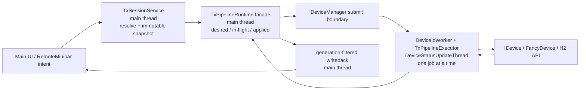

# TX Pipeline Async Executor Phase 1 Plan

## Status

- Task type: implementation
- Implementation status: `implemented; static verification complete` (2026-07-23)
- Current verification level: `static`
- First implementation target:
  1. remove confirmed redundant refresh/apply paths;
  2. move the existing core-managed device execution path to one serialized device I/O executor;
  3. add latest-intent request coalescing and generation-aware writeback filtering.
- Deferred implementation targets:
  1. device-side differential apply;
  2. Streaming asynchronous stop/rearm and backpressure cleanup.

This TaskLog records both the pre-change implementation boundary and the final
Phase 1 implementation result.

## Scope

Phase 1 covers the core-managed pipelines currently executed by
`TxPipelineRuntime`:

- `Mute`
- `FixedCw`
- `SweepCw`
- `FixedPlayback`
- `SweepPlayback`

Phase 1 keeps the current full device configuration sequence inside each apply.
It changes scheduling, ownership, request correlation, and writeback acceptance,
but deliberately does not yet change individual H2 set/query calls.

Product decision confirmed before implementation:

- Playback `dataReady == false` does not add an explicit Mute transition or
  force an RF intent change while waiting for waveform generation.
- The existing two-phase behavior remains: apply the Playback base
  configuration first, then download/start only after payload readiness.
- A deliberate silent-wait or old-waveform-continuity policy remains outside
  this phase together with device-side differential execution.

Phase 1 also removes confirmed redundant execution at the request boundary:

- duplicate RF refresh from `RemoteMinibarService`;
- repeated refresh signals within one main-thread event-loop turn;
- semantically identical desired requests when no intervening in-flight request
  can still change the hardware.

## Explicit Non-Goals

The following work must not be mixed into the first implementation:

- do not add RF-only, Center-only, Level-only, Clock-only, Trigger-only, or
  Sweep-only H2 fast paths yet;
- do not change the existing H2 configuration order inside
  `TxPipelineRuntime`/the extracted executor;
- do not move PropertySystem, `CommonDeviceProfile`, `StepSweepPanel`,
  `BusinessManager`, `IBusiness`, or any QWidget into a worker thread;
- do not make the helper process a runtime/device owner;
- do not move continuous `tx_send_stream()` calls into the TX apply queue;
- do not rewrite `StreamingBussiness` in Phase 1;
- do not remove legacy-managed provider paths;
- do not change waveform identity, shared-storage, or device-resident reuse
  semantics;
- do not add parallel device apply jobs.

Streaming transition waits remain a known limitation until the deferred
Streaming phase. Phase 1 must not claim that transitions out of an active
Streaming business are fully non-blocking.

## Assumptions And Evidence

### Observed

1. `TxSessionService::requestRefresh()` calls `updateOrchestrator()` directly.
   The caller therefore executes resolve, request construction, pipeline
   routing, device configuration, query, and writeback synchronously.
2. `TxSessionService::applyResolvedPipeline()` computes `requestChanged`, but
   the core-managed branch always calls `m_pipelineRuntime->requestApply()`.
   A request equal to the effective applied request can therefore execute the
   whole device sequence again.
3. The RF command in `RemoteMinibarService` calls
   `emitPropertyEditingFinished(property)`. `TxSessionService` is already
   connected to RF `editingFinished`, but the handler then calls
   `TxSessionService::requestRefresh()` explicitly a second time.
4. `TxPipelineRuntime::requestApply()` is documented and implemented as
   synchronous. It stores the request in mutable runtime state and immediately
   calls one of the `apply*()` functions.
5. `TxSessionService` currently records the core request as applied even though
   it ignores the boolean return value of `requestApply()`.
6. `FancyDevice::configuration()` always executes
   `applyCommonDeviceSettingsLocked()`, `applyModeConfigurationLocked()`, and
   full profile writeback when a writeback pointer is supplied.
7. `TxPipelineRuntime` emits device and sweep writeback from inside the
   synchronous apply call. `MainWindow` immediately writes successful device
   profile results into `CommonDeviceProfile`.
8. `TxApplyRequest` contains values and immutable payload handles, not QWidget,
   Property, or Business object pointers. It is therefore already close to a
   worker-safe execution snapshot.
9. `PlaybackPayload` copies share one storage identity. The runtime releases
   shared host storage after synchronous waveform download and retains only
   identity/count/device residence information.
10. Device open, close, delete, and periodic status polling are intentionally
    serialized on `DeviceStatusUpdateThread` through `DeviceIoWorker`.
11. `DeviceManager::stopStatusUpdates()` currently uses
    `Qt::BlockingQueuedConnection` when called outside the status thread.
    Reusing the same thread for long TX jobs without changing this path would
    make a device-switch action wait on the UI thread for the current TX job.
12. `StreamingBussiness` already performs configuration/send work on its sender
    thread, but `stopBusiness()` busy-waits on the calling thread until
    `m_interrupt` changes.
13. The minibar IPC contract already states that an accepted RSP means the main
    request adapter accepted the intent; it does not mean asynchronous hardware
    configuration has completed.

### Inferred

1. Removing duplicate refreshes will reduce unnecessary work but cannot
   guarantee UI responsiveness because any remaining synchronous SDK call can
   still block.
2. Moving only the device-facing execution stage is sufficient for core-managed
   UI responsiveness. Resolve and request construction should stay on the main
   thread because they consume UI/business-owned state.
3. The executor must be serialized per device, not per RF/Center/Level resource.
   All of these commands mutate one shared H2 channel/device state.
4. A stale completion cannot simply be ignored everywhere:
   - it must not overwrite current UI/property authoring state;
   - a successful stale completion may still describe what was physically
     applied and is useful as the executor's internal base for the next job;
   - a partial/failed stale completion makes the hardware state uncertain and
     must invalidate the executor's applied cache.
5. Equality checks must be aware of an in-flight job. If A is applied, B is
   in flight, and the user returns to A, A must remain pending because B may
   already have changed the hardware.
6. `PlaybackPayload::releaseStorage()` must not be called by a main-thread
   deactivate path while a worker is downloading from the same shared storage.
7. Reusing `DeviceStatusUpdateThread` is safer than creating an unrelated TX
   thread because it preserves the repository's device lifetime and SDK
   serialization rule. The existing blocking status-timer stop must be removed
   from the UI path as a prerequisite.

## Success Criteria

### Phase 1A: Redundant Work Removal

1. One RemoteMinibar RF command produces one logical refresh request.
2. Multiple refresh signals generated in the same main-thread event-loop turn
   produce one resolve/build operation.
3. When no apply is in flight, a desired request equal to the last successful
   effective applied request produces no device I/O.
4. If a different request is in flight, returning to the previously applied
   request is retained as pending and is not incorrectly dropped.
5. An apply failure is not recorded as the successful applied request.

### Phase 1B: Serialized Async Executor

1. Core-managed `requestRefresh()` returns without waiting for device
   configuration, sweep query, or waveform download.
2. At most one core TX apply is executing for the current device.
3. While one job is running, later UI changes replace one pending-latest
   request; they do not append an unbounded FIFO backlog.
4. Completion of an older generation cannot overwrite newer RF, Center, Level,
   common settings, Sweep authoring state, or RMS display.
5. The final successful generation publishes the same effective device/sweep
   writeback as the current synchronous flow.
6. Device UID or capability revision changes invalidate pending/applied state;
   an old completion is dropped and the ready device receives a freshly built
   request.
7. Open/close/delete/status polling and core TX apply remain serialized in one
   device I/O domain.
8. Clicking device switch while a TX job is running does not block the main
   thread while waiting to stop the status timer.
9. Existing immutable waveform storage is not copied. Download completion
   remains the storage-release boundary, and identical payload identity keeps
   device-resident reuse semantics.
10. Minibar accepted responses remain immediate main-side intent acceptance;
    no IPC protocol field is added solely for Phase 1.

### Known Phase 1 Limitation

A synchronous SDK call already in progress cannot be preempted. Phase 1 keeps
the UI responsive and coalesces the next request, but physical device
convergence waits until the current SDK call returns. Fast RF OFF ordering and
safe cancellation checkpoints belong to the differential-apply phase unless
the H2 API exposes a supported cancellation primitive.

## Target Architecture



### Ownership

| Owner | Thread | Responsibilities |
| --- | --- | --- |
| `TxSessionService` | main | collect shared/UI-owned state, resolve pipeline, build `TxApplyRequest`, route core/legacy |
| `TxPipelineRuntime` facade | main | generation allocation, desired/in-flight/pending/applied state machine, result filtering, public applied state |
| `DeviceManager` | main + device I/O | enqueue TX jobs, serialize them with lifecycle/status work, relay results |
| `TxPipelineExecutor` | device I/O | validate UID/revision, normalize device-specific values, run the existing complete apply sequence, own resident payload cache |
| `MainWindow` / writeback consumers | main | apply only accepted device/sweep writeback to authoring/UI state |
| `RemoteMinibarService` | main | accept typed UI intent and return an immediate authoritative main-state snapshot |

No worker object may read a Property, Panel, Business, or QWidget.

## Proposed Types

The exact filenames may be adjusted during implementation, but the semantic
split should remain explicit.

```cpp
struct TxApplyJob
{
    quint64 epoch = 0;
    quint64 generation = 0;
    TxApplyRequest request;
};

enum class TxApplyCompletionCode
{
    Succeeded,
    Failed,
    RejectedStaleDevice,
    SupersededBeforeStart
};

struct TxApplyWritebackEvent
{
    quint64 epoch = 0;
    quint64 generation = 0;
    quint64 deviceUid = 0;
    quint64 capabilityRevision = 0;
    bool hasDeviceProfile = false;
    IDevice::Profile deviceProfile;
    bool hasCarrier = false;
    TxCarrierPlanContext carrier;
};

struct TxApplyCompletion
{
    quint64 epoch = 0;
    quint64 generation = 0;
    TxApplyCompletionCode code = TxApplyCompletionCode::Failed;
    TxApplyRequest requested;
    TxApplyRequest effective;
    QString errorMessage;
    bool hardwareStateKnown = false;
};
```

Rules:

1. `epoch` changes when runtime ownership is invalidated, such as device
   capability change, suspend/deactivate, legacy takeover, or shutdown.
2. `generation` changes for each semantically new desired core request.
3. `effective` contains device-confirmed values absorbed by the current runtime,
   including Level writeback.
4. Existing multi-stage writeback points may be represented as tagged
   `TxApplyWritebackEvent` values. The facade filters every event before
   forwarding it.
5. New cross-thread value types require `Q_DECLARE_METATYPE` and startup
   registration, or functor-based queued dispatch with value captures where
   appropriate. Do not pass UI-owned pointers.

## Runtime State Model

The main-thread facade keeps:

```text
epoch
nextGeneration

hasDesiredRequest
desiredGeneration
desiredRequest

inFlight
inFlightGeneration
inFlightRequest

hasPendingLatest
pendingGeneration
pendingRequest

hasAppliedRequest
appliedGeneration
appliedEffectiveRequest
lastApplyStatus
```

The executor keeps only device execution state:

```text
residentPlaybackPayloadIdentity
residentPlaybackDeviceUid
residentPlaybackCapabilityRevision
deviceAppliedCacheValidity
lastExecutedEffectiveRequest
```

`TxSessionService::appliedPipeline()` and `appliedRequest()` continue to mean
successful/effective applied state. Enqueuing a request must not update them.
If the UI later needs desired/pending state, expose it under a separate name;
do not silently redefine `applied`.

## Request And Completion State Machine

### Submitting a Desired Request

1. Build the complete `TxApplyRequest` on the main thread.
2. If it equals the existing desired request, stop.
3. Allocate a new generation and replace `desiredRequest`.
4. If no job is in flight:
   - if desired equals the successful applied request, perform no device I/O;
   - otherwise dispatch it immediately.
5. If a job is in flight:
   - replace `pendingLatest` with the new desired request;
   - do not enqueue it to the device thread yet.

### Important Equality Case

```text
applied = A
in-flight = B
new desired = A
```

The new A is not a no-op. B may already have changed the hardware, so A remains
pending until B completes. Only a state-machine-aware check can decide whether
an equal request is safe to drop.

### Successful Completion

1. Verify completion epoch/generation matches the recorded in-flight job.
2. Clear `inFlight`.
3. Update the executor/internal applied basis from the successful effective
   result even if the generation is no longer the current UI intent.
4. Publish device/sweep writeback only when:
   - completion epoch still matches;
   - device UID and capability revision still match;
   - generation is still desired; or
   - desired request is semantically equal to the completed effective request.
5. If a newer pending request differs from the effective hardware state,
   dispatch only that latest request.
6. If the newest desired request is already satisfied by the completion, absorb
   it without another apply.

### Failed Completion

1. Clear `inFlight`.
2. Do not replace the last successful applied request.
3. Mark the executor's device-applied cache uncertain if the device may have
   completed only part of the sequence.
4. If a newer pending request exists:
   - retain the failure in logs/diagnostics;
   - do not roll the UI back to the stale request;
   - dispatch the latest request as a full apply.
5. If the failed request is still the latest desired request:
   - emit one final apply failure through the existing error/status path;
   - keep authoring state as the user's desired value;
   - do not automatically loop retries.

### Device Change

On `deviceCapabilitiesAboutToChange`:

1. increment epoch;
2. clear pending and successful applied state;
3. mark the in-flight result obsolete without attempting unsafe thread
   termination;
4. invalidate resident waveform and device-applied caches;
5. reject all later events/completion from the old epoch.

On `deviceCapabilitiesReady`:

1. build a new request from current UI/business state;
2. use the new device UID and capability revision;
3. perform a complete apply.

## Detailed Implementation Steps

### Step 1: Coalesce Main-Thread Refreshes

Files:

- `src/plugins/core/txsessionservice.h`
- `src/plugins/core/txsessionservice.cpp`

Add a zero-delay queued refresh boundary:

```text
requestRefresh()
  -> mark refreshDirty
  -> if not scheduled, queue processPendingRefresh()

processPendingRefresh()
  -> clear scheduled flag
  -> check suspend/capability gates
  -> if allowed, clear dirty and resolve/build once
```

Requirements:

1. Use one event-loop turn, not an arbitrary 50 ms debounce. RF and parameter
   intents should remain immediate.
2. If updates are gated by capability reconcile or suspension, retain the dirty
   state. When readiness resumes, schedule one fresh snapshot.
3. `setUpdatesSuspended(false)` must schedule a pending dirty refresh.
4. Audit callers that currently assume `requestRefresh()` has completed device
   configuration before it returns.
5. `MainWindow::refreshTxSession()` must not immediately call
   `updateWindowTitleForAppliedPipeline()` based on stale applied state. Update
   the title from an accepted applied-state signal instead.

### Step 2: Remove Confirmed Duplicate RF Refresh

File:

- `src/plugins/core/remoteminibarservice.cpp`

For RF:

1. keep property `setValue()`;
2. keep `emitPropertyEditingFinished(property)`;
3. remove the additional direct `TxSessionService::requestRefresh()` call;
4. keep immediate accepted RSP construction after main-side property update.

The helper's optimistic RF request correlation remains unchanged.

### Step 3: Add Cross-Thread Apply Job/Result Types

Preferred location:

- a new focused header under `src/plugins/core/`, or
- `txpipelinestate.h` only if the types remain small and broadly shared.

Requirements:

1. Keep the job entirely value-based.
2. Preserve lightweight `PlaybackPayload` identity/view copying.
3. Carry explicit epoch, generation, UID, and capability revision.
4. Carry error text and distinguish stale-device rejection from device failure.
5. Preserve current device-profile and sweep writeback boundaries.
6. Register all queued signal value types.

### Step 4: Extract Device-Facing Execution

Files:

- `src/plugins/core/txpipelineruntime.h`
- `src/plugins/core/txpipelineruntime.cpp`
- new `src/plugins/core/txpipelineexecutor.h/.cpp`
- `src/plugins/core/CMakeLists.txt`

Move these responsibilities to the executor without changing their internal H2
behavior:

- request validation against device UID/revision/capabilities;
- request normalization for trigger source and RF port;
- `fillDeviceProfile()`;
- `applyMute()`;
- `applyFixedCw()`;
- `applySweepCw()`;
- `applyFixedPlayback()`;
- `applySweepPlayback()`;
- sweep query/writeback;
- waveform upload and storage release;
- resident waveform identity/device/revision tracking.

The executor returns tagged writeback/completion values instead of directly
updating `TxSessionService`, `CommonDeviceProfile`, or UI.

The runtime facade remains on the main thread and owns request scheduling and
writeback filtering.

### Step 5: Place The Executor In The Existing Device I/O Domain

Files:

- `src/plugins/core/devicemanager.h`
- `src/plugins/core/devicemanager_p.h`
- `src/plugins/core/devicemanager.cpp`

Preferred ownership:

1. `DeviceIoWorker` owns or directly invokes `TxPipelineExecutor`.
2. `DeviceManager` exposes a narrow `submitTxApply(TxApplyJob)` boundary and a
   completion relay.
3. The executor runs on `DeviceStatusUpdateThread`.
4. It resolves the current device at execution time and validates UID/revision
   before dereferencing it.
5. Open, close, delete, status polling, and TX execution remain serialized.

Do not capture a raw current-device pointer on the main thread and later
dereference it from an unrelated worker thread.

### Step 6: Remove Main-Thread Blocking From Status Poll Stop

Files:

- `src/plugins/core/devicemanager_p.h`
- `src/plugins/core/devicemanager.cpp`

This is a prerequisite for safely reusing `DeviceStatusUpdateThread`.

Recommended behavior:

1. Add a thread-safe `pollingRequested`/`pollingEnabled` gate checked at the
   beginning of `onStatusUpdateTimeout()`.
2. `stopStatusUpdates()` clears the gate immediately and posts timer stop
   asynchronously; it does not use `BlockingQueuedConnection`.
3. `startStatusUpdates()` sets the gate before posting timer start.
4. A device switch job stops the timer again inside the device I/O thread before
   close/open work, so timer and lifecycle ordering remain deterministic.
5. A timeout event already queued before timer stop observes the disabled gate
   and returns before touching a device.

This avoids waiting on the UI thread when a long TX job is ahead of the timer
stop event.

### Step 7: Implement The Latest-Request Coordinator

Files:

- `src/plugins/core/txpipelineruntime.h`
- `src/plugins/core/txpipelineruntime.cpp`
- `src/plugins/core/txsessionservice.h`
- `src/plugins/core/txsessionservice.cpp`

Requirements:

1. One in-flight job maximum.
2. One replaceable pending-latest request maximum.
3. No unbounded device-thread queue of UI parameter changes.
4. State-aware equality handling.
5. Applied state changes only on successful completion.
6. Failed or stale requests do not publish RMS as successful.
7. `deactivate()` becomes an epoch/invalidation operation. It must not call
   `PlaybackPayload::releaseStorage()` from the main thread while an executor job
   may still consume it.
8. Entering a legacy-managed path invalidates the core executor's assumed
   device-applied cache. Returning to core-managed execution therefore performs
   a full apply.

### Step 8: Filter And Publish Writeback On The Main Thread

Files:

- `src/plugins/core/txpipelineruntime.cpp`
- `src/plugins/core/txsessionservice.cpp`
- `src/plugins/core/mainwindow.cpp`

Rules:

1. Filter every writeback event by epoch, generation, UID, and capability
   revision.
2. Do not call `CommonDeviceProfile::setProfile()` for stale generations.
3. Do not call `StepSweepPanel::applyCarrierPlanWriteback()` for stale
   generations.
4. Only a final accepted successful result updates:
   - `m_appliedPipeline`;
   - `m_appliedRequest`;
   - `m_hasAppliedRequest`;
   - RMS display;
   - applied-pipeline title state.
5. A current-generation failure reaches the existing device configuration error
   channel without overwriting authoring properties.
6. Preserve the special rule that MScan device writeback does not destructively
   replace the authoring table.

### Step 9: Preserve Minibar Request Semantics

Files to inspect:

- `src/plugins/core/remoteminibarservice.cpp`
- `src/app/minibarhelper/minibarclient.cpp`
- `src/app/minibarhelper/remoteminibarwindow.cpp`

Expected Phase 1 behavior:

1. Main validates and applies the UI/property intent.
2. Main queues a TX refresh/apply and immediately returns accepted RSP.
3. RSP snapshot describes current main authoring/desired state.
4. Hardware completion is not required before RSP.
5. Existing RF/MOD/Sweep helper latest-intent logic remains unchanged.
6. A stale executor writeback is filtered in main and therefore never becomes a
   correction EVT.

No minibar protocol version bump is required for this phase.

### Step 10: Add Structured Timing And Correlation Logs

Use a compact log prefix such as `[TxApplyQueue]` and keep the existing
`[TxPipelineRuntime]` device detail logs.

Log at minimum:

- epoch/generation;
- device UID/capability revision;
- desired/in-flight/pending/applied transition;
- enqueue-to-start delay;
- device execution duration;
- completion code;
- stale writeback drop reason;
- whether a pending request replaced an older pending request;
- payload identity and uploaded/reused status without logging payload contents.

The logs must make these questions answerable:

1. Did one UI intent produce more than one logical request?
2. Was the request executed, coalesced, or skipped as already applied?
3. Which generation physically finished?
4. Why was a writeback accepted or dropped?
5. How long did queue wait and device execution take separately?

## Waveform Memory And Lifetime Contract

Phase 1 must preserve the current memory optimization.

1. `TxApplyJob` copies a lightweight `PlaybackPayload` handle only.
2. No worker dispatch copies or scans the IQ array.
3. A request pending with the same payload identity shares storage with the
   in-flight request.
4. Only the device executor calls `releaseStorage()` after the synchronous
   waveform download returns.
5. The main-thread facade must not release shared storage on deactivate.
6. Dropping a never-started pending request normally drops its handle; it must
   not globally release storage if the same identity is still in flight.
7. Successful download keeps identity/word count/device UID/revision so a later
   full apply can still use `preservePlaybackWaveforms`.
8. Device change, capability revision change, explicit executor invalidation, or
   failed download clears resident reuse state.

## Failure And Race Matrix

| Scenario | Required result |
| --- | --- |
| A applied, refresh A | no job |
| A applied, B submitted | B becomes in flight |
| B in flight, C then D submitted | only D remains pending |
| A applied, B in flight, user returns A | A remains pending |
| B succeeds and is still desired | accept writeback, publish applied B |
| B succeeds while D is desired | drop B UI writeback, retain internal B basis, execute D |
| B succeeds and latest desired is semantically B | absorb completion, no second B job |
| B fails while D is desired | no stale rollback, invalidate hardware cache, execute full D |
| latest B fails | report once, keep last successful applied state |
| device changes during B | increment epoch, drop B result, rebuild for new UID/revision |
| writeback arrives after newer Center edit | do not overwrite newer Center |
| writeback arrives after newer Sweep edit | do not overwrite newer authoring state |
| same payload, parameter-only newer request | no host copy; existing resident reuse remains available |
| shutdown with queued pending request | discard pending, stop accepting new jobs |

## Shutdown And Teardown

Async execution introduces an in-flight lifetime that must be explicitly closed.

1. `TxSessionService` stops accepting new desired requests before device runtime
   teardown.
2. Increment epoch and discard pending-latest work.
3. Disconnect or guard result delivery before UI owners are destroyed.
4. Allow the serialized device worker to finish the current synchronous SDK call
   or use a documented SDK cancellation API if one exists.
5. Do not call `QThread::terminate()` as a normal TX cancellation mechanism.
6. Review the existing three-second DeviceManager shutdown timeout with actual
   waveform/configuration timing. A forced termination while H2 code owns device
   state is not a safe executor shutdown strategy.

The implementation may initially retain the existing application shutdown
timeout, but it must log an unfinished TX generation and must not introduce a
use-after-free between the executor, `IDevice`, and UI consumers.

## Planned Files

Expected Phase 1 source set:

- `src/plugins/core/txpipelinestate.h` or a new focused TX apply type header
- `src/plugins/core/txsessionservice.h`
- `src/plugins/core/txsessionservice.cpp`
- `src/plugins/core/txpipelineruntime.h`
- `src/plugins/core/txpipelineruntime.cpp`
- `src/plugins/core/txpipelineexecutor.h` (new)
- `src/plugins/core/txpipelineexecutor.cpp` (new)
- `src/plugins/core/devicemanager.h`
- `src/plugins/core/devicemanager_p.h`
- `src/plugins/core/devicemanager.cpp`
- `src/plugins/core/remoteminibarservice.cpp`
- `src/plugins/core/mainwindow.cpp`
- `src/plugins/core/CMakeLists.txt`
- `.github/KnowledgeBase/tx_execution_context_phase1_and_provider_migration.md`
  after implementation stabilizes

The exact list must be revalidated immediately before implementation. Do not
modify unrelated device-setting, GNSS, GPIO, Fan, or updater code.

## Implementation Sequence

Use small reviewable commits or checkpoints:

1. **Refresh dedup only**
   - queued refresh coalescing;
   - RemoteMinibar RF duplicate removal;
   - no thread changes.
2. **Job/result value model**
   - add metatypes and logs;
   - no execution behavior change.
3. **Executor extraction**
   - move current apply functions mechanically;
   - still invoke synchronously during the extraction checkpoint if necessary;
   - verify no H2 sequence changed.
4. **Device I/O thread dispatch**
   - integrate executor with `DeviceIoWorker`;
   - make status polling stop non-blocking;
   - return tagged result values.
5. **Latest-request coordinator**
   - one in flight plus one pending latest;
   - state-aware equality;
   - failure/applied semantics.
6. **Generation-filtered writeback**
   - Common profile, Sweep, RMS, title;
   - device/revision invalidation.
7. **Documentation and runtime validation**
   - update KnowledgeBase after behavior is verified;
   - keep differential apply and Streaming changes out of this phase.

## Verification Plan

### Static Verification

- Confirm all new Core sources are included by `src/plugins/core/CMakeLists.txt`.
- Confirm no worker path reads PropertySystem, QWidget, Panel, or Business state.
- Confirm no main-thread path directly calls the extracted `apply*()` functions.
- Confirm `requestRefresh()` has one queued processing entry.
- Confirm RemoteMinibar RF has no extra explicit refresh.
- Confirm result/writeback types contain epoch, generation, UID, and capability
  revision.
- Confirm `m_appliedRequest` changes only on successful accepted completion.
- Confirm `PlaybackPayload::releaseStorage()` is not called from main-thread
  deactivation while a job can be in flight.
- Confirm `stopStatusUpdates()` no longer uses a blocking wait on the TX worker
  thread.
- Run `git diff --check`.

### Debug Build Verification

When implementation is requested:

- use the existing Debug CMake build tree;
- build the current Core/app targets;
- do not switch build systems or create a new build tree.

### Runtime Without RF Instrumentation

Use structured logs first:

1. RF OFF/ON single click produces one generation.
2. Re-emitting the same value produces no executor job.
3. Rapid Center edits retain one in-flight plus one latest pending request.
4. MainWindow remains responsive while a deliberately delayed/fake executor job
   is running.
5. Device switch during a delayed job does not block the UI and drops the old
   result.
6. Current-generation failure does not become applied state.

### Hardware Runtime Matrix

- `Mute`
- `FixedCw`
- `SweepCw`: FScan/LScan; MScan when hardware/UI availability permits
- `FixedPlayback`: awaiting payload, new payload, resident payload reuse
- `SweepPlayback`: awaiting payload, upload/start, sweep query/writeback
- External/XPPS trigger remains armed without an unintended BUS trigger
- UNLEVEL and other warning-as-success behavior remains unchanged
- rapid `ON -> OFF -> ON`
- Center/Level edit while a prior apply is in flight
- device disconnect/reconnect during apply
- same payload with parameter-only changes does not download again

Performance acceptance:

- the main-thread intent handler returns without waiting for SDK configuration;
- queue wait and device execution timing are separated in logs;
- no unbounded pending job growth occurs;
- identical authoring confirmation causes no extra apply;
- final hardware state converges to the latest desired snapshot.

## Implementation Record

Implemented on 2026-07-23:

1. `TxSessionService::requestRefresh()` now coalesces refresh signals at a
   zero-delay event-loop boundary. A dirty marker is also sent to the runtime
   immediately, so a completion arriving before the next snapshot cannot write
   stale device values back into newer authoring state.
2. The redundant RemoteMinibar RF refresh was removed. The accepted response
   remains an immediate acknowledgement of main-side intent acceptance.
3. The former synchronous device-facing `TxPipelineRuntime` implementation was
   mechanically extracted to `TxPipelineExecutor`. Its H2 sequence was kept
   unchanged.
4. The new main-thread `TxPipelineRuntime` is a coordinator with one in-flight
   job and one replaceable pending-latest job. It owns epoch/generation
   correlation and publishes only accepted writeback.
5. `DeviceIoWorker` owns `TxPipelineExecutor`; core TX apply, device lifecycle,
   and status polling use the same `DeviceStatusUpdateThread` execution domain.
6. Status polling has an atomic request gate, and stopping its timer no longer
   uses `Qt::BlockingQueuedConnection` from the main thread.
7. `TxSessionService::appliedRequest()` is updated only from a successful,
   current runtime completion. RMS and window-title updates follow that accepted
   state.
8. Core-to-legacy handoff waits until an already-running core apply is idle
   before activating the latest legacy request. This prevents Phase 1 from
   introducing concurrent Core/Legacy H2 access.
9. Playback jobs copy only the immutable `PlaybackPayload` handle. Synchronous
   download completion remains the shared-storage release boundary; runtime
   invalidation does not release storage while a worker may still read it.
10. Playback `dataReady == false` does not add an implicit Mute or force an RF
    intent change. The existing Phase 1 base configuration still runs; payload
    download/start waits for waveform readiness.

Static verification completed:

- new source files are listed by `src/plugins/core/CMakeLists.txt`;
- the executor has no PropertySystem, QWidget, Panel, or Business dependency;
- device-facing `apply*()` functions are reachable only through
  `DeviceIoWorker`;
- queued job/result values carry epoch/generation and a full request containing
  device UID/capability revision;
- `PlaybackPayload::releaseStorage()` remains only at the synchronous download
  completion boundary;
- `DeviceManager::stopStatusUpdates()` contains no blocking queued connection;
- `git diff --check` passes (line-ending conversion warnings only).

Not run in this task:

- Debug build;
- executable/runtime verification;
- instrument/hardware matrix.

These remain required before treating the change as release-validated.

## Deferred Target 1: Differential Apply

Start only after Phase 1 logs prove request correlation and applied-state
tracking are stable.

Planned direction:

1. Compare newest desired request with the last successful effective device
   state inside the executor.
2. Produce a device-facing `TxChangeSet`/apply plan.
3. Do not query before every set merely to detect change; use the successful
   applied cache.
4. Query only fields that require clamp/normalization/writeback confirmation.
5. Add narrow paths in this order:
   - no-op;
   - RF output;
   - Center/Level FFM;
   - Clock;
   - Trigger/Trigger Out;
   - RF Port/LO;
   - Sweep carrier;
   - mode/provider transitions.
6. RF OFF should be the earliest safe operation.
7. RF ON should occur only after required common/mode/carrier/baseband
   configuration succeeds.
8. Check supersession at safe phase boundaries, especially after waveform
   download and before trigger/output.
9. Partial failure invalidates affected cached groups and forces a complete
   recovery apply.
10. All TX-writing legacy/direct paths must either migrate into the same
    executor or explicitly invalidate its applied cache.

The existing proposed `IDevice::applyTxRequest()`/`TxApplyWriteback` convergence
direction is a suitable device boundary for this phase, but it should consume
the executor's desired/effective model rather than becoming another synchronous
UI-thread entry.

## Deferred Target 2: Streaming

Streaming remains a session, not a sequence of ordinary TX apply jobs.

Next implementation goals:

1. Replace `StreamingBussiness::stopBusiness()` busy-wait with asynchronous
   stop request plus stopped acknowledgement.
2. Make core/legacy pipeline switching wait through an asynchronous transition
   state instead of blocking the main thread.
3. Keep continuous `tx_send_stream()` on the sender/session thread.
4. Route only Streaming configure/rearm/hard-reboot operations through a
   serialized configuration boundary.
5. Store the complete bridged `TxApplyRequest`, not only carrier context, so
   latest request correlation is consistent.
6. Define how Streaming configuration invalidates the core executor's applied
   and resident waveform caches.
7. Add bounded frame-duration/backpressure behavior for low sample rates.
8. Add failure backoff to avoid fast warning/error/log loops.
9. Preserve throughput status while avoiding unnecessary TX feature refresh
   contention.
10. Verify `Streaming -> Mute/CW/Playback` and reverse transitions without UI
    wait or concurrent H2 configuration.

## Final Design Boundary

Phase 1 is successful when scheduling and state ownership are correct even
though each device apply still uses the current full set/query sequence.

Differential apply then becomes an internal executor optimization, and
Streaming becomes a separately coordinated long-lived session. Neither future
change should require another UI ownership or writeback-correlation redesign.
