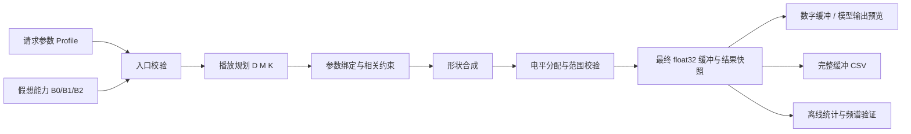

# AWG 假想硬件契约下的波形算法设计与重构方案
日期：2026-09-23。状态：供下一步重构使用的设计稿，尚未实现。

当前没有真实硬件，以下采样率、存储深度、分频与电平能力都是**明确选定的模型参数**，不代表已验证的设备规格，也不以等待硬件答复作为算法工作的前置条件。

## 1. 目标与本轮决定

目标是建立“输入参数 → 合法播放计划 → 数字缓冲 → 模型输出 → 可复现的数据分析”的闭环，使下一步重构能逐项验收。

本轮确定以下选择：

1. 以**固定基础采样率、有限缓冲循环回放**作为基本模型。频率由缓冲长度 M、周期数 K 和已声明的分频 D 决定。
2. 默认模型不分频、没有模拟增益和偏移；另用两组明确的假想能力测试分频、电平分配。它们属于本方案的验证范围，不泛化为任意硬件框架。
3. 周期波形使用**有限谐波合成**作为可分析的基线。Sine 直接求值；Square、Pulse、Ramp、Arbitrary 先定义谐波，再合成最终缓冲。区间平均不承担严格带限的职责。
4. 预览默认显示**归一化模型输出**，可切换数字缓冲；CSV 同时导出两者。没有电压标定时不标 V，也不称为“实测物理输出”。
5. 不静默改变周期波形幅度，不靠最终硬限幅掩盖带限过冲；Noise 的尾部限幅单独定义，并导出限幅次数与实际统计量。
6. 先完成算法和离线数据闭环，再处理性能及界面异步。真实设备协议、量化、上传、触发和序列器不在本轮实现范围内。

## 2. 当前代码事实与改动边界

以下是本次读取源码确认的事实，不是沿用历史方案的推测。

| 位置 | 当前状态 | 重构方向 |
| --- | --- | --- |
| `src/plugins/awg/awgwaveformgenerator.cpp` | 周期波形使用 `frequencyHz * pointCount` 得到采样率；生成器内部读取 `defaults()` | 注入能力，先规划再合成 |
| 同上，Arbitrary 分支 | 已将整文件解释为一个周期的形状表，按相位线性插值 | 保留周期形状语义，改为明确带限的重采样 |
| 同上，Noise 分支 | 时域白噪声或频域带限噪声；去均值、按总体标准差归一化，施加电平后在 ±1 限幅 | 使用有效采样率，明确尾部处理和统计偏差 |
| `awgprofile.h` | 周期点数与 Noise 长度共用 `pointCount`；非周期使用 `sampleRateHz` | 请求参数和规划派生量分开 |
| `awgprofilepersistence.cpp` | 持久化现有字段，没有显式 Profile 版本 | 加版本及明确迁移规则 |
| `awgcsvexporter.cpp` | CSV v1，列为 `time_seconds,value` | 升级分析格式，保留数字样本与模型输出 |
| `awgfileimporter.cpp` | 文本只接受一列值或两列时间/值；导入值限制在 [-1,1] | 新分析 CSV 需要显式识别，不能误把第二列当形状 |
| `awgpanel.cpp` | 同步调用生成器，结果采样率会写回界面状态 | 避免请求和结果互相覆盖，加入受控异步生成 |
| `awgbusiness.cpp` | AWG Debug / LF AWG Debug Preview | 当前没有需要实现的实际上传流程 |
| `src/libs/utils/fftutils.h` | 当前 FFT 仅支持 radix-2；`ifftInPlace` 已含 1/N 缩放 | 如采用本方案，补充任意长度变换，并保留原接口语义 |

保留已有 Pulse 分段定义、Ramp 对称度端点、Arbitrary 文件解析和 Profile 枚举编号。新增文件只用于播放规划、形状合成这两个具有独立数学契约的边界；不新增设备管理器、缓存框架或通用策略系统。

## 3. 假想硬件与观察模型

### 3.1 三组明确的能力

| 项目 | B0：默认回归基线 | B1：分频验证 | B2：电平验证 |
| --- | --- | --- | --- |
| 基础采样率 F0 | 125,000,000 Sa/s | 同 B0 | 同 B0 |
| 分频集合 D | {1} | {1,2,4,8,16,32,64,128,256,512,1024} | {1} |
| 缓冲长度 | 64 ≤ M ≤ 1,048,576 | 同 B0 | 同 B0 |
| 长度粒度 g | 16 | 同 B0 | 同 B0 |
| 模拟增益 G | {1} | {1} | {0.01,0.1,1} |
| 模拟偏移 b | 固定 0 | 固定 0 | 连续模型范围 [-1,1] |
| 数字样本 | float32，[-1,1]，有限值 | 同 B0 | 同 B0 |
| 输出模型范围 | [-1,1] | 同 B0 | 同 B0 |

分频的定义是：每隔 D 个基础时钟读取一个新样本，中间保持该值。因此有效样本更新率为 fs = F0/D，时间轴为 t[n] = n/fs。这不是 DDS 相位累加器模型。

B2 的偏移是**增益之后相加**，即 y = G·d+b。增益之前相加的硬件不符合此契约，不能仅换 capability 数值就宣称兼容。

能力只含当前规划、校验实际使用的数据。模拟偏移用允许范围表达，B0 为 [0,0]，不同时保存一个可推导的 `offsetDac` 标志。连续增益、任意分频范围、段重复不预先加入。

### 3.2 软件带宽策略

定义数字合成截止 fc = 0.4·fs，为 Nyquist 留出余量。它是本次的**数字带限策略**，不表示已知某个模拟重建滤波器的通带或阻带。

| 波形 | 基频或带宽上限 | B0 数值 |
| --- | --- | --- |
| Sine | 0.2·fs | 25 MHz |
| Square / Pulse | 0.08·fs | 10 MHz |
| Ramp | 0.016·fs | 2 MHz |
| Arbitrary | 0.04·fs | 5 MHz |
| 带限 Noise | 0.2·fs | 25 MHz |

这些比例是本模型的工作范围，不构成波形保真度保证。比如窄占空比方波，即使基频在范围内，经过带限也可能没有平坦高电平。

Pulse 保留当前约束，同时在模型中规定 rise/fall 各不小于 1/fs。Square 的高低区间各至少 1/fs；Pulse 也执行该占空比范围检查。实际检查使用规划后的频率及 fs。

### 3.3 三种数据必须区分

- **理想请求波形 w(t)**：用户输入的数学目标，允许包含无限谐波或理想跳变。
- **数字缓冲 d[n]**：经过频率规划、带限、电平分配，最后存为 float32 的实际样本序列。
- **归一化模型输出 y[n] = G·double(d[n])+b**：用最终 float32 缓冲计算的模型结果，是预览与分析的默认口径。

实际模拟信号还受 DAC 量化、零阶保持、重建滤波器、负载和校准影响。本轮不建这些模型；也不根据“14 bit”一项就推导真实 ENOB。未来如增加电压标定和模拟仿真，应作为独立且注明参数的观察层，不改写数字缓冲的含义。

## 4. 数据流与职责



各层的最小职责如下：

- **Capability**：描述允许的时钟、长度、电平范围；参数默认值和算法版本也需要可追溯。
- **播放规划**：只决定有效采样网格和频率实现误差，不能偷偷修改用户请求。
- **参数绑定**：统一使用 actualFrequencyHz，将相位、沿宽、截止频率转换成周、谐波数或 bin 数。
- **形状合成**：输入无量纲形状定义与 M/K，输出数值序列。形状可能过冲，不声明所有样本天然在 [-1,1]。
- **电平分配**：在相同输出目标下求数字 scale/offset 及 G/b，并校验最终数字及模型输出范围。
- **生成器**：编排前述步骤，形成一个一致的结果快照；失败和取消不能发布半成品。
- **预览、CSV、后续设备入口**：消费结果，不各自实现另一套幅度或频率规则。

优先扩展已有 `AwgGenerationResult`、`AwgRealWaveform` 和错误表达方式。不要为每一步都建立一个拥有重复字段的对象。

## 5. 播放规划：频率如何落到有限缓冲

### 5.1 数学契约

对周期波形：

$$
M=g m,\quad M_{lo}=g\lceil M_{min}/g\rceil,\quad
M_{hi}=g\lfloor M_{max}/g\rfloor,
$$

$$
K\ge1,\qquad f_{actual}=\frac{K F_0}{DM}=\frac{K f_s}{M}.
$$

因此连分数若以后采用，正确目标是 K/m ≈ f·g/fs，不能使用 f/(fs·g)。

每个 D 的最低周期频率为 fs/Mhi；B0 的下限为 119.20928955078125 Hz。DC 不使用这个下限，Noise 没有“基频”。B1 的理论全局下限约 0.1164 Hz，仍不支持 1 mHz。

缓冲周期时长为 M/fs；平均每周期采样数 M/K 可以不是整数。K 不要求与 M 互质；满足粒度约束后的缓冲可能包含更短样本序列的重复。

### 5.2 首版采用有界枚举

本方案先不用连分数优化。B0 只有 65,533 个合法长度，B1 也只有 11 个分频候选，直接枚举更容易证明“满足容差时最短”和“达不到时误差最小”，也适合作为以后优化算法的对照基线。

对每个 D，按 M 从小到大枚举：

1. 根据波形上限、Pulse 沿宽/占空比等约束，求当前 M 下允许的整数 K 区间；没有合法 K 时跳过。
2. 计算目标 q = f_request·M/fs。在合法 K 区间内选择使 |K−q| 最小的整数；半整数平局取较小 K。必要时比较 floor(q)/ceil(q) 与合法边界，避免舍入把候选推到能力范围之外。
3. 计算 actualFrequencyHz、带符号误差 Δf = f_actual−f_request、相对误差 e = Δf/f_request。
4. 对此 D，找到第一个 |e| ≤ 1e-9 的长度即可结束本 D 搜索；否则保留全范围最小 |Δf| 的候选，平局取更短 M，再取更小 K。

跨 D 的选择顺序：

- 只要存在达到容差的计划，选最小 D 下的最短合格 M。
- 都未达到容差时，选 |Δf| 最小的合法计划；平局依次比较 D、M、K。
- 没有合法计划则失败。达不到容差但有合法近似时，允许离线生成，返回明确警告，显示并导出实际频率及误差。

请求本身必须位于能力支持的范围，不能通过“最近合法频率”把 100 Hz 在 B0 下伪装成成功。所有与实际周期有关的约束仍按候选 f_actual 校验。

输入继续保留为以 Hz 为单位的 double，不按界面显示小数位隐式量化成 µHz。M、K、索引及乘积使用有边界证明的整数；误差计算使用 double，并在容差边界测试。不能仅因分子和分母分别装得进 uint64，就认定交叉乘法不会溢出；也不假设所有平台的 long double 都比 double 精度高。

### 5.3 可手算的基线例子

以下为 B0、g=16、1e-9 容差下的计划例子：

| 请求 | M | K | 实际频率 / 结果 |
| --- | --- | --- | --- |
| 1 kHz | 250,000 | 2 | 1 kHz，精确 |
| 500 kHz | 2,000 | 8 | 500 kHz，精确 |
| 10 MHz Square | 400 | 32 | 10 MHz，精确 |
| 119.20928955078125 Hz | 1,048,576 | 1 | 恰好处于下限 |
| 100 Hz | — | — | 超出 B0 能力，失败 |

原稿的 1 kHz / M=125,000 不满足 g=16，因此不能直接作为验收数据。任意小数频率的误差应由规划器计算，不保留没有计算依据的“约 1e-10”承诺。

## 6. 周期形状与带限合成

### 6.1 统一相位与谱定义

设相位 φ 以周表示，正相位表示波形向前推进：

$$
p_n=\operatorname{frac}\left(\frac{Kn\bmod M}{M}+\varphi\right),
\qquad \varphi=phaseDegrees/360.
$$

整数相位网格避免逐次累加浮点造成漂移。B0/B1 的 K、M 范围下 Kn 可用 64 位整数容纳；实施时必须按实际允许上限证明。

单周期理想形状的复系数定义为：

$$
c_h=\int_0^1 s(p)e^{-j2\pi hp}\,dp,\qquad
s_H(p)=c_0+2\operatorname{Re}\sum_{h=1}^{H}c_h e^{j2\pi hp}.
$$

取 H = floor(fc/f_actual)，同时保证 hK < M/2。fc 使用有效 fs，所有频率换算使用 f_actual。相位通过系数乘 exp(j2πhφ) 实现。

对最终 M 点缓冲构造频谱：

- X[0] = M·c0；
- X[hK] = M·c_h·exp(j2πhφ)；
- X[M−hK] = conjugate(X[hK])；其余为 0。

调用含 1/M 缩放的 IFFT 后得到 s_H(p_n)。由于保留的 hK 严格在正半谱内，不应将超 Nyquist 谐波取模后放入缓冲，那会把混叠主动写进去。

“循环一致”指延伸到 n=M 时回到 n=0，且拼接与同一周期函数的连续采样一致；**不要求 samples[M−1] 等于 samples[0]**，也不将方波或锯齿的合法跳变判成错误。

### 6.2 为什么不以区间平均作为本轮主算法

区间平均相当于矩形核平滑，能缓和采样网格对边沿的影响，但不能消除 Nyquist 以上所有能量。使用 [n,n+1] 区间还会相对 n/fs 的点采样引入半个采样间隔的对齐差异，必须另行定义相位。

原稿由此推导“消除时间抖动”“保证 −40 dBc”“严格带限”缺少依据。均值滤波的频域局限可参照作者提供的 [DSP Guide 频率响应说明](https://www.dspguide.com/ch15/3.htm)。

本轮优先选择可直接检查谐波位置与系数的频谱合成。接受其计算和内存成本；待建立正确基线后，再依据测量决定是否需要其他加速算法，不同时维护两个可由用户切换的合成模式。

### 6.3 Sine、Square、Pulse、Ramp

**Sine**：s(p)=sin(2πp)，直接按相位网格计算。无须 FFT，也不做区间平均；可用单谐波谱作为独立验证基准。

**Square**：0≤p<d 时为 +1，其余为 −1。c0=2d−1；h≠0 时：

$$
c_h=\frac{1-e^{-j2\pi hd}}{j\pi h}.
$$

不对非 50% duty 方波强行去均值。它的平均值由 duty 决定，用户 offset 是另加的直流量。

**Pulse**：保持当前相位定义。令 r=riseTime·f_actual，q=fallTime·f_actual：

- [0,r)：从 −1 线性上升到 +1；
- [r,d−q)：保持 +1；
- [d−q,d)：从 +1 线性下降到 −1；
- [d,1)：保持 −1。

保留当前 r+q≤d 且 r+q≤1−d 的产品约束；它比仅保证分段不重叠更严格，本轮不借重构改变这条规则。rise/fall 是理想参考形状的沿宽，经过带限后测得的 10%–90% 上升时间不保证等于输入。

**Ramp**：0<a<1 时，[0,a) 从 −1 上升到 +1，[a,1) 从 +1 下降到 −1；a=0 为下降锯齿，a=1 为上升锯齿。端点单独求值，不进入除以 a 或 1−a 的公式。

Pulse 和 Ramp 的 c_h 由上述线性段逐段解析积分得到；c0 单独求面积。可在合成模块中使用一个局部的分段线性积分函数，供这两种波形共享；以小规模数值积分或直接参考序列验证符号、相位与 DC 项。

### 6.4 Arbitrary

导入的 L 点仍表示一个周期在 p=l/L 的等间隔样本，文件采样率不控制回放速率。导入端继续验证有限值与 [-1,1] 范围；不自动删除末尾看似重复的点。

算法：

1. 对原始 L 点做 DFT，按 1/L 得到周期系数。
2. 采用实数周期三角插值作为形状定义，保留 DC 和满足 h·f_actual≤fc 的谐波。
3. 偶数 L 的源 Nyquist 分量 h=L/2 若被保留，应在 ±h 各分配原实系数的一半，解释为余弦；不能双计，也不能无说明丢弃。目标 Nyquist 仍不使用。
4. 将系数映射到 M 点谱的 hK 位置，做 IFFT。无需再构造过采样波表和 Catmull-Rom 插值。
5. 保存源点数、内容摘要、保留的最高阶数、移除谱能量比例，便于比较不同频率下的形状变化。

这是对现在线性插值语义的明确改变。低频、未截断时应在原形状网格上复现输入点；网格之间遵循三角插值，不能宣称与旧线性插值逐点相等。源数组长度 L=1 时按常数形状处理，去掉所有非 DC 项后也仍是合法常数；请求频率只代表播放计划，没有可测基频。

### 6.5 FFT、成本与软件限制

M 是 16 的倍数，不一定是 2 的幂；L 也可能不是 2 的幂。必须补充任意长度 FFT/IFFT 才能执行上述算法。采用 Bluestein，将任意长度变换转为长度 nextPow2(2N−1) 的卷积，复用当前 radix-2 内核；保留现有接口与归一化规则，不给无关调用方换算法。

任意长度变换的可行性可参照 [FFTW 官方说明](https://www.fftw.org/doc/Introduction.html)；本文选择扩展现有 Utils，不要求引入 FFTW 依赖，也不把“约 40 行”当作工作量评估。

B0 最大缓冲为 4 MiB float32，但 FFT 还需要复数数组和卷积临时空间，峰值可能达到数十到百余 MiB。首版为本合成路径设独立的软件限制 L≤1,048,576，与输出 M 上限分别校验；它是处理成本限制，不是文件格式或真实硬件限制。大文件应在全量载入/FFT 分配前报告超限，不能先分配再检查。

M、L、2N−1、nextPow2 和字节数均须检查溢出及容器范围。源 DFT 与输出 IFFT 的临时数组按生命周期释放或复用，不同时缓存多个大频谱。生成取消检查沿用 FFT 回调模式，不假设 IFFT 可以独立按输出小段计算。

## 7. 幅度、过冲与电平分配

### 7.1 先定义目标，再分配电平

周期波形目标为 y_target[n] = offset + A·s_H[n]。A 是理想形状的归一化峰值缩放系数；经过带限后，有限样本的实际 Vpp、峰值和均值可能不同，结果要给出实际统计量。

有限谐波可能过冲。Gibbs 的常见约 9% 是相对于跳变高度，±1 方波不应被理解为“峰值只到 1.09”。本方案不使用固定百分比放行，而是检查实际生成的缓冲。

处理原则：

- 保留原有基本电平规则 |offset|+A≤1；对合成后的实际最小/最大值再验证输出范围。
- 不通过 clip 或峰值归一化静默改变周期波形。如果超限，返回峰值/允许幅度信息，用户降低 A 后重新生成。
- 允许根据 s_min、s_max 求当前相位与播放网格下的 A 上限；UI 只是呈现这个权威计算结果，不复制公式。
- 全零/全常数 Arb 不除以峰值，按常数序列直接处理。
- 默认周期幅度建议设为 0.8，以给常见带限过冲留余量；这不是对所有 Arb 的保证。旧 Profile 的 A=1 不自动缩小，超限时明确报告。

这里校验的是样本电平范围。模拟重建后的样点间峰值并未建模，不能用通过此检查来证明真实模拟输出不超限。

### 7.2 B0/B1 与 B2 的分配

令目标写成 O+A·s[n]。设 digital[n]=a·s[n]+o，则：

$$
y[n]=G\cdot digital[n]+b,\qquad Ga=A,\quad Go+b=O.
$$

- B0/B1：G=1，b=0，a=A，o=O。
- B2：b=O，o=0；按升序选能容纳 A·s[n] 峰值的最小 G，a=A/G。b 必须落在能力范围内，目标输出仍必须落在 [-1,1]。
- DC：A=0；B0/B1 数字样本为 constantValue，B2 数字样本为 0、b=constantValue，G 取能力列表中首个合法值。不引入 G=0。

最后转换成 float32，再从**实际存储值**计算 y[n] 和统计量，检查有限值及范围。仅可对明确限定的浮点舍入误差使用数值容差，不能重新引入业务限幅。

离散增益下改幅度一般会改变 A/G，仍需改变数字缓冲。例如 G 固定在 0.1 档时，A 从 0.02 变到 0.03，数字缩放从 0.2 变到 0.3。只有 A/G 及数字偏移等全部不变时，缓冲才可能复用。

## 8. Noise 与 DC

### 8.1 Noise 播放计划

Noise 不经过周期频率规划，不把随机缓冲的循环频率标成“噪声基频”。

- `noiseBufferLength` 为独立输入，默认 1,048,576；首版统一要求为 2 的幂，且满足长度粒度和范围。
- 带宽关闭：D 固定选最小合法值，生成离散白噪声；不声称它经过 fc 带限。
- 带宽开启：按 D 升序选满足 BW≤0.2·fs 且 4≤B≤M/2−1 的最小 D，其中 B=floor(BW·M/fs)。
- 导出请求带宽和实际最高非零 bin 频率 B·fs/M。砖墙频谱的边界不称为实测 −3 dB 带宽。

B0 最大长度下，df=119.20928955078125 Hz，最低带限带宽为 476.837158203125 Hz，缓冲重复时间为 8.388608 ms。有限随机缓冲循环后是离散线谱，不能当作无限长独立随机噪声。

### 8.2 统计语义与 CF

保留当前时域白高斯、频域 Hermitian 对称高斯谱两条算法含义；频域路径 DC/Nyquist 置零。以总体标准差（除以 M）归一化为 x，目标均值 μ、标准差参数 σ。

本方案选择将尾部处理明确固定为：

$$
x_c[n]=\operatorname{clip}(x[n],-5,5),\qquad y_{target}[n]=\mu+\sigma x_c[n].
$$

这保留了 CF=5 的确定性范围预算，并使尾部处理独立于后续数字/模拟电平分配。入口校验 |μ|+5σ≤1。

**这是相对于当前“加均值后在 ±1 限幅”的行为变化**，由新的算法版本明确标识。它的代价必须同时接受：

- 限幅后均值和标准差不再保证精确等于请求值。
- 带限噪声限幅后可能产生带外能量，不能再以“带外只有浮点噪声”验收最终样本。
- 不在限幅后重新归一化或再次滤波，否则会改变范围或重新引入峰值超限，形成多轮调整。

结果记录 clip_count、实际 mean/stddev/min/max 和带外能量；无任何尾部被裁剪时，再执行严格的频带支持验收。σ=0 是否允许沿用当前 capability；本次不借机改变其输入范围。

`noiseSeed` 保留。同一算法版本、同一构建环境和输入要求确定性复现；当前 `std::normal_distribution` 不足以承诺跨标准库逐字节一致。CSV 中的最终数字样本是跨环境精确复查的依据。本轮不为了这一点另换随机算法。

### 8.3 DC

选择最小对齐长度 Mlo，生成常数，结果中周期频率、K、每周期点数均显示“不适用”。面向用户的名称改为 DC，持久化枚举值仍为 4。

## 9. 结果、所有权与异步生成

### 9.1 一个一致的结果快照

生成结果应包含或关联：

- 发起生成时的 Profile 快照、capability/model ID 与数值快照、算法版本；
- float32 数字缓冲、有效 sampleRateHz；
- 周期波形的 D/M/K、请求频率、实际频率、误差和是否达到容差；
- 电平分配 a/o/G/b；
- 对应波形的谐波数、Noise bin 数、限幅统计、源数据摘要及输出统计；
- 明确的错误、警告与取消结果。

M 由 samples.size() 派生；最终 fs 以 waveform.sampleRateHz 为权威，K/D 是规划依据，不在多个对象中各保存一份可独立修改的频率与长度。频率误差、时长等能可靠推导的量优先用只读访问函数。

模型输出按需从数字缓冲计算，不长期保存第二份 M 点数组。CSV 导出读取这份快照，不能把“新 UI 参数”和“旧生成样本”拼在一起。

### 9.2 异步生命周期

当前同步生成不适合百万点任意长度 FFT，下一步需要工作线程：

- 面板拥有生成任务的生命周期；工作线程持有 Profile、capability、导入形状的值快照，不访问 QWidget 或可变 UI 状态。
- 最多一个执行任务和一个最新待执行请求。新输入取消旧任务并替换待执行请求，不无限排队。
- 使用现有 revision 判定结果是否仍对应当前请求；过期、失败、取消结果不覆盖最新有效结果，不开放错误的导出入口。
- 销毁面板时停止接受请求、请求取消、按 Qt 线程协议结束任务后释放资源；不能靠清空指针代替退出协议。
- 大数组使用单一结果所有者及受控移动/Qt 值语义；不因异步就把所有类型改成共享指针。

这些状态仅表示“生成中/完成/失败/取消”。当前没有真实设备，不伪造“上传完成/已经输出”状态。

### 9.3 暂不实现缓冲身份缓存

本轮没有上传需求，先每次生成完整正确结果，不新增 `AwgBufferIdentity`。

以后需要复用时，数字缓冲身份与播放设置必须分开：前者由最终样本内容、长度和编码决定，后者包括 fs、G、b 等。相同文件路径不代表内容相同，整个播放计划相等也不是样本相等的必要条件。即使样本可复用，设备设置变化仍需按真实硬件协议判断是否可在线切换。

## 10. 预览与 CSV：用于分析的明确口径

### 10.1 预览决定

**默认显示归一化模型输出 y[n]，提供数字缓冲 d[n] 切换。** 横轴秒，纵轴标“归一化模型输出”或“归一化数字样本”，不标电压。

周期波形默认显示约两个实际周期。K=1 时两个周期跨越缓冲边界，应按 n mod M 读取同一结果，不重新调用另一套数学生成器。图上优先显示采样点或阶梯；阶梯只表示保持约定，不表示模拟重建后的光滑曲线。

Noise 默认展示有限时间窗并提供整段概览。包络保峰仅用于绘图，不能将包络数据交给 FFT、统计或 CSV。

结果区显示实际频率及误差、有效 fs、M/K、缓冲时长、范围/统计和警告；Noise/DC 的不适用字段留空。保留“调试预览，无设备输出”的状态说明。

### 10.2 CSV v2

使用一个格式，不维护“物理版”和“数字版”两套导出路径。数据列固定为：

```csv
sample_index,time_seconds,digital_normalized,model_output_normalized
```

- 行数恰好 M，索引 0…M−1，时间 n/fs；不额外复制末点或 n=M 的首点。
- digital 列精确描述最终 float32 缓冲；十进制输出至少满足 float32 的往返精度。
- model_output 列为 G·double(digital)+b，使用 double 足够的往返精度；沿用现有 C locale 和 17 位输出策略。
- 即使 B0 两列完全相同也保留，以便分析脚本跨模型复用。
- 导出完整缓冲，不导出预览抽点，不按“前两个周期”裁剪。

必需元数据分组：

| 类别 | 内容 |
| --- | --- |
| 身份 | format_version=2、algorithm_version、model_id、output_model=ideal_affine、单位为 normalized、DAC 量化未建模 |
| 输入 | 波形及相关请求参数、相位约定、Noise seed、源点数和形状内容摘要 |
| 播放 | F0、D、有效 fs、M、duration；周期波形的 K、请求/实际频率、带符号误差与容差状态 |
| 形状 | 数字 cutoff、谐波阶数；Noise 的 BW 请求/有效 bin 边界、CF、clip_count |
| 电平 | digital_scale、digital_offset、analog_gain、analog_offset、数字与输出允许范围 |
| 实际统计 | model_output 的 mean/stddev/min/max；必要的带外能量与生成警告 |

模型元数据足以重建本次所用能力和策略；只写一个可能日后变更的 `model_id` 不够。不要把“数字缓冲本身”说成只需写在元数据中：完整数字序列就是 digital 列。

保留 `QSaveFile` 原子提交和错误报告。格式版本升级是本轮明确的数据契约变化，CSV v1 的读取能力保留。

### 10.3 导出再导入的边界

当前导入器只支持一列或两列，必须同步处理新的四列格式：

- 通过 format/version 及完整表头识别 SGStudio 分析 CSV v2，默认取 `model_output_normalized` 作为周期形状，并在 UI 明示。
- 校验索引连续、时间间隔一致、所选列有限且在 [-1,1]；不能凭列数猜测，更不能把数字列与输出列相加。
- 继续支持既有一列、两列形状输入；未知版本或不匹配表头给出具体错误。

分析 CSV 表示完整 M 点输出，其中可能有 K 个周期；重新导入后，这 M 点按现有 Arb 语义成为**一个新的形状周期**。它不是恢复原 Profile 的工程格式，也不保证重新导入后只设置原频率就重现原输出。需要原请求时使用版本化 Profile，精确比较用 CSV 数字列。

## 11. Profile 与 UI 迁移

新增 Profile 版本。保持已有波形枚举编号及 Ramp 历史兼容字段行为；本次不清理无关兼容逻辑。

| 旧字段/行为 | 新规则 |
| --- | --- |
| 周期 `pointCount` | 移除输入意义，不迁移为新周期参数；M/K 由规划得到 |
| Noise `pointCount` | 可迁移为 noiseBufferLength，因为这里原本就表示缓冲样本数；不合法时保留错误信息，提示用户选择新合法值 |
| 旧 `sampleRateHz` | 新契约不采用；迁移时提示采样率改由模型决定，不伪装为等价回放 |
| 无 Noise 长度的旧周期 Profile | noiseBufferLength 使用新默认值，不从旧周期点数推断 |
| 旧低频、过大电平、无效沿宽 | 保留请求并显示不能生成，不能静默夹到新范围 |
| `Constant` | UI/CSV 显示 DC，枚举值不变 |

UI 的频率、幅度、沿宽限制由同一校验/规划规则提供。移除周期 Points/Period 编辑器和 Sample Rate 编辑器；Noise 使用合法长度列表，避免生成器私自吸附。Pulse/Arb 都显示其有效相位参数。

持久化加载属于不可信输入边界：检查转换成功、有限值、整数范围和版本。默认值只用于真正缺失的字段，不把损坏的值默默变成 0。生成结果派生量不写回 Profile。

## 12. 无硬件验收方法

以下是下一步实现后的验收要求，本次只完成静态设计。它们不等同于本次已经运行测试。

### 12.1 规划及数学单元验证

| 项目 | 验收条件 |
| --- | --- |
| 长度与周期 | M 范围、粒度、K≥1、f_actual=Kfs/M；临界频率上下两侧有明确结果 |
| 选择策略 | 小规模能力用独立全枚举对照，证明最短合格 M 和无合格时最小误差；覆盖 minLength 不对齐、平局和容差边界 |
| 基线数值 | 第 5.3 节例子全部通过；低于 B0 下限返回失败 |
| 分频 | B1 的 10 Hz Sine 选 D=16；验证更小 D 无法装下，不能只检查“生成成功” |
| 相位与循环 | 0°/±90°/360°、跨缓冲边界与统一数学参考一致；不检查末点等于首点 |
| FFT | 小尺寸与直接 DFT 对照；奇数/偶数/质数/2 的幂、前后向归一化、取消、长度溢出均有覆盖 |
| 形状 | Square DC=2d−1；Pulse 分段及面积；Ramp a=0/0.5/1；Arb 常数、全零、单音和偶数源 Nyquist |
| 电平 | 超量程拒绝；B2 各增益档、偏移边界、A=0、Noise/DC 电平映射；无静默归一化 |

### 12.2 频域及统计验证

从完整 M 点序列分析。周期缓冲包含整数周期，使用矩形窗即可对应精确 DFT bin；不能先截两个周期或加窗后再把泄漏判成算法杂散。

以 double 精度直接谐波和作为小规模独立参考。首版目标：最终数字样本最大绝对误差 ≤1e-6（归一化满量程）。对交流 RMS≥0.1 的周期测试，预期 DC/±hK 集合之外的 RMS 泄漏，相对于交流 RMS 目标 ≤−100 dB；计算 20·log10(RMS_out/RMS_ac)。零信号或极小信号改用绝对误差，不做除零或夸大的 dBc 判断。

这些是待实现验证的数值目标，不是硬件杂散规格；若未达标，应检查 FFT、float 转换及参考算法并记录原因，不能把任意调整门限当作完成。

Noise 分别检查：

- 限幅前去均值和总体标准差归一化；无裁剪时结果 mean/stddev 以 1e-6 满量程绝对误差为目标。
- CF 范围与 clip_count 可复算，裁剪后的 mean/stddev 与 CSV 统计一致。
- 无裁剪的带限序列只占允许 bin；裁剪案例报告带外能量，不强求其仍严格带限。
- 分析实际随机谱的统计特征，不要求单次有限长度实现每个 bin 功率相同。
- 同一构建环境、同一输入/seed 确定性复现；跨环境以记录的数字样本作比较依据。

### 12.3 跨能力与数据链路验证

“同一参数在不同硬件下输出逐点相同”不是普遍不变量。应拆成以下条件：

1. **相同 fs/M/K、相同形状与带限，只改变可实现的电平分配**：B0/B2 的模型输出应在 1e-6 满量程误差内一致，数字缓冲允许不同。
2. **不同采样网格或截止**：各自对照自己的带限数学参考，记录 Δf、H、时间轴；不要求逐点相等，也不把高频谐波损失当成电平错误。
3. **不同离散增益档**：只有最终数字样本相同时才可声称缓冲复用；验证 A/G 改变时数字样本确实变化。
4. **预览与 CSV**：同一快照、同一索引，模型输出换算一致；预览跨周期读取不得越界。
5. **CSV**：恰好 M 行，时间轴正确，数字列能往返为相同 float32，统计可从数据独立复算；错误/取消不产生半个有效文件。
6. **Profile 迁移**：分别覆盖旧周期、旧 Noise、越界参数、缺失字段和损坏字段；范围变更不能静默改输入。
7. **异步**：快速编辑后仅最新 revision 可发布；关闭面板中止任务后无悬空回调，失败状态不能导出过期数据冒充当前请求。

## 13. 下一步实施顺序

所有路径均相对于 `D:\development\vsg2.0`。每阶段更新 TaskLog，先读目标文件当前版本；未明确要求运行验证时按仓库规则保持 static。需要编译/运行时使用现有 Debug 工作流，不预先执行。

| 阶段 | 工作及主要文件 | 完成条件 |
| --- | --- | --- |
| P1 契约与规划 | `awgwaveformcapabilities.*`、`awgprofile.h`、`awgwaveformgenerator.h`；新增 `awgplaybackplanner.*`，更新 AWG CMake | 注入能力，B0/B1/B2 有明确模型数据；周期/Noise/DC 计划与边界规则统一 |
| P2 基础闭环 | `awgwaveformgenerator.cpp`，先 Sine/DC；`awgcsvexporter.*`、`awgfileimporter.*`、`awgprofilepersistence.*` 的必要适配 | 请求与派生量分开，最终数字缓冲和模型输出可导出，v1/v2 格式边界明确 |
| P3 带限周期合成 | 新增 `awgshapesynthesis.*`；`src/libs/utils/fftutils.*`；相关 CMake | 任意长度 FFT 正确，Square/Pulse/Ramp/Arb 走统一谱合成，过冲可诊断 |
| P4 Noise 与电平 | `awgshapesynthesis.*`、`awgplaybackplanner.*`、生成器 | 固定 CF 语义、限幅统计、电平分配与实际输出一致；模型差异可验证 |
| P5 预览与完整迁移 | `awgpanel.*`、`awgwaveformpreview.*`、持久化与导出 | 数字/模型视图、实际规划字段、旧配置提示及一致快照完成 |
| P6 异步与验收 | 面板任务生命周期、既有测试入口及必要的 CMake 测试源登记 | 不阻塞交互；第 12 节核心用例通过并记录最大长度耗时、峰值内存 |

P2 只是分阶段交付边界，不能将部分新模型与仍在旧 `frequency*pointCount` 模型下的波形混合发布为“重构已完成”。P3/P4/P5/P6 都是本轮方案完整落地所需工作。

建议首次实现从 **P1 + Sine/DC 规划与导出基线** 开始：先证明采样率、频率、时间轴和两列输出完全一致，再引入多谐波和随机算法。这样出现偏差时能明确定位到规划、形状或电平阶段。

## 14. 真实硬件到来后的边界

以后对接真实硬件时再确认：时钟更新方式、缓冲约束、接口究竟接收 float32 还是整数码、码制/舍入规则、模拟增益和偏移的位置及范围、重建响应、负载标定、停止/重载协议。

设备若接收整数码，量化和序列化应由明确的设备适配契约负责，并可增加相应观察模型；不能把当前 float32 当成物理 DAC 原生格式。重载期间输出关断也必须由真实协议保证，不能把“先上传全零”假定为可靠替代。

段重复本身不降低已生成完整周期的频率；只有延长/压缩可重复的局部片段或改变更新时序才可能扩展可表示时长。严格带限后的波形还可能失去精确平坦段，因此不承诺当前谐波合成可以直接变成序列器压缩。DDS、插值 DAC、序列器等新模型需要重新评估播放契约和结果表示。

本方案交付的是可计算、可追溯的离线算法基线。真实硬件接入后，应继续区分数字生成正确性、模型预测与实测偏差。